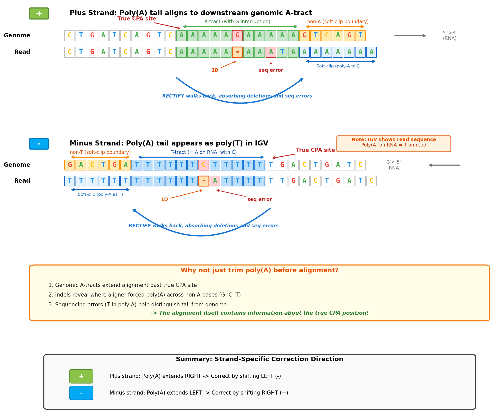
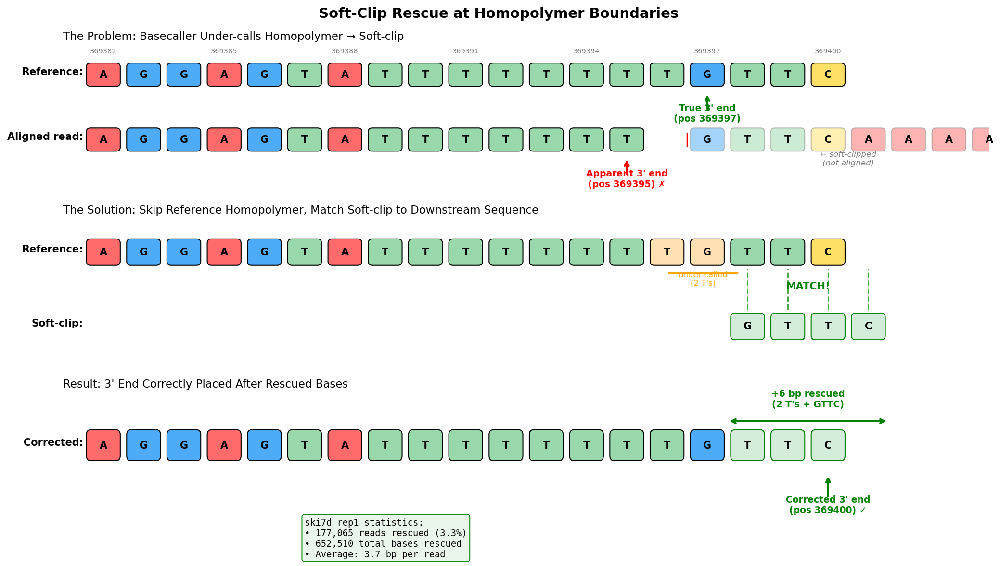
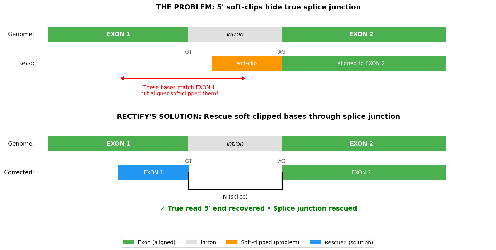
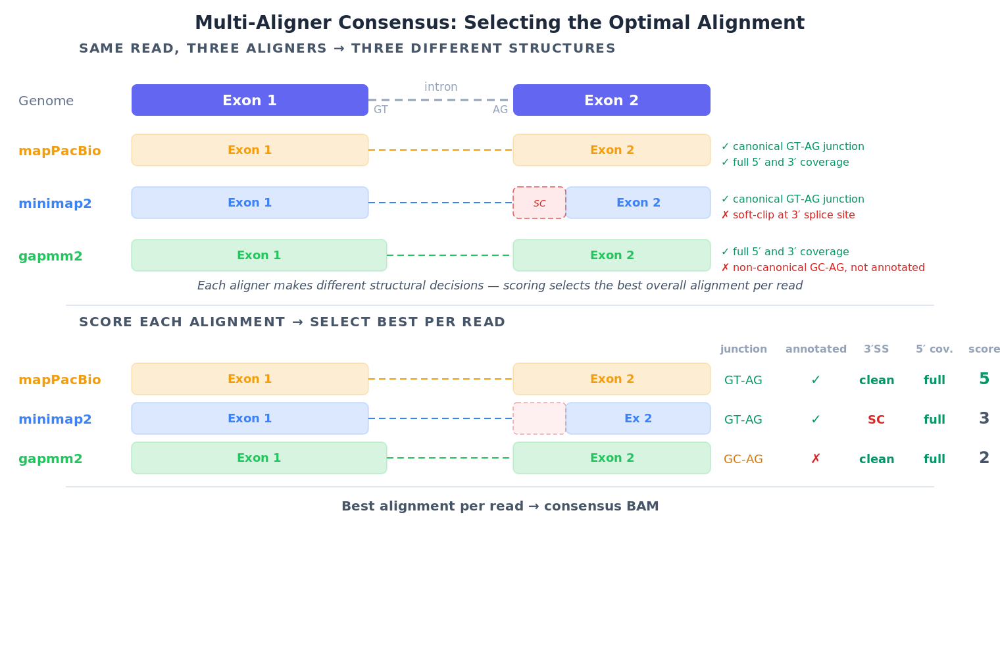
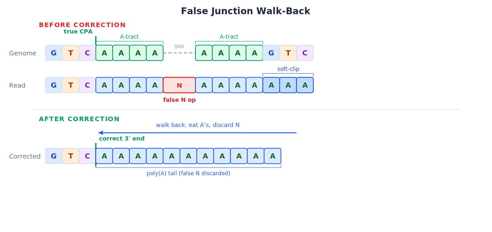
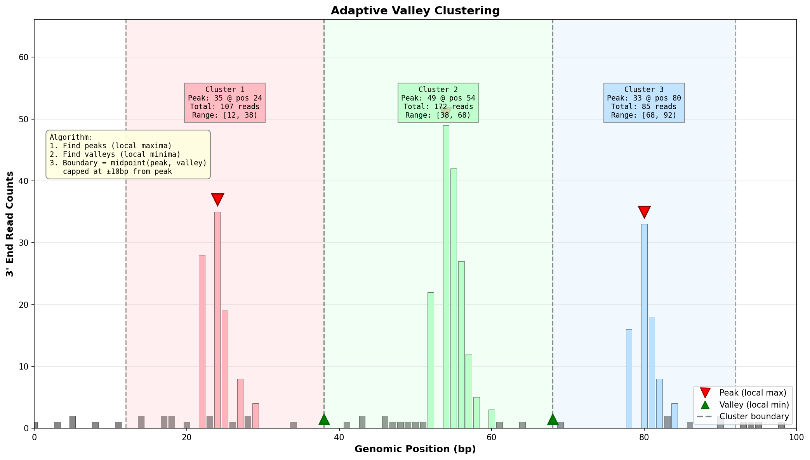
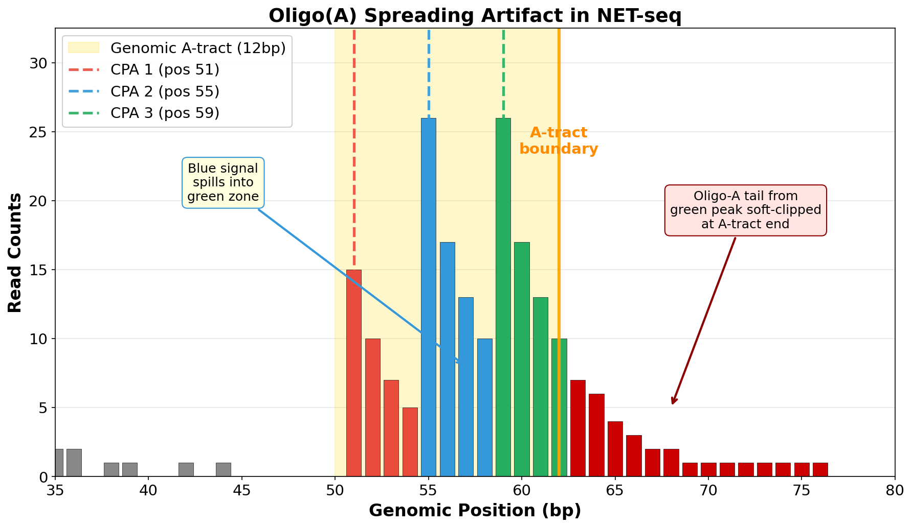
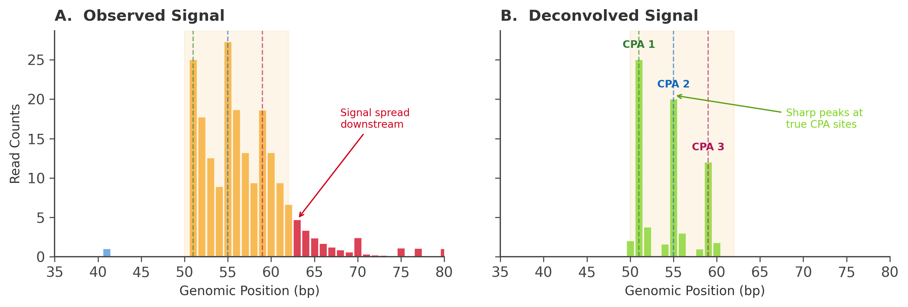

# RECTIFY

**R**NA 5' and 3' **E**nd **C**orrection **T**ool with **I**ntron re**F**inement and ambiguit**Y** resolution

[](https://pypi.org/project/rectify-rna/)
[](https://opensource.org/licenses/MIT)
[](https://www.python.org/downloads/)

**Precision transcript structure mapping for direct RNA nanopore sequencing data.** Accurate 5' ends, 3' ends, and splice junctions through refinement of alignments at transcript termini, correction of artifacts due to sequencing errors, and selection of the optimal alignments from a panel of aligners (minimap2, gapmm2, and mapPacBio).

---

## Quick Start

```bash
pip install rectify-rna

# Single sample — bundled yeast genome, no external files needed
rectify run-all reads.fastq.gz --Scer -o results/

# Multiple samples via manifest (typical usage)
rectify run-all --manifest samples.tsv --Scer -o results/
```

The manifest `samples.tsv` is a tab-separated file (no header):

```
wt_rep1.fastq.gz      WT    rep1
wt_rep2.fastq.gz      WT    rep2
wt_rep3.fastq.gz      WT    rep3
rna15_rep1.fastq.gz   rna15 rep1
rna15_rep2.fastq.gz   rna15 rep2
rna15_rep3.fastq.gz   rna15 rep3
```

Columns: `filename` (resolved relative to the manifest), `group` (condition label for DESeq2 contrasts), `bio_rep`.

**Outputs** (`results/`):

```
results/
├── <sample_id>/                        # Per-sample
│   ├── <sample_id>.consensus.bam       # Triple-aligner consensus alignment
│   ├── corrected_3ends.tsv             # Per-read corrected 3' ends, confidence, poly(A) length, fraction
│   ├── corrected_3ends_stats.tsv       # Correction statistics
│   ├── corrected_3ends_report.html     # Per-sample QC report
│   ├── junctions/junctions.tsv         # Splice junctions with partial-rescue evidence
│   └── PROVENANCE.json
│
└── combined/                           # Cross-sample (requires ≥2 samples)
    ├── cpa_clusters.tsv                # CPA site clusters with per-sample read counts
    ├── tables/
    │   ├── deseq2_genes_*.tsv          # Gene-level differential expression
    │   ├── deseq2_clusters_*.tsv       # Cluster-level differential expression
    │   └── shift_results.tsv           # APA shift analysis (proximal/distal usage)
    ├── go_enrichment.tsv               # GO enrichment for DE genes
    ├── motif_results/                  # Enriched sequence motifs near CPA sites
    ├── report.html                     # Combined QC and results report
    └── PROVENANCE.json
```

---

## Key Features

| Feature | Description |
|---------|-------------|
| **Multi-Aligner Consensus** | Runs minimap2, mapPacBio, gapmm2 in parallel and selects best junction set per read |
| **5' End Junction Recovery** | Rescues soft-clipped bases by extending alignments through splice junctions |
| **Spike-in Filtering** | Removes synthetic spike-in reads by sequence signature before correction |
| **3' End Indel Correction** | Fixes alignment artifacts where poly(A) tails align to genomic A-tracts |
| **3' False Junction Handling** | Walk back correction eats through spurious junctions from poly(A) artifacts |
| **Poly(A) Measurement** | Reports tail length (aligned + soft-clipped) |
| **Junction Ambiguity Resolution** | Resolves reads matching multiple junctions using proportional assignment |
| **NET-seq Refinement** | Resolves A-tract ambiguity using nascent RNA data; reads assigned proportionally across peaks |
| **Adaptive Clustering** | Groups CPA sites with valley-based algorithm |
| **Dual-Resolution DESeq2** | Gene-level and cluster-level differential expression |
| **APA Shift Analysis** | Detects proximal/distal CPA site usage changes |
| **Visualization** | Metagene plots, genome browser figures (`pip install rectify-rna[visualize]`) |

### Bundled Data (Yeast)

For *S. cerevisiae*, RECTIFY includes the S288C genome, SGD annotations, GO terms, and pre-deconvolved WT NET-seq data (pan-mutant consensus, NNLS-deconvolved offline)—no external files needed.

---

## 3' End Correction: Indel Artifacts in Poly(A) Regions

When poly(A) tails align to genomic A-tracts, aligners like minimap2 introduce indel artifacts to maximize alignment score. This shifts the apparent 3' end **downstream** of the true cleavage site.



**The Problem:** The aligner introduces deletions to extend alignment of poly(A) tail bases into downstream genomic A-tracts, shifting the apparent 3' end.

**RECTIFY's Solution:** Walk upstream from the soft-clip boundary through the aligned region:
1. Skip positions where genome = A (ambiguous with poly(A) tail)
2. Skip deletions (D in CIGAR) - these are alignment artifacts
3. Skip T sequencing errors in the tail
4. **STOP** at first non-A/T agreement between genome and read

**Result:** True 3' end at the correct position. Poly(A) length = soft-clipped + aligned A's + absorbed deletions.

**Key insight for IGV users:** For minus strand reads, the poly(A) tail appears as poly(T) extending leftward. RECTIFY corrects by shifting rightward toward the true CPA.

---

## Soft-Clip Rescue at Homopolymer Boundaries

Nanopore basecallers systematically under-call homopolymer runs (e.g., calling 8 U's instead of 10). When this happens at CPA sites with upstream T-tracts, the aligner soft-clips the non-T bases instead of placing them correctly.



**The Problem:** The basecaller under-calls the T-tract, so when the aligner reaches the first non-T base, it can't fit it into the shortened homopolymer and soft-clips it instead.

**RECTIFY's Solution:**
1. Detect soft-clips adjacent to homopolymer boundaries
2. Skip over remaining reference homopolymer bases (the under-called T's)
3. Match soft-clipped bases to reference sequence beyond the homopolymer
4. Extend the 3' end to include the rescued bases

---

## 5' End Correction: Splice Junction Soft-Clips

Long reads spanning splice junctions often have soft-clipped bases at the 5' end where the aligner fails to find the exact junction boundary. RECTIFY recovers the true splice site.



**The Problem:** Soft-clipped bases at the 5' end actually match the upstream exon, but the aligner couldn't extend through the splice junction.

**RECTIFY's Solution:**
1. Identify reads with 5' soft-clips near annotated splice sites
2. Check if soft-clipped sequence matches upstream exon
3. Extend the alignment to the canonical splice donor (GT)

**Result:** Accurate read 5' end and recovered splice junction. Note: Due to 5'-to-3' degradation in direct RNA sequencing, the read's 5' end often does not represent the true TSS.

---

## Multi-Aligner Consensus Pipeline

Different aligners make different tradeoffs at splice junctions. RECTIFY runs three aligners in parallel and selects the best alignment per read.



**The Problem:** Different aligners handle the same read differently. Some soft-clip at splice boundaries while others find the junction.

**RECTIFY's Solution:**
1. Run all 3 aligners (minimap2, mapPacBio, gapmm2) on the same reads
2. **Attempt to rescue** each alignment's 5' soft-clips by extending through known junctions
3. Score the (potentially rescued) alignments by canonical splice sites (GT-AG) and annotation matches
4. Select the highest-scoring alignment per read
5. Output: Single consensus BAM with best alignment per read

**Note:** 3' false junctions from poly(A) artifacts are handled separately by walk back correction (see "3' False Junction Handling" below).

**Usage:**

```bash
# Multi-aligner consensus alignment (default, aligners run in parallel)
rectify align reads.fastq.gz --genome genome.fa --annotation genes.gff -o aligned.bam

# Parallel aligners with proportional thread allocation (minimap2 gets fewer threads
# since it's faster; mapPacBio and gapmm2 get more to finish at the same time)
rectify align reads.fastq.gz --genome genome.fa --annotation genes.gff \
    --parallel-aligners --threads 16 -o aligned.bam

# Single aligner mode (faster, less accurate)
rectify align reads.fastq.gz --genome genome.fa --aligner minimap2 -o aligned.bam
```

---

## 3' False Junction Handling

Poly(A) tails can create spurious "junctions" when the aligner introduces a skip (N) operation to align tail bases to a downstream genomic A-tract. **RECTIFY's walk back correction completely handles this artifact.**



**The Problem:** The aligner introduces an N (skip) to extend the poly(A) tail alignment into a downstream A-tract, creating a spurious junction that doesn't exist in the transcript.

**RECTIFY's Solution:** The walk back algorithm finds the true 3' end by walking upstream through ALL aligned A's until it finds the first non-A agreement between genome and read. Crucially, it **DISCARDS any N (skip) operations** it encounters.

**Result:**
- Walk back finds the true CPA at the EXON/A boundary
- The false junction (N operation) is completely ignored
- No special false junction detection needed

**This means 3' false junctions are NOT a problem for downstream analysis**—walk back correction handles them automatically as part of finding the true cleavage and polyadenylation site.

---

## Adaptive Clustering and Differential Expression

After correction, RECTIFY groups nearby CPA sites into clusters using a valley-based algorithm, then runs DESeq2 at both gene and cluster resolution.



**Algorithm:**
1. Find peaks (local maxima in 3' end signal)
2. Find valleys (local minima between peaks)
3. Set boundaries at midpoint between peak and valley (capped at ±10bp)

**Why cluster-level analysis matters:**
- Genes often have MULTIPLE CPA sites (alternative polyadenylation)
- Conditions may shift usage between proximal/distal sites
- Cluster-level DESeq2 detects isoform-specific changes that gene-level misses

**Dual-resolution output:**

| Level | Detects | Example |
|-------|---------|---------|
| **Gene** | Total expression changes | HSP82 is 2-fold down in heat shock |
| **Cluster** | CPA site usage changes | FAS1 shifts from distal to proximal site |

---

## Output

Each read gets a corrected position with confidence scores:

```
read_id   │ chrom │ strand │ original │ corrected │ shift │ confidence │ polya_len │ fraction │ qc_flags
read001   │ chrI  │   +    │  147592  │   147585  │  -7   │    HIGH    │    42     │  1.0000  │   PASS
read002   │ chrI  │   +    │  147594  │   147591  │  -3   │   MEDIUM   │    38     │  1.0000  │   PASS
read003   │ chrII │   +    │  283109  │   283104  │  -5   │    LOW     │    31     │  0.6500  │ AG_RICH
```

The `fraction` column reflects proportional NET-seq assignment: when a read falls in an A-tract with multiple NET-seq peaks, it is split across peaks rather than snapped to a single position. Fractions sum to 1.0 per input read.

The `rectify analyze` command produces:
- `clusters.tsv` - CPA site clusters with read counts per sample
- `deseq2_gene_results.tsv` - Gene-level differential expression
- `deseq2_cluster_results.tsv` - Cluster-level differential expression
- `shift_results.tsv` - Genes with significant APA shifts
- `go_enrichment.tsv` - GO enrichment for DE genes
- `motif_results/` - Enriched sequence motifs near CPA sites

---

## NET-seq Refinement (Optional)

For organisms with NET-seq data, RECTIFY resolves remaining A-tract ambiguity by assigning reads proportionally across NET-seq peaks rather than snapping to a single position.

**Bundled yeast data** (`--Scer`): pre-deconvolved pan-mutant NET-seq (WT + DST1Δ consensus, NNLS deconvolution applied once offline). No runtime deconvolution — reads are assigned directly using the pre-computed signal.

**Custom data**: provide raw NET-seq bigWigs with `--netseq-dir`. NNLS deconvolution is applied at runtime to recover true CPA positions from the oligo-adenylation spreading pattern.

---

## Installation

```bash
# PyPI
pip install rectify-rna

# With visualization support
pip install rectify-rna[visualize]

# Conda (includes MEME Suite for motif discovery)
conda install -c conda-forge -c bioconda rectify-rna
```

---

## Commands

### All-in-one

| Command | Description |
|---------|-------------|
| `rectify run-all` | Full pipeline: align (if FASTQ) → correct → analyze → aggregate junctions. Skips completed steps automatically on re-run. |

### Individual steps

Run steps independently to re-process from any point in the pipeline.

| Command | Description |
|---------|-------------|
| `rectify align` | Align FASTQ with the aligner panel (minimap2, gapmm2, mapPacBio; all with DRS-optimized settings) and select the best alignment per read |
| `rectify correct` | Correct 5' ends, 3' ends, and junctions — indel correction at poly(A) boundaries, A-tract ambiguity resolution, NET-seq refinement |
| `rectify analyze` | Downstream analysis: CPA clustering, DESeq2, GO enrichment, motif discovery |
| `rectify export` | Export corrected positions to bigWig/bedGraph tracks |
| `rectify extract` | Extract per-read features from BAM to TSV (5'/3' ends, junctions, poly(A) length) |
| `rectify aggregate` | Aggregate reads into 3' end, 5' end, and junction-centered datasets |
| `rectify netseq` | Process NET-seq BAM files (3' end extraction, NNLS deconvolution; for standalone analysis or for assigning DRS 3' ends in A-tracts to their likely CPA sites) |

### Examples

```bash
# Multiple samples via manifest — typical multi-condition experiment
rectify run-all --manifest samples.tsv --Scer --filter-spikein ENO2 -o results/

# Single sample, bundled yeast genome
rectify run-all reads.fastq.gz --Scer -o results/

# Non-DRS protocol where poly(A) tail is not sequenced
rectify run-all reads.fastq.gz --genome genome.fa --annotation genes.gff \
    --no-polya-sequenced -o results/

# Re-run correction only (alignment already done)
rectify correct reads.bam --genome genome.fa --netseq-dir my_netseq/ -o corrected.tsv

# Re-run analysis only (correction already done)
rectify analyze corrected.tsv --annotation genes.gff --output-dir results/

# Process NET-seq data
rectify netseq netseq.bam --genome genome.fa --gff genes.gff -o netseq_output/
```

---

## NET-seq Processing

RECTIFY includes a dedicated pipeline for processing NET-seq (Native Elongating Transcript sequencing) data. NET-seq captures nascent RNA 3' ends, which undergo oligo-adenylation during library preparation, creating characteristic signal spreading at A-tract regions.

### The Problem: Oligo(A) Signal Spreading



With oligo(A) tails (~5.5 bp mean), reads can prime at ANY downstream A in genomic A-tracts. This causes signal to "spread" downstream, obscuring the true CPA site.

### RECTIFY's Solution: NNLS Deconvolution



Using the Point-Spread-Function (PSF) derived from 5000+ 0A sites (sites with no downstream genomic A's, where the true position is known):

1. Build convolution matrix: A[i,j] = P(observe at j | true peak at i)
2. Solve NNLS with L2 regularization: min ||Ax - observed||² + λ||x||²
3. Recover true peak positions from deconvolved signal

**Result:** Sharper, more accurate 3' end signal with A-tract ambiguity resolved.

### NET-seq Command

```bash
# Basic usage
rectify netseq input.bam --genome genome.fa --gff genes.gff -o output/

# With exclusion region control
rectify netseq input.bam --genome genome.fa --gff genes.gff \
    --include-rdna \        # Don't exclude rDNA locus
    --include-pol3 \        # Don't exclude Pol III genes (tRNAs)
    --exclude-mito \        # Exclude mitochondrial genome
    -o output/

# Disable deconvolution (raw 3' ends only)
rectify netseq input.bam --genome genome.fa --no-deconvolution -o output/

# Process multiple samples
rectify netseq sample1.bam sample2.bam sample3.bam \
    --genome genome.fa --gff genes.gff -o output/
```

### Output Files

| File | Description |
|------|-------------|
| `{sample}.unified_reads.parquet` | Per-read records (25 columns, same schema as nanopore) |
| `{sample}.raw.plus.bedgraph` | Raw 3' ends, plus strand, RPM-normalized |
| `{sample}.raw.minus.bedgraph` | Raw 3' ends, minus strand, RPM-normalized |
| `{sample}.deconv.plus.bedgraph` | Deconvolved signal, plus strand, RPM-normalized |
| `{sample}.deconv.minus.bedgraph` | Deconvolved signal, minus strand, RPM-normalized |

### Exclusion Regions

By default, RECTIFY excludes regions with non-standard transcription:

- **rDNA locus** (chrXII ~450,000-490,000 in yeast): Highly repetitive, Pol I transcribed
- **Pol III genes** (tRNAs, SNR6, RDN5, RPR1, SCR1): Different transcription termination mechanism
- **Flanking regions** (100 bp by default): Buffer around excluded genes

These regions are auto-detected from GFF annotation. Use `--include-rdna` and `--include-pol3` flags to include them if needed.

### Strand-Aware Coordinate Mapping

NET-seq reads are short (~40-76 bp) and represent the 3' end of nascent RNA:

| Strand | 3' end position | 3' soft-clip | Oligo(A) detection |
|--------|-----------------|--------------|-------------------|
| **+** | `reference_end - 1` (rightmost) | Right clip | Count A's |
| **-** | `reference_start` (leftmost) | Left clip | Count T's (= RNA A's) |

---

## Supported Technologies

- Nanopore direct RNA-seq (minimap2)
- QuantSeq (oligo-dT short-read)
- PacBio Iso-Seq
- NET-seq (nascent RNA 3' end sequencing)
- Any poly(A)-tailed RNA-seq

---

## Citation

**Original RECTIFY:**
> Roy KR, Chanfreau GF. Robust mapping of polyadenylated and non-polyadenylated RNA 3' ends at nucleotide resolution by 3'-end sequencing. *Methods*. 2020;176:4-13. [PMID: 31128237](https://pubmed.ncbi.nlm.nih.gov/31128237/)

**RECTIFY 2.0:** Manuscript in preparation

---

## License

MIT License - See [LICENSE](LICENSE) for details

## Contact

- Kevin R. Roy - [kevinrjroy@gmail.com](mailto:kevinrjroy@gmail.com)
- GitHub: [k-roy/RECTIFY](https://github.com/k-roy/RECTIFY)
