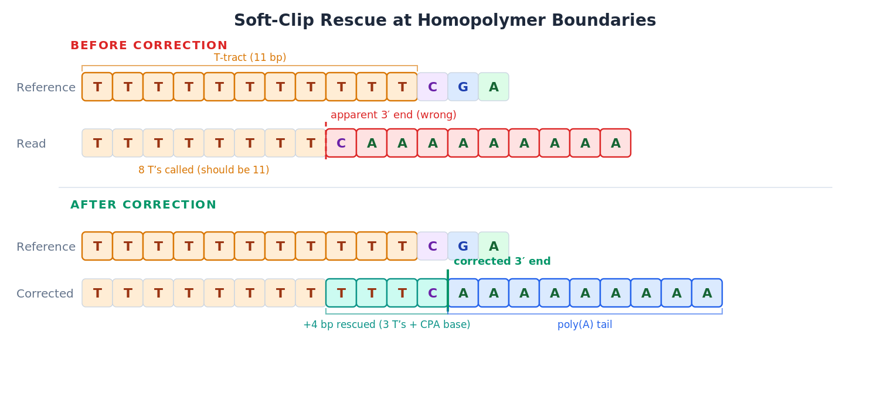

<p align="center">
  <h1 align="center">RECTIFY</h1>
  <p align="center">
    <b>R</b>NA 5' and 3' <b>E</b>nd <b>C</b>orrection <b>T</b>ool with <b>I</b>ntron re<b>F</b>inement and ambiguit<b>Y</b> resolution
  </p>
  <p align="center">
    <a href="https://pypi.org/project/rectify-rna/"></a>
    <a href="https://opensource.org/licenses/MIT"></a>
    <a href="https://www.python.org/downloads/"></a>
  </p>
</p>

---

## Overview

Nanopore direct RNA sequencing offers unprecedented read lengths, but accurate transcript structure mapping requires solving four intertwined problems: spurious 3' ends created by poly(A) tail artifacts (indels and false splice junctions), soft-clipped 5' bases that actually align upstream of splice sites, homopolymer-driven soft-clipping at 3' ends, and conflicting junction calls between different aligners. **RECTIFY** solves all four through multi-aligner rectification, artifact-aware corrections, and optional NET-seq refinement, delivering nucleotide-precision 5' and 3' end coordinates and splice junction sets.

**Use RECTIFY when you need:**
- Accurate cleavage and polyadenylation (CPA) site mapping from DRS data
- Correction of poly(A) misalignment artifacts in A-tract regions
- Robust splice junction calls from reads spanning multiple exons
- Detection of alternative polyadenylation (APA) with cluster-level resolution
- Differential expression analysis at gene and isoform levels
- Optional NET-seq-informed refinement for A-tract ambiguity

---

## Quick Start

### Installation

```bash
# Via PyPI
pip install rectify-rna

# With visualization support (metagene plots, genome figures)
pip install rectify-rna[visualize]

# Via Conda (includes MEME Suite for motif discovery)
conda install -c conda-forge -c bioconda rectify-rna
```

### Basic Usage

```bash
# Correct 3' ends from FASTQ (bundled yeast genome — no external files needed)
rectify correct reads.fastq.gz --organism yeast -o corrected.tsv

# Full pipeline: alignment → correction → analysis
rectify run reads.bam --genome genome.fa --annotation genes.gtf --output-dir results/

# Process NET-seq data (nascent RNA 3' ends)
rectify netseq netseq.bam --genome genome.fa --gff genes.gff -o netseq_output/
```

---

## How It Works

RECTIFY reconstructs true RNA 3' and 5' ends through four sequential corrections, each addressing a specific alignment artifact.

### 1. 3' End Walk-Back: Recovering the True CPA Site

When poly(A) tails align to genomic A-tracts, aligners introduce indels and spurious splice junctions (N operations) to maximize alignment score, **shifting the apparent 3' end far downstream** of the true cleavage site. RECTIFY walks backward from the soft-clip boundary, skipping A's, deletions, T sequencing errors, and any intron-skip (N) operations it encounters, until it finds the first non-A/T agreement between genome and read — the true CPA site.

<p align="center">
  
</p>

**Why simple poly(A) trimming fails:** The boundary between genomic A's and tail A's is ambiguous in A-tract regions. RECTIFY's walk-back algorithm handles deletions, T sequencing errors, and false splice junctions within the A-tract, recovering the true CPA position even when the aligner has spread the poly(A) signal across multiple genomic A-runs or introduced spurious N operations to reach downstream A-tracts. For minus-strand genes, the poly(A) tail appears as a poly(T) prefix extending leftward — RECTIFY applies identical logic in reverse orientation.

**False junction cleanup is built-in:** Poly(A) tails can cause aligners to introduce skip (N) operations to reach downstream A-tracts, creating spurious splice junctions. The same walk-back that corrects indel artifacts transparently absorbs these N operations — they require no separate detection step.

<p align="center">
  
</p>

### 2. 5' End Junction Rescue: Recovering Soft-Clipped Bases at Splice Sites

Nanopore reads that begin near a splice junction frequently have their 5'-most bases soft-clipped rather than placed in the upstream exon. RECTIFY identifies these soft-clipped sequences, locates the nearest annotated donor site, and extends the alignment through the intron to recover the true transcription start position.

<p align="center">
  
</p>

### 3. Soft-Clip Rescue: Recovering 5' Bases at Homopolymer Boundaries

Nanopore basecallers systematically under-call homopolymer runs. At CPA sites with upstream T-rich regions, this causes the aligner to soft-clip non-T bases rather than place them in the correct exon. RECTIFY identifies soft-clipped sequences, skips remaining reference homopolymer bases, and matches them to downstream reference positions.

<p align="center">
  
</p>

This correction is especially critical for detecting true 3' ends in regions where weak basecalling and homopolymer under-calling create false soft-clip boundaries.

### 4. Multi-Aligner Rectification: Selecting the Optimal Junction Set

Different aligners make different tradeoffs at splice junctions. RECTIFY solves this in three stages:

**Stage 1 — Per-aligner rectification:** `rectify correct` is applied independently to each aligner's BAM (minimap2, mapPacBio, gapmm2). Every correction module (3' walk-back, 5' junction rescue, soft-clip rescue, false-junction filter) runs on each aligner's output, producing a separate corrected TSV per aligner.

**Stage 2 — Consensus selection:** The per-aligner corrected TSVs are merged by `rectify consensus`, which selects the winning aligner per read using post-rectification features (in priority order): (1) `five_prime_rescued` — prefer the aligner where Cat3 5' rescue fired; (2) `confidence` — high > medium > low; (3) corrected_3′ agreement — prefer positions agreed on by most aligners; (4) alignment span — prefer wider reference span; (5) `n_junctions` — prefer more completely spliced.

**Stage 3 — Chimeric reconstruction:** For reads where two or more aligners each uniquely contribute a junction not present in the other's corrected output, `rectify consensus` can optionally stitch the complementary junctions into a single chimeric alignment — recovering reads that no single aligner handles completely.

<p align="center">
  
</p>

```bash
# Align and rectify with all three aligners (default, DRS-optimized)
rectify align reads.fastq.gz --genome genome.fa --annotation genes.gff -o aligned_dir/

# Merge per-aligner corrected TSVs into a single consensus result
rectify consensus minimap2:aligned_dir/minimap2/corrected_3ends.tsv \
                  mapPacBio:aligned_dir/mapPacBio/corrected_3ends.tsv \
                  gapmm2:aligned_dir/gapmm2/corrected_3ends.tsv \
                  -o corrected_3ends.tsv

# Single-aligner mode (faster, less accurate)
rectify align reads.fastq.gz --genome genome.fa --aligner minimap2 -o aligned.bam
```

---

## Key Features

| Feature | Benefit |
|:--------|:--------|
| **Multi-Aligner Rectification** | Rectifies each aligner independently, then selects the winning aligner per read using post-rectification features (5' rescue > confidence > agreement > span > junctions); optionally stitches complementary junctions from two aligners (chimeric reconstruction) |
| **5' End Junction Recovery** | Rescues soft-clipped bases by extending alignments through known splice junctions |
| **3' End Walk-Back** | Walks backward from soft-clip boundary to recover true CPA site, transparently absorbing indels, T sequencing errors, and spurious splice junctions (N ops) in a single pass |
| **Junction Ambiguity Resolution** | Resolves reads matching multiple junctions using proportional assignment |
| **Poly(A) Measurement** | Reports tail length including both aligned and soft-clipped bases |
| **NET-seq Refinement** | Uses nascent RNA 3' ends to deconvolve A-tract ambiguity (optional) |
| **Adaptive Clustering** | Groups nearby CPA sites using valley-based peak detection |
| **Dual-Resolution Differential Expression** | DESeq2 at both gene level and cluster (isoform) level |
| **APA Shift Analysis** | Detects significant proximal/distal CPA site usage changes |
| **Visualization** | Metagene plots and genome browser figures (`pip install rectify-rna[visualize]`) |
| **Bundled Yeast Data** | S288C genome, SGD annotations, GO terms, WT NET-seq, 64K pre-computed A-tract CPA sites |

---

## Output and Results

Each read receives a corrected position with confidence scoring:

```
read_id   │ chrom │ strand │ original │ corrected │ shift │ confidence │ polya_len │ qc_flags
read001   │ chrI  │   +    │  147592  │   147585  │  -7   │    HIGH    │    42     │   PASS
read002   │ chrI  │   +    │  147594  │   147591  │  -3   │   MEDIUM   │    38     │   PASS
read003   │ chrII │   +    │  283109  │   283104  │  -5   │    LOW     │    31     │ AG_RICH
```

The `rectify analyze` command produces:
- **clusters.tsv** — CPA site clusters with read counts per condition
- **deseq2_gene_results.tsv** — Differential expression at gene level
- **deseq2_cluster_results.tsv** — Differential expression at cluster (isoform) level
- **shift_results.tsv** — Genes with statistically significant APA shifts
- **go_enrichment.tsv** — GO term enrichment on shifted genes
- **motif_results/** — Enriched sequence motifs near CPA sites

---

## NET-seq Refinement (Optional)

For organisms with nascent RNA (NET-seq) data, RECTIFY resolves remaining ambiguity within A-tracts. NET-seq samples RNA still attached to polymerase, providing a reference for true CPA positions. Since nascent RNA is oligo-adenylated post-capture, RECTIFY uses NNLS deconvolution with a point-spread function derived from 5000+ zero-A calibration sites to recover true CPA positions.

<p align="center">
  
</p>

<p align="center">
  
</p>

**For *S. cerevisiae***, bundled WT NET-seq data is auto-detected. For other organisms or mutant conditions, provide NET-seq bigWigs with the `--netseq-dir` flag.

---

## Commands Reference

| Command | Purpose |
|:--------|:--------|
| `rectify correct` | Correct 3' end positions (indel correction + A-tract resolution) |
| `rectify analyze` | Downstream analysis (clustering, DESeq2, GO enrichment, motifs) |
| `rectify export` | Export corrected positions to bigWig/bedGraph tracks |
| `rectify extract` | Extract per-read 5'/3' ends and junctions to TSV |
| `rectify aggregate` | Group reads into 3'/5'/junction dataset files |
| `rectify align` | Align FASTQ with multi-aligner rectification |
| `rectify netseq` | Process NET-seq BAM files (3' extraction + deconvolution) |
| `rectify run` | Full pipeline: align (if FASTQ) → correct → analyze |
| `rectify run-all` | Full pipeline with provenance tracking and step-skip |

<details>
<summary><b>Usage examples</b></summary>

```bash
# Correct 3' ends (bundled yeast genome, no external files needed)
rectify correct reads.fastq.gz --organism yeast -o corrected.tsv

# Correct with custom genome and optional NET-seq deconvolution
rectify correct reads.bam --genome genome.fa --netseq-dir my_netseq/ -o corrected.tsv

# Extract per-read features (5'/3' ends, junctions) to TSV
rectify extract reads.bam -o reads.tsv --genome genome.fa --annotation genes.gff

# Aggregate into separate 3'/5'/junction datasets by condition
rectify aggregate reads.bam -o aggregated/ --annotation genes.gff --mode all

# Differential expression analysis (gene and cluster level)
rectify analyze corrected.tsv --annotation genes.gtf --output-dir results/

# Export corrected positions as genome browser tracks
rectify export corrected.tsv -o tracks/ --genome genome.fa

# Complete pipeline from reads to differential expression
rectify run reads.bam --genome genome.fa --annotation genes.gtf --output-dir results/

# Process NET-seq data (nascent RNA 3' ends for A-tract refinement)
rectify netseq netseq.bam --genome genome.fa --gff genes.gff -o netseq_output/
```

</details>

---

## Supported Technologies

**Direct RNA sequencing:** Nanopore direct RNA-seq (DRS)
**Short-read quantification:** QuantSeq (oligo-dT), PacBio Iso-Seq, NET-seq
**General:** Any poly(A)-tailed RNA-seq platform

---

## Citation

Please cite RECTIFY if you use it in your research:

> Roy KR, Chanfreau GF. Robust mapping of polyadenylated and non-polyadenylated RNA 3' ends at nucleotide resolution by 3'-end sequencing. *Methods*. 2020;176:4-13. [PMID: 31128237](https://pubmed.ncbi.nlm.nih.gov/31128237/)

**RECTIFY 2.0:** Manuscript in preparation.

---

## License

MIT — see [LICENSE](LICENSE) for details.

## Contact

**Kevin R. Roy**
Email: [kevinrjroy@gmail.com](mailto:kevinrjroy@gmail.com)
GitHub: [k-roy/RECTIFY](https://github.com/k-roy/RECTIFY)
