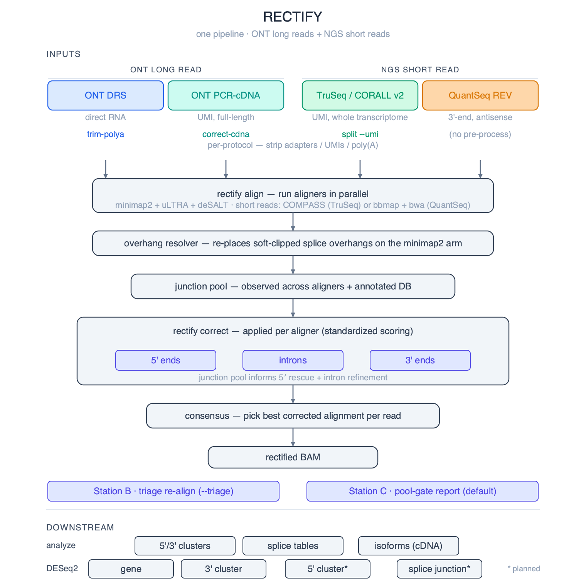
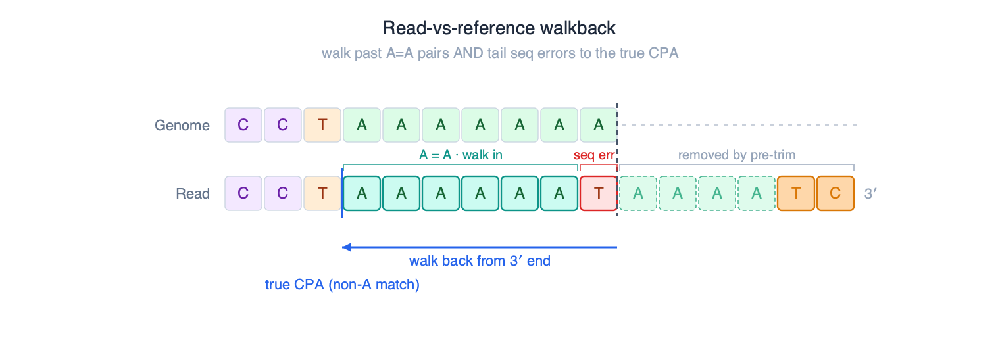
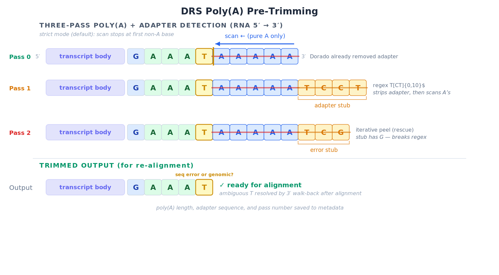
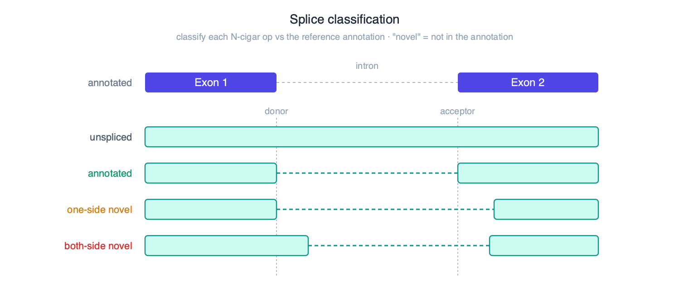
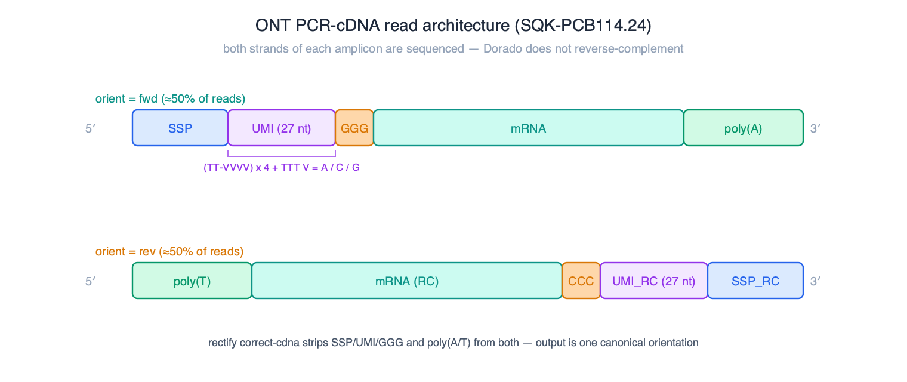
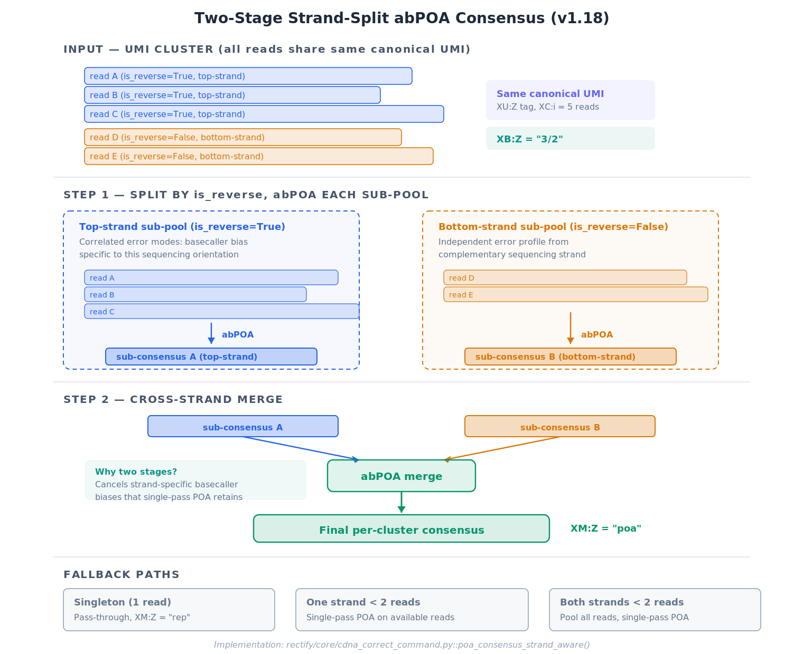
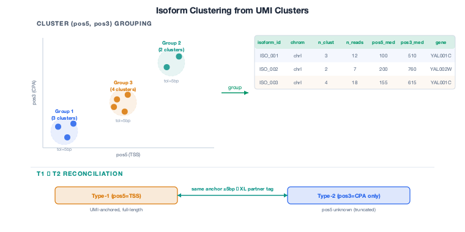

<p align="center">
  <h1 align="center">RECTIFY</h1>
  <p align="center">
    <b>R</b>NA 5' and 3' <b>E</b>nd <b>C</b>orrection <b>T</b>ool with <b>I</b>ntron re<b>F</b>inement and ambiguit<b>Y</b> resolution
  </p>
  <p align="center">
    <a href="https://pypi.org/project/rectify-rna/"></a>
    <a href="https://rectify-rna.readthedocs.io"></a>
    <a href="https://github.com/k-roy/RECTIFY/actions"></a>
    <a href="https://opensource.org/licenses/MIT"></a>
    <a href="https://www.python.org/downloads/"></a>
    <a href="https://pubmed.ncbi.nlm.nih.gov/31128237/"></a>
  </p>
</p>

Precision transcript structure mapping for nanopore and short-read 3'-end RNA-seq. RECTIFY provides accurate 5' ends, 3' ends, and splice junctions through multi-aligner consensus, read-vs-reference walkback, and optional NET-seq refinement. Three protocol tracks (ONT direct RNA, ONT PCR-cDNA, QuantSeq REV) share one set of multi-aligner / walkback / downstream-analysis modules and diverge only where the chemistry forces them to.

<p align="center">
  
</p>

---

## Protocol Tracks

All three tracks reuse the same multi-aligner consensus, read-vs-reference walkback core, and downstream `rectify analyze` pipeline. They differ in (a) how the 3'-end side of the read is identified, (b) whether the poly(A) tail is in the read, and (c) whether the BAM strand matches or is inverted relative to the gene/RNA strand.

| Track | Chemistry | Subcommand(s) | Aligners | 3'-end side | Gene strand vs BAM |
|---|---|---|---|---|---|
| **DRS** | ONT direct RNA-seq | `rectify trim-polya` → `rectify align` → `rectify correct` | minimap2 + mapPacBio + gapmm2 (± deSALT, uLTRA) | right | same |
| **ONT cDNA** | ONT PCR-cDNA (SQK-PCB114.24, SSP+UMI) | `rectify correct-cdna` → `rectify align` → `rectify cdna-analyze` | minimap2 + mapPacBio + gapmm2 | right | same |
| **QuantSeq REV** | dT-primed antisense short-read | `rectify align --short-read` → `rectify correct --dT-primed-cDNA --short-read` | bbmap + bwa | left | **opposite** |

All three tracks invoke the same multi-aligner consensus path in `rectify align` (which expands `--aligners all` to the long-read panel by default, or to bbmap+bwa when `--short-read` is set). The walkback core (`rectify/core/correct/walkback.py`) is protocol-agnostic; three thin wrappers (`walkback_drs`, `walkback_quantseq_rev`, and the `cdna-analyze` post-align caller) handle the side and strand differences.

> **QuantSeq REV note.** Pre-align the FASTQ explicitly with `rectify align --short-read` first. If you pass a FASTQ directly to `rectify correct --dT-primed-cDNA`, it currently aligns with minimap2 only (see [preprocess.py:479](rectify/core/align/preprocess.py#L479)) which is the wrong panel for short reads.

---

## Quick Start

```bash
pip install rectify-rna

# Single sample: alignment → correction (bundled yeast genome — no external files needed)
rectify correct reads.fastq.gz --organism yeast -o corrected.tsv

# Full pipeline on single sample: alignment → correction → analysis
rectify run-all reads.bam --genome genome.fa --annotation genes.gtf --output-dir results/

# Multi-sample manifest mode (parallel correction + combined DESeq2)
rectify run-all --manifest samples.tsv --genome genome.fa --annotation genes.gtf --output-dir results/

# QuantSeq REV / dT-primed cDNA-seq — antisense short read; poly(A) is NOT in the read
rectify correct reads.bam --genome genome.fa --dT-primed-cDNA --short-read -o corrected.tsv

# ONT PCR-cDNA (PCB114.24 chemistry) — UMI-aware 3-stage pipeline
rectify correct-cdna  pcb114.bam --reference genome.fa -o out/    # Stage 1: per-cluster FASTQ
rectify align         out/stage1_consensus.fastq.gz --genome genome.fa -o out/
rectify cdna-analyze  out/stage1.rectified.bam --reference genome.fa --gff genes.gff -o out/
```

---

## Key Features

| Feature | Description |
|:--------|:------------|
| **Multi-Aligner Consensus** | Runs minimap2, mapPacBio, gapmm2 in parallel and selects the best junction set per read (or per cluster, for cDNA) |
| **Read-vs-Reference Walkback** | Three-case terminal gate that walks past every A — including A-over-A — to find the true CPA. Catches internal-priming at genomic A-tracts that the older reference-only walkback missed |
| **5' End Junction Recovery** | Rescues soft-clipped bases by extending alignments through splice junctions |
| **3' End Indel Correction** | Fixes alignment artifacts where poly(A) tails align to genomic A-tracts |
| **3' False Junction Handling** | Walk back correction removes spurious junctions from poly(A) artifacts |
| **Junction Ambiguity Resolution** | Resolves reads matching multiple junctions using proportional assignment |
| **ONT cDNA UMI Consensus** | PCB114.24 SSP+UMI architecture: three read classes (`umi_captured_fwd`, `umi_captured_rev`, `umi_not_captured`); directional UMI clustering (Lev ≤ 3, 2× rule); two-stage strand-split abPOA consensus per molecule |
| **5'/3' Isoform Clustering** | Type-1 reads cluster by both TSS and CPA; Type-2 reads cluster by CPA only; same-molecule Type-1 ↔ Type-2 pairs are linked via `XL:Z` |
| **Splice Classification** | Per-read splice classification (`unspliced` / `annotated` / `alternative` / `novel`) against a gene panel; quantifies NMD-sensitive isoform accumulation |
| **Poly(A) Measurement** | Reports tail length (aligned + soft-clipped) |
| **NET-seq Refinement** | Resolves A-tract ambiguity using nascent RNA data (optional) |
| **Adaptive Clustering** | Groups CPA sites with valley-based algorithm |
| **Dual-Resolution DESeq2** | Gene-level and cluster-level differential expression |
| **APA Shift Analysis** | Detects proximal/distal CPA site usage changes |
| **Visualization** | Metagene plots, genome browser figures (`pip install rectify-rna[visualize]`) |

**Bundled data for yeast:** For *S. cerevisiae*, RECTIFY includes the S288C genome, SGD annotations, GO terms, WT NET-seq data, and 64K pre-computed A-tract CPA sites — no external files needed.

---

## How It Works

### 3' End Indel Correction

After pre-trimming removes the poly(A) tail, reads that terminate within genomic A-tracts can extend past the true cleavage site — aligners introduce deletions and mismatches to maximize alignment into the A-rich region. RECTIFY walks back from the apparent 3' end, skipping aligned A's, deletions, and T sequencing errors, stopping at the first non-A genomic base with a matching read base to recover the true CPA position.

<p align="center">
  
</p>

### Soft-Clip Rescue at Homopolymer Boundaries

Nanopore basecallers systematically under-call homopolymer runs. When this happens at CPA sites with upstream T-tracts, the aligner soft-clips non-T bases instead of placing them correctly. RECTIFY skips over remaining reference homopolymer bases and matches the soft-clipped sequence to the downstream reference.

<p align="center">
  
</p>

### 5' End Correction

Long reads spanning splice junctions often have soft-clipped bases at the 5' end. These bases actually match the upstream exon, but the aligner couldn't extend through the junction. RECTIFY identifies these reads, checks for upstream exon matches, and extends the alignment to the canonical splice donor.

<p align="center">
  
</p>

> **Note:** Due to 5'-to-3' degradation in direct RNA sequencing, the read's 5' end often does not represent the true TSS.

### Multi-Aligner Consensus

Different aligners make different tradeoffs at splice junctions. RECTIFY runs three aligners (minimap2, mapPacBio, gapmm2) in parallel and applies full correction (`rectify correct`) to each independently. A consensus step then selects the best corrected result per read using a priority order (5' rescued > confidence > 3' agreement > span > n_junctions). Optionally, chimeric reconstruction stitches complementary junction sets from different aligners to recover junctions that no single aligner found.

<p align="center">
  
</p>

```bash
# Multi-aligner consensus alignment (default)
rectify align reads.fastq.gz --genome genome.fa --annotation genes.gff -o aligned.bam

# Single aligner mode (faster, less accurate)
rectify align reads.fastq.gz --genome genome.fa --aligner minimap2 -o aligned.bam
```

### 3' False Junction Handling

Poly(A) tails can create spurious "junctions" when the aligner introduces a skip (N) operation to align tail bases to a downstream A-tract. The walk back algorithm handles this automatically — it eats through all aligned A's and discards any N operations it encounters, finding the true CPA site without needing special false junction detection.

<p align="center">
  
</p>

### Read-vs-Reference Poly(A) Walkback

The core algorithmic improvement over earlier RECTIFY versions. Older versions walked back along the **reference** A-tract only — and stopped at the first genomic non-A. That misses internal-priming, where the read's own poly(A) tail aligns over a genomic A-tract before reaching the true CPA. The current walkback compares **read** to **reference** at each position and resolves three cases at the terminal base:

1. **Anchored non-A** — read base is not A and matches the genome → already correctly placed, no correction.
2. **Read-A over genome-A** — both read and reference are A → walk inward. This is the internal-priming scenario the old reference-only check incorrectly skipped.
3. **Mismatch** — read base ≠ reference base → walk inward until `read_base == ref_base` AND `ref_base != 'A'`.

This logic is protocol-agnostic and lives in [`rectify/core/correct/walkback.py`](rectify/core/correct/walkback.py). The shared core has two flavors: `walkback_3prime` / `walkback_3prime_with_qpos` (no artifact guards — for cDNA tail-counting and QuantSeq REV) and `walkback_3prime_guarded` (with three artifact guards — for DRS). Protocol wrappers select per-chemistry side, stop base (read-side), and gene-strand mapping:

| Wrapper | Chemistry | `is_reverse` → gene strand | 3'-end side | Stop base (read) | Guards |
|---|---|---|---|---|---|
| `walkback_drs_full` | ONT direct RNA-seq | False → +, True → − | right (+), left (−) | A (+), T (−) | **on** |
| `walk_back_anchor_and_tail` (cdna-analyze) | ONT PCR-cDNA (PCB114.24) | orient=fwd → right, orient=rev → left | right (fwd), left (rev) | A (fwd), T (rev) | off |
| `walkback_quantseq_rev` | QuantSeq REV (dT-primed) | False → −, True → + (inverted) | **left** (False), right (True) | A (both) | off |

All three wrappers delegate the read-vs-reference scan to the same `walkback.py` module. The DRS production path in [`bam_processor.py`](rectify/core/bam/bam_processor.py) calls `walkback_drs_full`, which adds three artifact guards on top of the scan: a homopolymer early-exit (skip reads not at a genomic A-tract), a large-deletion pre-scan (v2.9.3), an N-op intron-boundary guard for minus-strand reads (v2.9.4), and a 4-base poly(A) tail-context false-stop check (v3.0.3). The legacy `indel_corrector.find_polya_boundary` is now a thin alias that delegates to `walkback_3prime_guarded`; byte-identical output on the bundled Cat1–9 validation reads is enforced by `tests/test_walkback_readvsref.py::TestGuardedParityWithFindPolyaBoundary`. Enabling the guards on the cDNA and QuantSeq REV paths is a separate task (those paths currently match their pre-unification behavior).

<p align="center">
  
</p>

### Poly(A) Pre-Trim (DRS)

For ONT DRS, the basecalled poly(A) tail and adapter stub are stripped from the read's 3' end **before alignment** so the aligner doesn't try to place non-genomic A's over genomic A-tracts. The trimmed bases are cached as soft-clip metadata and restored by `rectify restore-softclip` after correction, preserving tail-length measurement. ONT PCR-cDNA does the analogous pretrim inside `rectify correct-cdna` (also stripping the 5' SSP+UMI+GGG bridge). QuantSeq REV reads carry no poly(A) and skip this step.

<p align="center">
  
</p>

### Splice Classification

`rectify analyze splice` classifies each read's N-cigar ops against a panel of annotated introns using strict 0-bp matching (with optional snap tolerance for basecaller jitter):

| Class | Condition |
|---|---|
| `no_intron_span` | Read does not overlap any annotated intron |
| `unspliced` | Read spans an intron but has no N-cigar op |
| `annotated` | Every N-op matches an annotated donor + acceptor exactly |
| `alternative` | One end of an N-op matches an annotated site (the other does not) |
| `novel` | Neither end of any N-op matches any annotated site |

This is the basis for the NMD-AS splice audit: NMD-sensitive isoforms are typically `alternative` or `novel` and accumulate when surveillance is impaired.

<p align="center">
  
</p>

### Adaptive Clustering and Differential Expression

After correction, RECTIFY groups nearby CPA sites into clusters using a valley-based algorithm (find peaks → find valleys → set boundaries), then runs DESeq2 at both gene and cluster resolution. Cluster-level analysis detects isoform-specific changes that gene-level analysis misses.

<p align="center">
  
</p>

| Level | Detects | Example |
|:------|:--------|:--------|
| **Gene** | Total expression changes | HSP82 is 2-fold down in heat shock |
| **Cluster** | CPA site usage changes | FAS1 shifts from distal to proximal site |

### ONT PCR-cDNA Pipeline (PCB114.24)

For Oxford Nanopore PCR-cDNA libraries built with the SQK-PCB114.24 chemistry, RECTIFY runs a three-stage UMI-aware pipeline that deduplicates per molecule before correction, then assigns isoforms on post-alignment coordinates.

<p align="center">
  
</p>

**Stage 1 — `rectify correct-cdna`.** PCB114.24 places a 27-nt structured UMI (pattern `(TT-VVVV)×4 + TTT`, V ∈ {A,C,G}) between the SSP and a GGG template-switching bridge at the basecalled 5′ end. Stage 1 extracts the UMI from each read in a pre-aligned BAM, clusters reads by (3′ anchor, UMI similarity) using directional clustering with a 2× count rule (avoids the chain-merge failure mode of connected components on hot poly-A loci), builds an abPOA consensus per multi-read cluster, and strips SSP/UMI/GGG at 5′ + poly(A) at 3′ so the downstream aligner receives clean mRNA. Output is one `stage1_consensus.fastq.gz` record per UMI cluster, with alignment-independent per-cluster tags on a TAB-separated FASTQ comment.

<p align="center">
  
</p>

<p align="center">
  
</p>

Reads are typed by where the UMI landed:

| `XY:Z`              | `XT:i` | When                                                                  | Deduplication                            |
|:--------------------|:-------|:----------------------------------------------------------------------|:-----------------------------------------|
| `umi_captured_fwd`  | 1      | SSP+UMI at basecalled-5′ (full-length molecule)                       | UMI-anchored                             |
| `umi_captured_rev`  | 1      | SSP_RC+UMI_RC at basecalled-3′ (pA-first read traveled far enough)    | UMI-anchored                             |
| `umi_not_captured`  | 2      | pA-first read truncated before reaching SSP/UMI                       | Not merged — each read is one observation |

**Stage 2 — `rectify align`.** The per-cluster FASTQ goes through the standard multi-aligner consensus path (minimap2 + mapPacBio + gapmm2 + optional chimeric reconstruction). Per-cluster tags ride through via `minimap2 -y`; the FASTQ writer uses TAB-separated comments so each `XX:T:value` becomes its own BAM aux field rather than collapsing into the first tag's Z-string.

**Stage 3 — `rectify cdna-analyze`.** On post-alignment coordinates (more accurate than pre-align for tol-5 = 5 / tol-3 = 5 grouping), Stage 3 recomputes corrected poly(A) length and TSS via read-vs-reference walkback/walk-forward, assigns genes + sense/antisense, groups Stage-1 clusters into isoforms (Type-1 uses 5′+3′ positions; Type-2 uses 3′ only — the 5′ end is random truncation noise), and links same-molecule Type-1 ↔ Type-2 cluster pairs at the same gene+orient with `|Δ5′| ≤ 5 ∧ |Δ3′| ≤ 5`.

<p align="center">
  
</p>

Outputs: `clusters.tsv` (per-cluster manifest), `isoforms.tsv` (isoform-level aggregation), `t1t2_pairs.tsv` (same-molecule pairings), and `consensus_tagged.bam` (input BAM rewritten with the new XA/XG/XS/XI/XL tags for downstream consumers that prefer SAM-tag access).

> **Tag namespace.** The cDNA pipeline owns the `X[upper]` tag namespace (`XU`/`XO`/`XC`/`XR`/`XA`/`XF`/`XT`/`XY`/`XQ`/`XK`/`XB`/`XS`/`XG`/`XI`/`XL`). `rectify align`'s internal aligner-selection bookkeeping uses `X[lower]` (`Xa`/`Xc`/`Xn`/`Xj`/`Xv`/`Xz`/`Xg`/`Xm`/`Xq`/`Xw`/`Xy`) — these are debug metadata, not stable for downstream consumers.

---

## NET-seq Refinement

Nascent Elongating Transcript Sequencing (NET-seq) captures RNA polymerase II–associated transcripts at nucleotide resolution, providing direct evidence of cleavage and polyadenylation (CPA) intermediates. At known CPA sites, NET-seq signal peaks with approximately half of the reads exhibiting short oligo-adenylated tails, corresponding to the early, distributive phase of adenylation by poly(A) polymerase before processive elongation to full-length tails. This signature confirms that CPA intermediates are captured as nascent transcripts and provides ground-truth positions for resolving 3' end ambiguity within genomic A-tracts.

However, these oligo(A) tails (typically 1–12 nt) cause the observed NET-seq signal to spread downstream of the true cleavage site, proportional to the local A-tract length. RECTIFY uses NNLS deconvolution with a point-spread function derived from 5000+ zero-A sites to recover true CPA positions.

<p align="center">
  
</p>

<p align="center">
  
</p>

Bundled WT NET-seq data for yeast is auto-detected. For other organisms or mutant conditions, provide NET-seq bigWigs with `--netseq-dir`.

```bash
# Use bundled yeast NET-seq to improve DRS 3' end resolution in A-tracts
rectify correct reads.bam --organism yeast -o corrected.tsv  # NET-seq auto-detected

# Use custom NET-seq data for A-tract deconvolution
rectify correct reads.bam --genome genome.fa --netseq-dir my_netseq/ -o corrected.tsv

# Process your own NET-seq BAM (extract 3' ends, build deconvolution profiles)
rectify netseq input.bam --genome genome.fa --gff genes.gff -o output/

# With exclusion region control
rectify netseq input.bam --genome genome.fa --gff genes.gff \
    --include-rdna --include-pol3 --exclude-mito -o output/
```

---

## Output

Each read gets a corrected position with confidence scores:

```
read_id   │ chrom │ strand │ original │ corrected │ shift │ confidence │ polya_len │ qc_flags
read001   │ chrI  │   +    │  147592  │   147585  │  -7   │    HIGH    │    42     │   PASS
read002   │ chrI  │   +    │  147594  │   147591  │  -3   │   MEDIUM   │    38     │   PASS
read003   │ chrII │   +    │  283109  │   283104  │  -5   │    LOW     │    31     │ AG_RICH
```

The `rectify analyze` command produces: `clusters.tsv` (CPA site clusters with read counts), `deseq2_gene_results.tsv` and `deseq2_cluster_results.tsv` (differential expression at both resolutions), `shift_results.tsv` (genes with significant APA shifts), `go_enrichment.tsv` (GO enrichment), and `motif_results/` (enriched sequence motifs near CPA sites).

---

## Installation

```bash
# PyPI
pip install rectify-rna

# With visualization support
pip install rectify-rna[visualize]

# Conda (includes MEME Suite for motif discovery)
conda install -c conda-forge -c bioconda rectify-rna
```

---

## Commands

| Command | Description |
|:--------|:------------|
| `rectify run-all` | Full pipeline with manifest support, provenance tracking, and step-skip logic |
| `rectify correct` | Correct 3' end positions (indel correction, A-tract resolution) |
| `rectify align` | Align FASTQ with multi-aligner consensus (Tier 1: minimap2 + mapPacBio + gapmm2; Tier 2: deSALT + uLTRA; `--short-read`: bbmap + bwa) |
| `rectify analyze` | Downstream analysis (clustering, DESeq2, GO, motifs) |
| `rectify analyze splice` | Per-read splice classification (unspliced / annotated / alternative / novel) against a gene panel — basis of the NMD-AS isoform audit |
| `rectify export` | Export corrected positions to bigWig/bedGraph tracks |
| `rectify extract` | Extract per-read info from BAM to TSV (5'/3' ends, junctions) |
| `rectify aggregate` | Aggregate reads into 3' end, 5' end, and junction datasets |
| `rectify netseq` | Resolve CPA site ambiguity within A-tracts using NET-seq nascent RNA data |
| `rectify trim-polya` | Pre-trim poly(A) tail and adapter from Dorado DRS BAMs (Step 0) |
| `rectify correct-cdna` | ONT PCR-cDNA Stage 1 — UMI extraction, directional clustering, abPOA consensus, pre-trim → per-cluster FASTQ |
| `rectify cdna-analyze` | ONT PCR-cDNA Stage 3 — post-align walkback + gene/isoform/T1↔T2 on the `rectify align` output |
| `rectify tag-polya` | Annotate BAM reads with poly(A) model scores (pt_tag, polya_score, polya_source) |
| `rectify validate` | Validate corrected 3' ends against NET-seq or known CPA sites |
| `rectify restore-softclip` | Restore poly(A) tail as soft-clips after correction (Step 4, DRS only) |
| `rectify train-polya` | Train a poly(A) tail model from control data |
| `rectify batch` | Generate and submit SLURM/PBS/SGE array jobs for parallel correction |
| `rectify split` | Chunk FASTQ into N equal parts for SLURM array alignment |
| `rectify consensus` | Select best aligner per read from pre-built per-aligner BAMs |
| `rectify install-aligners` | Download and compile external aligners (minimap2, mapPacBio, deSALT, uLTRA) |

<details>
<summary><b>Usage examples</b></summary>

```bash
# Correct 3' ends — direct RNA nanopore (bundled yeast genome)
rectify correct reads.fastq.gz --organism yeast -o corrected.tsv

# Correct 3' ends — dT-primed cDNA-seq (QuantSeq, etc.)
rectify correct reads.bam --genome genome.fa --dT-primed-cDNA -o corrected.tsv

# ONT PCR-cDNA (PCB114.24) — 3-stage UMI-aware pipeline
rectify correct-cdna  pcb114.bam --reference genome.fa -o out/
rectify align         out/stage1_consensus.fastq.gz --genome genome.fa --prefix stage1 -o out/
rectify cdna-analyze  out/stage1.rectified.bam --reference genome.fa --gff genes.gff -o out/

# Correct with custom genome and NET-seq for A-tract resolution
rectify correct reads.bam --genome genome.fa --netseq-dir my_netseq/ -o corrected.tsv

# Multi-sample manifest mode
rectify run-all --manifest samples.tsv --genome genome.fa --annotation genes.gtf --output-dir results/

# Extract per-read features from BAM
rectify extract reads.bam -o reads.tsv --genome genome.fa --annotation genes.gff

# Aggregate into 3'/5'/junction datasets
rectify aggregate reads.bam -o aggregated/ --annotation genes.gff --mode all

# Differential expression analysis
rectify analyze corrected.tsv --annotation genes.gtf --output-dir results/

# Export bigWig tracks
rectify export corrected.tsv -o tracks/ --genome genome.fa
```

</details>

---

## Supported Technologies

| Chemistry | Read | 3'-end anchor | Tier | Subcommand |
|:--|:--|:--|:--|:--|
| ONT direct RNA (DRS) | long | poly(A)-tailed read; 3' = right end | primary | `rectify correct` |
| ONT PCR-cDNA (SQK-PCB114.24, SSP + 27-nt UMI) | long | poly(A)-tailed read; 3' = right end; UMI-aware | primary | `rectify correct-cdna` → `align` → `cdna-analyze` |
| QuantSeq 3' REV (oligo-dT antisense) | short | poly(A) NOT in read; 3' = left end; strand inverted | primary | `rectify correct --dT-primed-cDNA --short-read` |
| NET-seq (nascent RNA, 3' end) | short | nascent 3' end; used as NET-seq refinement track for DRS A-tract ambiguity | primary | `rectify netseq` |
| PacBio Iso-Seq | long | poly(A)-tailed read; minor mode of `rectify correct` | secondary | `rectify correct` |
| Any poly(A)-tailed RNA-seq | either | poly(A)-tailed read; generic 3'-end correction | secondary | `rectify correct` |

---

## Citation

> Roy KR, Chanfreau GF. Robust mapping of polyadenylated and non-polyadenylated RNA 3' ends at nucleotide resolution by 3'-end sequencing. *Methods*. 2020;176:4-13. [PMID: 31128237](https://pubmed.ncbi.nlm.nih.gov/31128237/)

**RECTIFY 0.9.0** (first public release): manuscript in preparation.

---

## License

MIT — see [LICENSE](LICENSE) for details.

## Contact

Kevin R. Roy — [kevinrjroy@gmail.com](mailto:kevinrjroy@gmail.com) · GitHub: [k-roy/RECTIFY](https://github.com/k-roy/RECTIFY)
