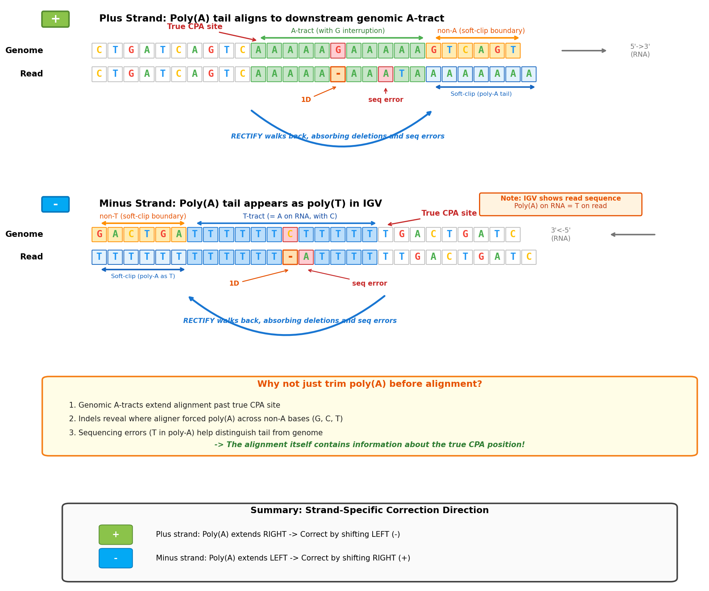
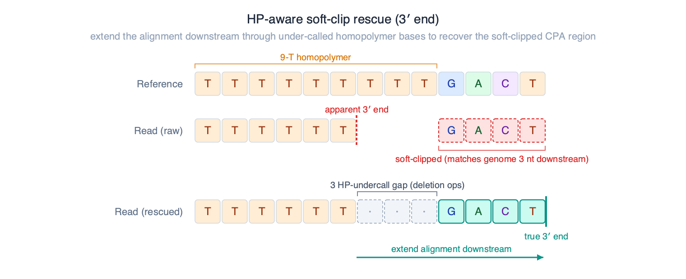
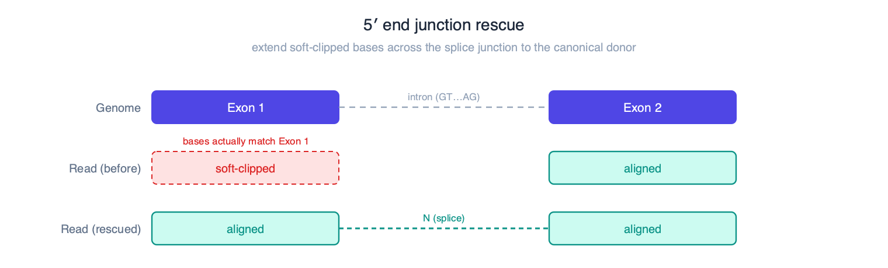
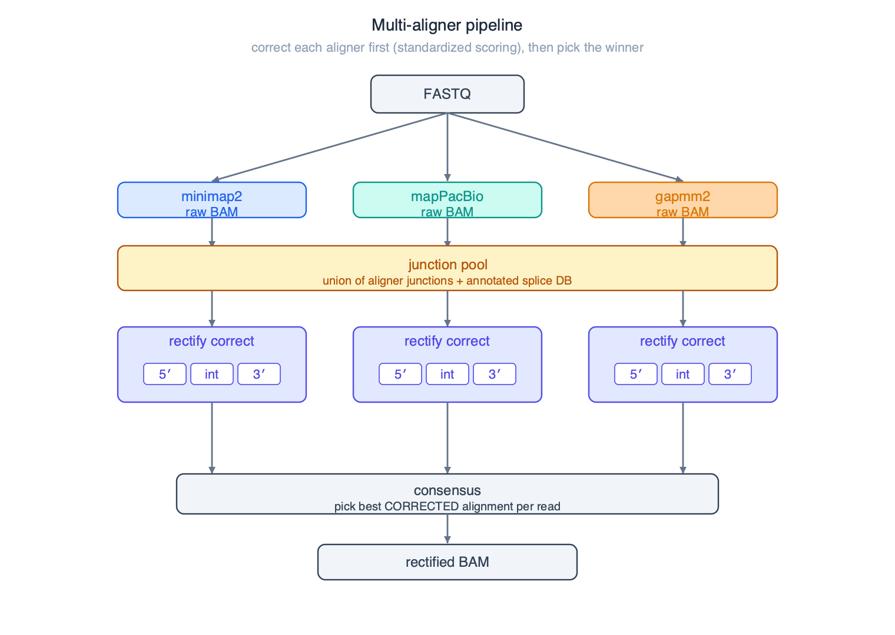
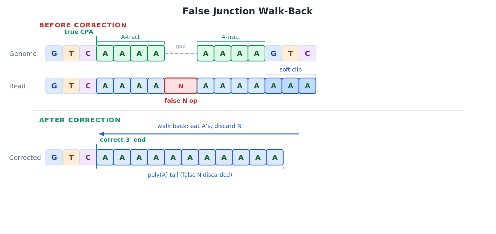
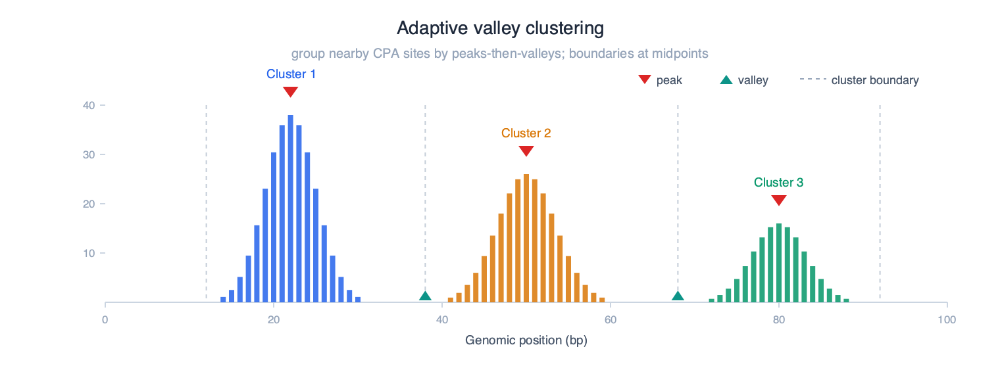
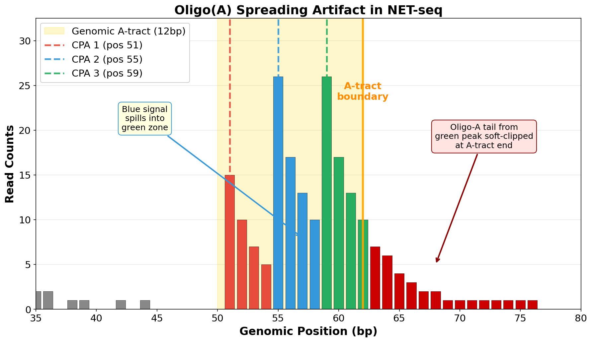

<p align="center">
  <h1 align="center">RECTIFY</h1>
  <p align="center">
    <b>R</b>NA 5' and 3' <b>E</b>nd <b>C</b>orrection <b>T</b>ool with <b>I</b>ntron re<b>F</b>inement and ambiguit<b>Y</b> resolution
  </p>
  <p align="center">
    <a href="https://pypi.org/project/rectify-rna/"></a>
    <a href="https://opensource.org/licenses/MIT"></a>
    <a href="https://www.python.org/downloads/"></a>
  </p>
</p>

Precision transcript structure mapping for direct RNA nanopore sequencing. RECTIFY provides accurate 5' ends, 3' ends, and splice junctions through multi-aligner consensus, artifact correction, and optional NET-seq refinement. Analysis of Nascent Elongating Transcript Sequencing (NET-seq) data reveals evidence of cleavage and polyadenylation (CPA) intermediates — peaks at known CPA sites where approximately half the signal exhibits oligo-adenylated tails — enabling RECTIFY to resolve 3' end positions within genomic A-tracts at nucleotide resolution.

---

## Quick Start

```bash
pip install rectify-rna

# Single sample: alignment → correction (bundled yeast genome — no external files needed)
rectify correct reads.fastq.gz --organism yeast -o corrected.tsv

# Full pipeline on single sample: alignment → correction → analysis
rectify run-all reads.bam --genome genome.fa --annotation genes.gtf --output-dir results/

# Multi-sample manifest mode (parallel correction + combined DESeq2)
rectify run-all --manifest samples.tsv --genome genome.fa --annotation genes.gtf --output-dir results/

# dT-primed cDNA-seq (QuantSeq, etc. — poly(A) is NOT in the read)
rectify correct reads.bam --genome genome.fa --dT-primed-cDNA -o corrected.tsv
```

---

## Key Features

| Feature | Description |
|:--------|:------------|
| **Multi-Aligner Consensus** | Runs minimap2, pbmm2, gapmm2 and selects best junction set per read |
| **5' End Junction Recovery** | Rescues soft-clipped bases by extending alignments through splice junctions |
| **3' End Indel Correction** | Fixes alignment artifacts where poly(A) tails align to genomic A-tracts |
| **3' False Junction Handling** | Walk back correction removes spurious junctions from poly(A) artifacts |
| **Junction Ambiguity Resolution** | Resolves reads matching multiple junctions using proportional assignment |
| **Poly(A) Measurement** | Reports tail length (aligned + soft-clipped) |
| **NET-seq Refinement** | Resolves A-tract ambiguity using nascent RNA data (optional) |
| **Adaptive Clustering** | Groups CPA sites with valley-based algorithm |
| **Dual-Resolution DESeq2** | Gene-level and cluster-level differential expression |
| **APA Shift Analysis** | Detects proximal/distal CPA site usage changes |
| **Visualization** | Metagene plots, genome browser figures (`pip install rectify-rna[visualize]`) |

**Bundled data for yeast:** For *S. cerevisiae*, RECTIFY includes the S288C genome, SGD annotations, GO terms, WT NET-seq data, and 64K pre-computed A-tract CPA sites — no external files needed.

---

## How It Works

### 3' End Indel Correction

After pre-trimming removes the poly(A) tail, reads that terminate within genomic A-tracts can extend past the true cleavage site — aligners introduce deletions and mismatches to maximize alignment into the A-rich region. RECTIFY walks back from the apparent 3' end, skipping aligned A's, deletions, and T sequencing errors, stopping at the first non-A genomic base with a matching read base to recover the true CPA position.

<p align="center">
  
</p>

### Soft-Clip Rescue at Homopolymer Boundaries

Nanopore basecallers systematically under-call homopolymer runs. When this happens at CPA sites with upstream T-tracts, the aligner soft-clips non-T bases instead of placing them correctly. RECTIFY skips over remaining reference homopolymer bases and matches the soft-clipped sequence to the downstream reference.

<p align="center">
  
</p>

### 5' End Correction

Long reads spanning splice junctions often have soft-clipped bases at the 5' end. These bases actually match the upstream exon, but the aligner couldn't extend through the junction. RECTIFY identifies these reads, checks for upstream exon matches, and extends the alignment to the canonical splice donor.

<p align="center">
  
</p>

> **Note:** Due to 5'-to-3' degradation in direct RNA sequencing, the read's 5' end often does not represent the true TSS.

### Multi-Aligner Consensus

Different aligners make different tradeoffs at splice junctions. RECTIFY runs three aligners (minimap2, mapPacBio, gapmm2) in parallel and applies full correction (`rectify correct`) to each independently. A consensus step then selects the best corrected result per read using a priority order (5' rescued > confidence > 3' agreement > span > n_junctions). Optionally, chimeric reconstruction stitches complementary junction sets from different aligners to recover junctions that no single aligner found.

<p align="center">
  
</p>

```bash
# Multi-aligner consensus alignment (default)
rectify align reads.fastq.gz --genome genome.fa --annotation genes.gff -o aligned.bam

# Single aligner mode (faster, less accurate)
rectify align reads.fastq.gz --genome genome.fa --aligner minimap2 -o aligned.bam
```

### 3' False Junction Handling

Poly(A) tails can create spurious "junctions" when the aligner introduces a skip (N) operation to align tail bases to a downstream A-tract. The walk back algorithm handles this automatically — it eats through all aligned A's and discards any N operations it encounters, finding the true CPA site without needing special false junction detection.

<p align="center">
  
</p>

### Adaptive Clustering and Differential Expression

After correction, RECTIFY groups nearby CPA sites into clusters using a valley-based algorithm (find peaks → find valleys → set boundaries), then runs DESeq2 at both gene and cluster resolution. Cluster-level analysis detects isoform-specific changes that gene-level analysis misses.

<p align="center">
  
</p>

| Level | Detects | Example |
|:------|:--------|:--------|
| **Gene** | Total expression changes | HSP82 is 2-fold down in heat shock |
| **Cluster** | CPA site usage changes | FAS1 shifts from distal to proximal site |

---

## NET-seq Refinement

Nascent Elongating Transcript Sequencing (NET-seq) captures RNA polymerase II–associated transcripts at nucleotide resolution, providing direct evidence of cleavage and polyadenylation (CPA) intermediates. At known CPA sites, NET-seq signal peaks with approximately half of the reads exhibiting short oligo-adenylated tails, corresponding to the early, distributive phase of adenylation by poly(A) polymerase before processive elongation to full-length tails. This signature confirms that CPA intermediates are captured as nascent transcripts and provides ground-truth positions for resolving 3' end ambiguity within genomic A-tracts.

However, these oligo(A) tails (typically 1–12 nt) cause the observed NET-seq signal to spread downstream of the true cleavage site, proportional to the local A-tract length. RECTIFY uses NNLS deconvolution with a point-spread function derived from 5000+ zero-A sites to recover true CPA positions.

<p align="center">
  
</p>

<p align="center">
  
</p>

Bundled WT NET-seq data for yeast is auto-detected. For other organisms or mutant conditions, provide NET-seq bigWigs with `--netseq-dir`.

```bash
# Use bundled yeast NET-seq to improve DRS 3' end resolution in A-tracts
rectify correct reads.bam --organism yeast -o corrected.tsv  # NET-seq auto-detected

# Use custom NET-seq data for A-tract deconvolution
rectify correct reads.bam --genome genome.fa --netseq-dir my_netseq/ -o corrected.tsv

# Process your own NET-seq BAM (extract 3' ends, build deconvolution profiles)
rectify netseq input.bam --genome genome.fa --gff genes.gff -o output/

# With exclusion region control
rectify netseq input.bam --genome genome.fa --gff genes.gff \
    --include-rdna --include-pol3 --exclude-mito -o output/
```

---

## Output

Each read gets a corrected position with confidence scores:

```
read_id   │ chrom │ strand │ original │ corrected │ shift │ confidence │ polya_len │ qc_flags
read001   │ chrI  │   +    │  147592  │   147585  │  -7   │    HIGH    │    42     │   PASS
read002   │ chrI  │   +    │  147594  │   147591  │  -3   │   MEDIUM   │    38     │   PASS
read003   │ chrII │   +    │  283109  │   283104  │  -5   │    LOW     │    31     │ AG_RICH
```

The `rectify analyze` command produces: `clusters.tsv` (CPA site clusters with read counts), `deseq2_gene_results.tsv` and `deseq2_cluster_results.tsv` (differential expression at both resolutions), `shift_results.tsv` (genes with significant APA shifts), `go_enrichment.tsv` (GO enrichment), and `motif_results/` (enriched sequence motifs near CPA sites).

---

## Installation

```bash
# PyPI
pip install rectify-rna

# With visualization support
pip install rectify-rna[visualize]

# Conda (includes MEME Suite for motif discovery)
conda install -c conda-forge -c bioconda rectify-rna
```

---

## Commands

| Command | Description |
|:--------|:------------|
| `rectify run-all` | Full pipeline with manifest support, provenance tracking, and step-skip logic |
| `rectify correct` | Correct 3' end positions (indel correction, A-tract resolution) |
| `rectify align` | Align FASTQ with multi-aligner consensus (Tier 1: minimap2 + mapPacBio + gapmm2; Tier 2: deSALT + uLTRA; `--short-read`: bbmap + bwa) |
| `rectify analyze` | Downstream analysis (clustering, DESeq2, GO, motifs) |
| `rectify export` | Export corrected positions to bigWig/bedGraph tracks |
| `rectify extract` | Extract per-read info from BAM to TSV (5'/3' ends, junctions) |
| `rectify aggregate` | Aggregate reads into 3' end, 5' end, and junction datasets |
| `rectify netseq` | Resolve CPA site ambiguity within A-tracts using NET-seq nascent RNA data |
| `rectify trim-polya` | Pre-trim poly(A) tail and adapter from Dorado DRS BAMs (Step 0) |
| `rectify tag-polya` | Annotate BAM reads with poly(A) model scores (pt_tag, polya_score, polya_source) |
| `rectify validate` | Validate corrected 3' ends against NET-seq or known CPA sites |
| `rectify restore-softclip` | Restore poly(A) tail as soft-clips after correction (Step 4, DRS only) |
| `rectify train-polya` | Train a poly(A) tail model from control data |
| `rectify batch` | Generate and submit SLURM/PBS/SGE array jobs for parallel correction |
| `rectify split` | Chunk FASTQ into N equal parts for SLURM array alignment |
| `rectify consensus` | Select best aligner per read from pre-built per-aligner BAMs |
| `rectify install-aligners` | Download and compile external aligners (minimap2, mapPacBio, deSALT, uLTRA) |

<details>
<summary><b>Usage examples</b></summary>

```bash
# Correct 3' ends — direct RNA nanopore (bundled yeast genome)
rectify correct reads.fastq.gz --organism yeast -o corrected.tsv

# Correct 3' ends — dT-primed cDNA-seq (QuantSeq, etc.)
rectify correct reads.bam --genome genome.fa --dT-primed-cDNA -o corrected.tsv

# Correct with custom genome and NET-seq for A-tract resolution
rectify correct reads.bam --genome genome.fa --netseq-dir my_netseq/ -o corrected.tsv

# Multi-sample manifest mode
rectify run-all --manifest samples.tsv --genome genome.fa --annotation genes.gtf --output-dir results/

# Extract per-read features from BAM
rectify extract reads.bam -o reads.tsv --genome genome.fa --annotation genes.gff

# Aggregate into 3'/5'/junction datasets
rectify aggregate reads.bam -o aggregated/ --annotation genes.gff --mode all

# Differential expression analysis
rectify analyze corrected.tsv --annotation genes.gtf --output-dir results/

# Export bigWig tracks
rectify export corrected.tsv -o tracks/ --genome genome.fa
```

</details>

---

## Supported Technologies

Nanopore direct RNA-seq · QuantSeq (oligo-dT short-read) · PacBio Iso-Seq · NET-seq · Any poly(A)-tailed RNA-seq

---

## Citation

> Roy KR, Chanfreau GF. Robust mapping of polyadenylated and non-polyadenylated RNA 3' ends at nucleotide resolution by 3'-end sequencing. *Methods*. 2020;176:4-13. [PMID: 31128237](https://pubmed.ncbi.nlm.nih.gov/31128237/)

**RECTIFY 2.0:** Manuscript in preparation.

---

## License

MIT — see [LICENSE](LICENSE) for details.

## Contact

Kevin R. Roy — [kevinrjroy@gmail.com](mailto:kevinrjroy@gmail.com) · GitHub: [k-roy/RECTIFY](https://github.com/k-roy/RECTIFY)
