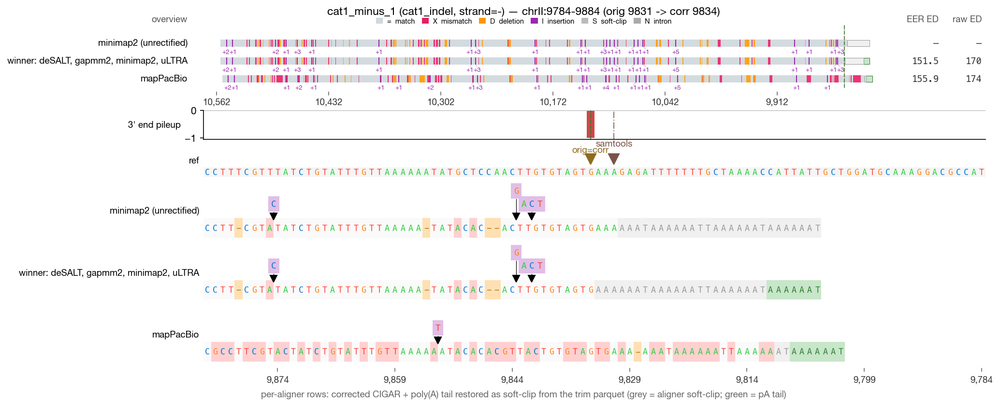
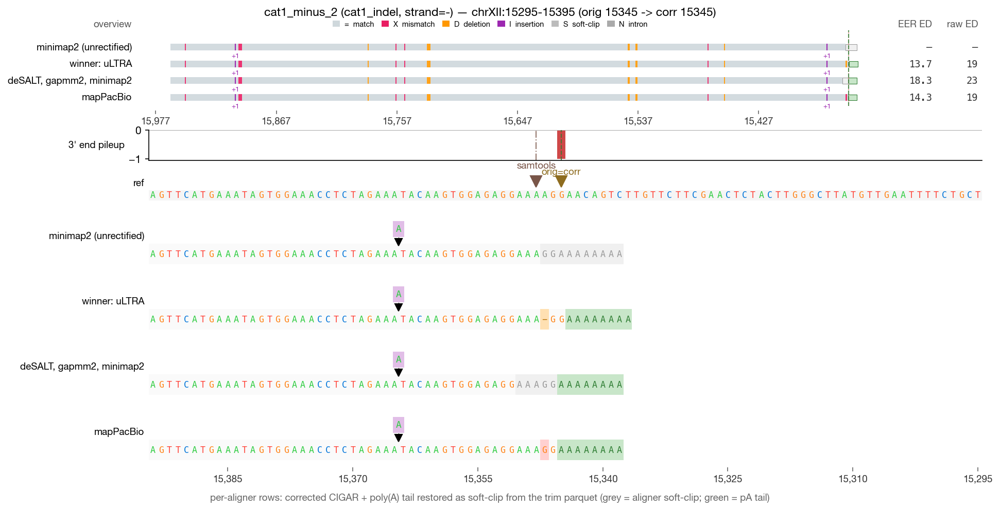
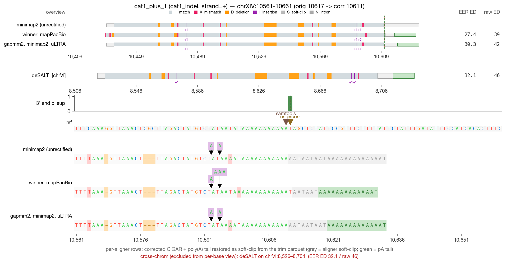
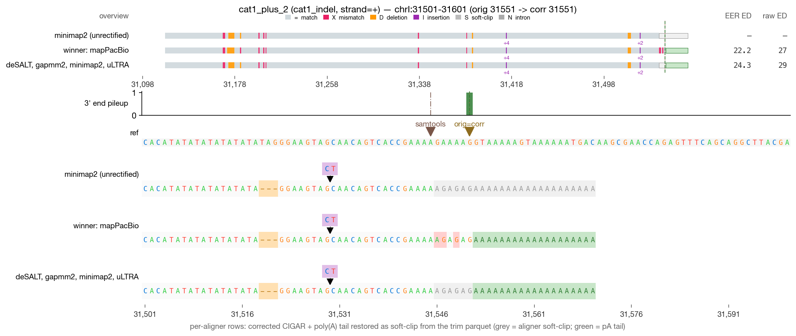

# RECTIFY DRS validation — cat1_indel (4 reads)

_Generated 2026-05-19 09:44 · 4 reads across 1 category_

> **Leftmost-possible-CPA principle** — in mature mRNA, the boundary between genomic A's and post-transcriptionally added poly(A) is irrecoverably lost. RECTIFY's walkback anchors at the first non-stop read=ref agreement walking inward from the alignment 3′ edge. When NET-seq is available, `rectify correct --netseq-dir` pins the corrected 3′ within that ambiguity window.

## Jump to read

- **cat1_indel** — [cat1_minus_1](#cat1_minus_1) · [cat1_minus_2](#cat1_minus_2) · [cat1_plus_1](#cat1_plus_1) · [cat1_plus_2](#cat1_plus_2)

---

## cat1_minus_1  — cat1_indel

| field | value |
| --- | --- |
| read_id | `77b392d9-d80a-4f7c-be62-4dbb854857bc` |
| category | cat1_indel |
| strand | - |
| aligner shown | minimap2 |
| chrom | chrII |
| locus shown | chrII:9784-9884 |
| alignment span | [9831, 10558) |
| 5′ position | 10557 |
| original 3′ | 9831 |
| corrected 3′ | 9834 |
| shift (corr − orig) | **+3 bp** |
| correction_applied | `atract_ambiguity,polya_walkback` |

**What RECTIFY did for this read**

*3 bp downstream shift.* The walkback moved the 3' end from the aligner's original position to the leftmost-possible-CPA by absorbing 3 bp of poly-A artifact.

- **A-tract ambiguity window detected** — the genome at the 3' end contains a poly-A homopolymer; the walkback's leftmost-possible-CPA principle applies.

- **Module 2E (poly-A walkback)** fired — walked back through poly-A stop-base matches until finding the first non-stop read=ref agreement = leftmost-possible-CPA.

**What to verify visually**

> Indel correction: terminal poly-A indel artifact in the aligner output. The walkback should anchor at the leftmost-possible-CPA = first non-A read=ref match. Verify the genome at the corrected_3prime position is a non-A and there's an A-tract starting one base to its right.

_Reviewer notes:_ [ ] OK   [ ] flag — note here

---

## cat1_minus_2  — cat1_indel

| field | value |
| --- | --- |
| read_id | `34ba198b-3138-4d51-b7e5-964e39036315` |
| category | cat1_indel |
| strand | - |
| aligner shown | minimap2 |
| chrom | chrXII |
| locus shown | chrXII:15295-15395 |
| alignment span | [15345, 15964) |
| 5′ position | 15963 |
| original 3′ | 15345 |
| corrected 3′ | 15345 |
| shift (corr − orig) | 0 bp (zero-shift) |
| correction_applied | `indel_correction` |

**What RECTIFY did for this read**

*Zero-shift correction.* The terminal alignment position was already at the leftmost-possible-CPA; the listed module(s) verified this but did not move the 3' end.

- **Module 2C (indel correction)** fired — the aligner had introduced indels in the terminal alignment over the poly-A region; the walkback recognized the homopolymer context and resolved the read=ref anchor.

**What to verify visually**

> Indel correction: terminal poly-A indel artifact in the aligner output. The walkback should anchor at the leftmost-possible-CPA = first non-A read=ref match. Verify the genome at the corrected_3prime position is a non-A and there's an A-tract starting one base to its right.

_Reviewer notes:_ [ ] OK   [ ] flag — note here

---

## cat1_plus_1  — cat1_indel

| field | value |
| --- | --- |
| read_id | `0cb5a111-14c7-4b46-82a9-1f1d806d2ccc` |
| category | cat1_indel |
| strand | + |
| aligner shown | minimap2 |
| chrom | chrXIV |
| locus shown | chrXIV:10561-10661 |
| alignment span | [10429, 10618) |
| 5′ position | 10429 |
| original 3′ | 10617 |
| corrected 3′ | 10611 |
| shift (corr − orig) | **-6 bp** |
| correction_applied | `polya_walkback` |

**What RECTIFY did for this read**

*6 bp upstream shift.* The walkback moved the 3' end from the aligner's original position to the leftmost-possible-CPA by absorbing 6 bp of poly-A artifact.

- **Module 2E (poly-A walkback)** fired — walked back through poly-A stop-base matches until finding the first non-stop read=ref agreement = leftmost-possible-CPA.

**What to verify visually**

> Indel correction: terminal poly-A indel artifact in the aligner output. The walkback should anchor at the leftmost-possible-CPA = first non-A read=ref match. Verify the genome at the corrected_3prime position is a non-A and there's an A-tract starting one base to its right.

_Reviewer notes:_ [ ] OK   [ ] flag — note here

---

## cat1_plus_2  — cat1_indel

| field | value |
| --- | --- |
| read_id | `a146838d-8fbd-4aec-af8d-b7082e337195` |
| category | cat1_indel |
| strand | + |
| aligner shown | minimap2 |
| chrom | chrI |
| locus shown | chrI:31501-31601 |
| alignment span | [31118, 31552) |
| 5′ position | 31118 |
| original 3′ | 31551 |
| corrected 3′ | 31551 |
| shift (corr − orig) | 0 bp (zero-shift) |
| correction_applied | `none` |

**What RECTIFY did for this read**

*Zero-shift correction.* The terminal alignment position was already at the leftmost-possible-CPA; the listed module(s) verified this but did not move the 3' end.

- No correction modules fired — the read's terminal alignment was already at a clean read=ref non-A match.

**What to verify visually**

> Indel correction: terminal poly-A indel artifact in the aligner output. The walkback should anchor at the leftmost-possible-CPA = first non-A read=ref match. Verify the genome at the corrected_3prime position is a non-A and there's an A-tract starting one base to its right.

_Reviewer notes:_ [ ] OK   [ ] flag — note here
