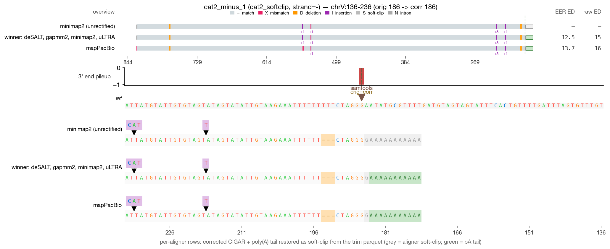
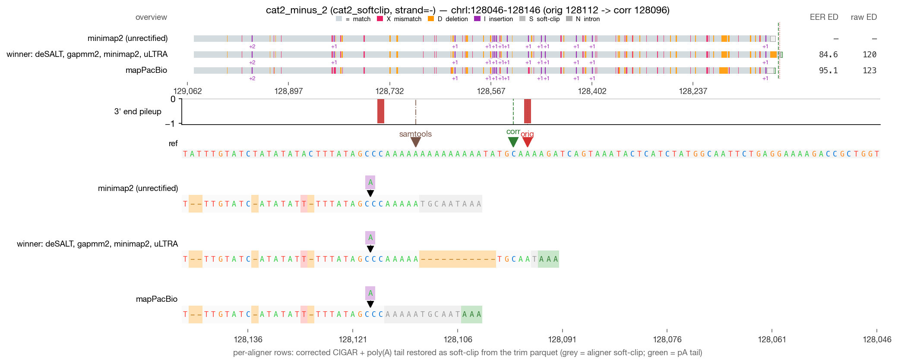
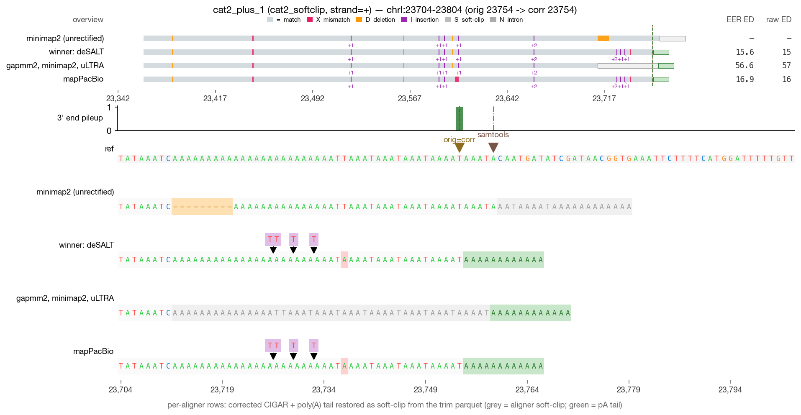
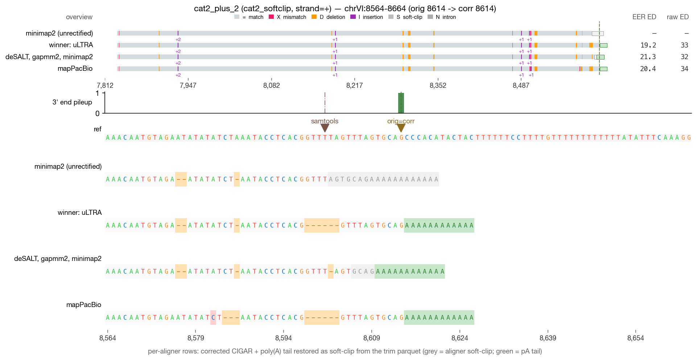

# RECTIFY DRS validation — cat2_softclip (4 reads)

_Generated 2026-05-19 09:44 · 4 reads across 1 category_

> **Leftmost-possible-CPA principle** — in mature mRNA, the boundary between genomic A's and post-transcriptionally added poly(A) is irrecoverably lost. RECTIFY's walkback anchors at the first non-stop read=ref agreement walking inward from the alignment 3′ edge. When NET-seq is available, `rectify correct --netseq-dir` pins the corrected 3′ within that ambiguity window.

## Jump to read

- **cat2_softclip** — [cat2_minus_1](#cat2_minus_1) · [cat2_minus_2](#cat2_minus_2) · [cat2_plus_1](#cat2_plus_1) · [cat2_plus_2](#cat2_plus_2)

---

## cat2_minus_1  — cat2_softclip

| field | value |
| --- | --- |
| read_id | `b313b50d-51ec-4c8d-ba8a-c275f64d55a2` |
| category | cat2_softclip |
| strand | - |
| aligner shown | minimap2 |
| chrom | chrV |
| locus shown | chrV:136-236 |
| alignment span | [186, 829) |
| 5′ position | 828 |
| original 3′ | 186 |
| corrected 3′ | 186 |
| shift (corr − orig) | 0 bp (zero-shift) |
| correction_applied | `none` |

**What RECTIFY did for this read**

*Zero-shift correction.* The terminal alignment position was already at the leftmost-possible-CPA; the listed module(s) verified this but did not move the 3' end.

- No correction modules fired — the read's terminal alignment was already at a clean read=ref non-A match.

**What to verify visually**

> Soft-clip rescue: 3' soft-clip at a homopolymer boundary. RECTIFY extends the alignment outward through the soft-clip, anchoring at the leftmost-possible-CPA. Check that the soft-clip bases in the mapped track are M bases (or restored as 3' soft-clip) in the corrected track.

_Reviewer notes:_ [ ] OK   [ ] flag — note here

---

## cat2_minus_2  — cat2_softclip

| field | value |
| --- | --- |
| read_id | `9dbd37bf-0b48-496d-8894-3f222710dae1` |
| category | cat2_softclip |
| strand | - |
| aligner shown | minimap2 |
| chrom | chrI |
| locus shown | chrI:128046-128146 |
| alignment span | [128112, 129052) |
| 5′ position | 129051 |
| original 3′ | 128112 |
| corrected 3′ | 128096 |
| shift (corr − orig) | **-16 bp** |
| correction_applied | `atract_ambiguity,indel_correction,softclip_rescue` |

**What RECTIFY did for this read**

*16 bp upstream shift.* The walkback moved the 3' end from the aligner's original position to the leftmost-possible-CPA by absorbing 16 bp of poly-A artifact.

- **A-tract ambiguity window detected** — the genome at the 3' end contains a poly-A homopolymer; the walkback's leftmost-possible-CPA principle applies.

- **Module 2C (indel correction)** fired — the aligner had introduced indels in the terminal alignment over the poly-A region; the walkback recognized the homopolymer context and resolved the read=ref anchor.

- **Module 2G (soft-clip rescue at homopolymer)** fired — a 3' soft-clip adjacent to a genomic homopolymer was extended outward, re-anchoring the 3' end at the leftmost-possible-CPA.

**What to verify visually**

> Soft-clip rescue: 3' soft-clip at a homopolymer boundary. RECTIFY extends the alignment outward through the soft-clip, anchoring at the leftmost-possible-CPA. Check that the soft-clip bases in the mapped track are M bases (or restored as 3' soft-clip) in the corrected track.

_Reviewer notes:_ [ ] OK   [ ] flag — note here

---

## cat2_plus_1  — cat2_softclip

| field | value |
| --- | --- |
| read_id | `61b0c014-cd11-49a3-8518-c949d91a4e70` |
| category | cat2_softclip |
| strand | + |
| aligner shown | minimap2 |
| chrom | chrI |
| locus shown | chrI:23704-23804 |
| alignment span | [23362, 23755) |
| 5′ position | 23362 |
| original 3′ | 23754 |
| corrected 3′ | 23754 |
| shift (corr − orig) | 0 bp (zero-shift) |
| correction_applied | `none` |

**What RECTIFY did for this read**

*Zero-shift correction.* The terminal alignment position was already at the leftmost-possible-CPA; the listed module(s) verified this but did not move the 3' end.

- No correction modules fired — the read's terminal alignment was already at a clean read=ref non-A match.

**What to verify visually**

> Soft-clip rescue: 3' soft-clip at a homopolymer boundary. RECTIFY extends the alignment outward through the soft-clip, anchoring at the leftmost-possible-CPA. Check that the soft-clip bases in the mapped track are M bases (or restored as 3' soft-clip) in the corrected track.

_Reviewer notes:_ [ ] OK   [ ] flag — note here

---

## cat2_plus_2  — cat2_softclip

| field | value |
| --- | --- |
| read_id | `88953e9c-7c5b-4a75-8324-e60b6d358be0` |
| category | cat2_softclip |
| strand | + |
| aligner shown | minimap2 |
| chrom | chrVI |
| locus shown | chrVI:8564-8664 |
| alignment span | [7832, 8615) |
| 5′ position | 7832 |
| original 3′ | 8614 |
| corrected 3′ | 8614 |
| shift (corr − orig) | 0 bp (zero-shift) |
| correction_applied | `none` |

**What RECTIFY did for this read**

*Zero-shift correction.* The terminal alignment position was already at the leftmost-possible-CPA; the listed module(s) verified this but did not move the 3' end.

- No correction modules fired — the read's terminal alignment was already at a clean read=ref non-A match.

**What to verify visually**

> Soft-clip rescue: 3' soft-clip at a homopolymer boundary. RECTIFY extends the alignment outward through the soft-clip, anchoring at the leftmost-possible-CPA. Check that the soft-clip bases in the mapped track are M bases (or restored as 3' soft-clip) in the corrected track.

_Reviewer notes:_ [ ] OK   [ ] flag — note here
