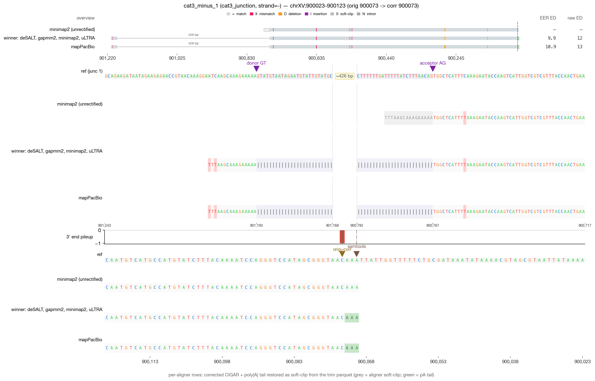
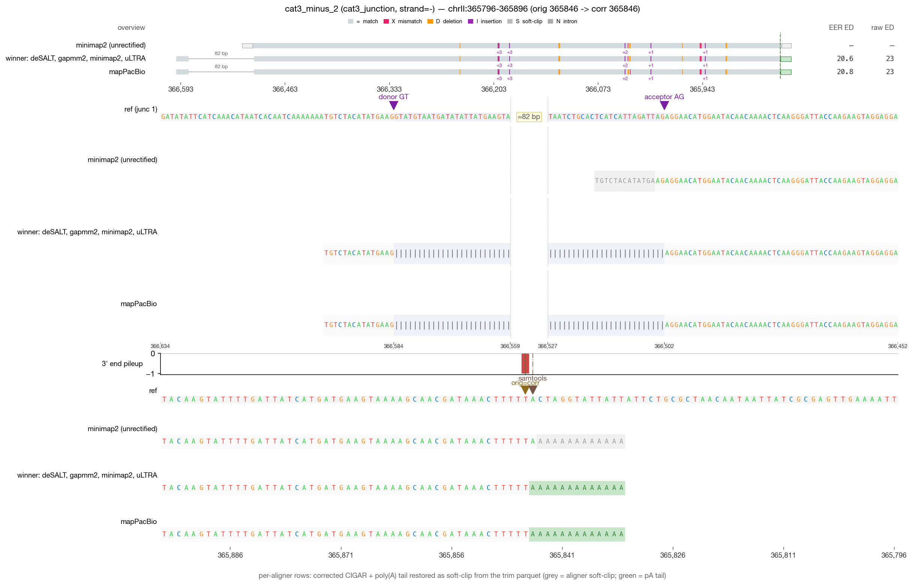
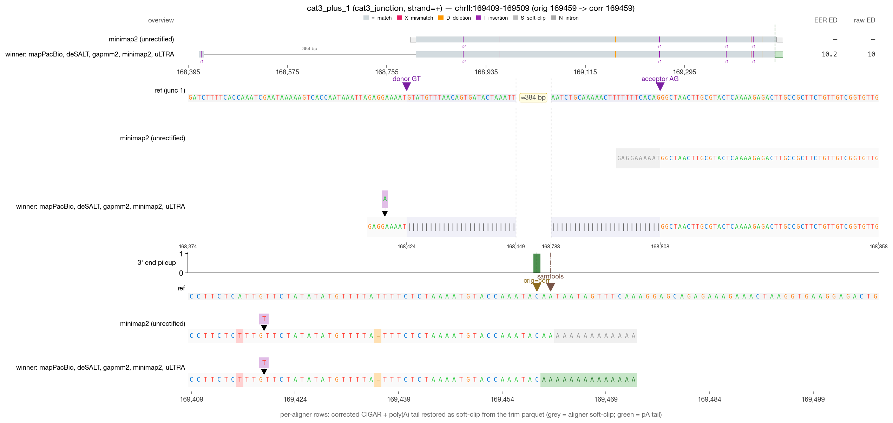
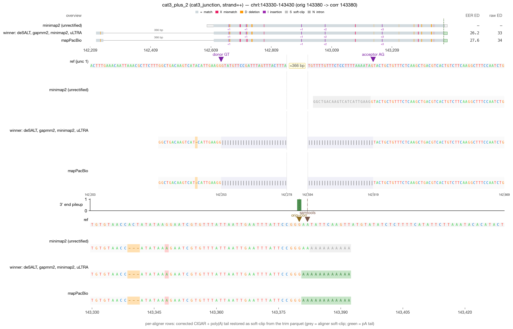

# RECTIFY DRS validation — cat3_junction (4 reads)

_Generated 2026-05-19 09:44 · 4 reads across 1 category_

> **Leftmost-possible-CPA principle** — in mature mRNA, the boundary between genomic A's and post-transcriptionally added poly(A) is irrecoverably lost. RECTIFY's walkback anchors at the first non-stop read=ref agreement walking inward from the alignment 3′ edge. When NET-seq is available, `rectify correct --netseq-dir` pins the corrected 3′ within that ambiguity window.

## Jump to read

- **cat3_junction** — [cat3_minus_1](#cat3_minus_1) · [cat3_minus_2](#cat3_minus_2) · [cat3_plus_1](#cat3_plus_1) · [cat3_plus_2](#cat3_plus_2)

---

## cat3_minus_1  — cat3_junction

| field | value |
| --- | --- |
| read_id | `ac4db6da-93db-4335-801f-b3598d294222` |
| category | cat3_junction |
| strand | - |
| aligner shown | minimap2 |
| chrom | chrXV |
| locus shown | chrXV:900023-900123 |
| alignment span | [900073, 900767) |
| 5′ position | 901193 |
| original 3′ | 900073 |
| corrected 3′ | 900073 |
| shift (corr − orig) | 0 bp (zero-shift) |
| correction_applied | `five_prime_rescued` |

**What RECTIFY did for this read**

*Zero-shift correction.* The terminal alignment position was already at the leftmost-possible-CPA; the listed module(s) verified this but did not move the 3' end.

- **5' junction rescue** fired — a leading soft-clip in the mapped track was extended through an annotated splice junction into the upstream exon.

**What to verify visually**

> 5' junction rescue: leading soft-clip in the mapped track gets extended back through an annotated splice junction into the upstream exon. The corrected track should show M ops where the mapped track had soft-clip.

_Reviewer notes:_ [ ] OK   [ ] flag — note here

---

## cat3_minus_2  — cat3_junction

| field | value |
| --- | --- |
| read_id | `28ea9379-1518-42f6-94ac-b00709b37b39` |
| category | cat3_junction |
| strand | - |
| aligner shown | minimap2 |
| chrom | chrII |
| locus shown | chrII:365796-365896 |
| alignment span | [365846, 366504) |
| 5′ position | 366584 |
| original 3′ | 365846 |
| corrected 3′ | 365846 |
| shift (corr − orig) | 0 bp (zero-shift) |
| correction_applied | `five_prime_rescued` |

**What RECTIFY did for this read**

*Zero-shift correction.* The terminal alignment position was already at the leftmost-possible-CPA; the listed module(s) verified this but did not move the 3' end.

- **5' junction rescue** fired — a leading soft-clip in the mapped track was extended through an annotated splice junction into the upstream exon.

**What to verify visually**

> 5' junction rescue: leading soft-clip in the mapped track gets extended back through an annotated splice junction into the upstream exon. The corrected track should show M ops where the mapped track had soft-clip.

_Reviewer notes:_ [ ] OK   [ ] flag — note here

---

## cat3_plus_1  — cat3_junction

| field | value |
| --- | --- |
| read_id | `0a28167d-bb74-4d99-8c12-e4911a01b432` |
| category | cat3_junction |
| strand | + |
| aligner shown | minimap2 |
| chrom | chrII |
| locus shown | chrII:169409-169509 |
| alignment span | [168805, 169460) |
| 5′ position | 168423 |
| original 3′ | 169459 |
| corrected 3′ | 169459 |
| shift (corr − orig) | 0 bp (zero-shift) |
| correction_applied | `five_prime_rescued` |

**What RECTIFY did for this read**

*Zero-shift correction.* The terminal alignment position was already at the leftmost-possible-CPA; the listed module(s) verified this but did not move the 3' end.

- **5' junction rescue** fired — a leading soft-clip in the mapped track was extended through an annotated splice junction into the upstream exon.

**What to verify visually**

> 5' junction rescue: leading soft-clip in the mapped track gets extended back through an annotated splice junction into the upstream exon. The corrected track should show M ops where the mapped track had soft-clip.

_Reviewer notes:_ [ ] OK   [ ] flag — note here

---

## cat3_plus_2  — cat3_junction

| field | value |
| --- | --- |
| read_id | `79f61403-cf63-4522-b555-569590dc4304` |
| category | cat3_junction |
| strand | + |
| aligner shown | minimap2 |
| chrom | chrI |
| locus shown | chrI:143330-143430 |
| alignment span | [142618, 143381) |
| 5′ position | 142252 |
| original 3′ | 143380 |
| corrected 3′ | 143380 |
| shift (corr − orig) | 0 bp (zero-shift) |
| correction_applied | `five_prime_rescued` |

**What RECTIFY did for this read**

*Zero-shift correction.* The terminal alignment position was already at the leftmost-possible-CPA; the listed module(s) verified this but did not move the 3' end.

- **5' junction rescue** fired — a leading soft-clip in the mapped track was extended through an annotated splice junction into the upstream exon.

**What to verify visually**

> 5' junction rescue: leading soft-clip in the mapped track gets extended back through an annotated splice junction into the upstream exon. The corrected track should show M ops where the mapped track had soft-clip.

_Reviewer notes:_ [ ] OK   [ ] flag — note here
