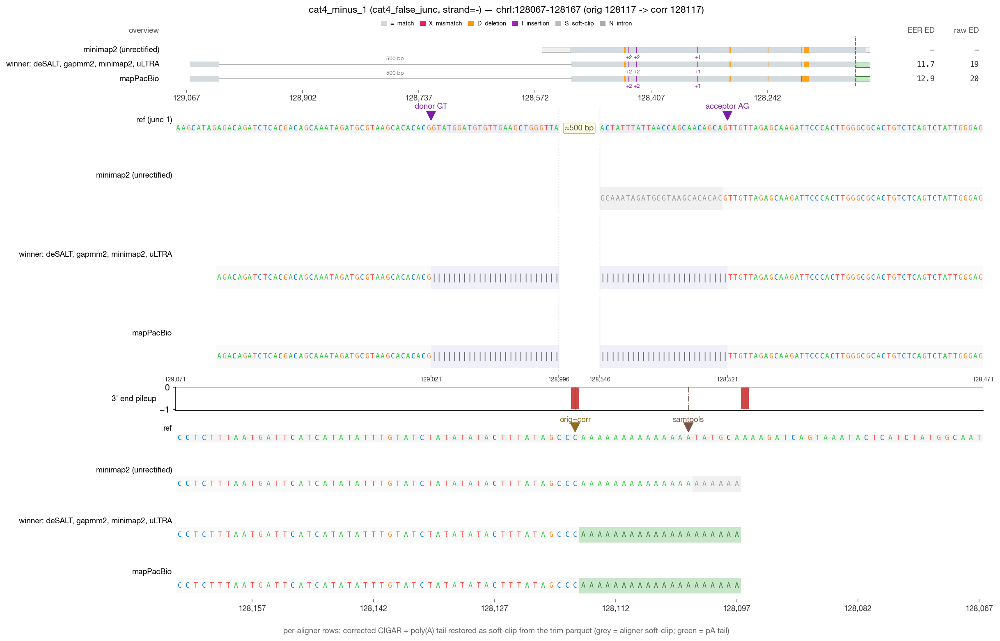
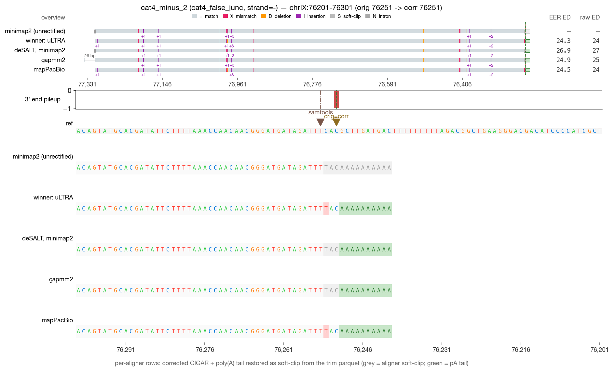
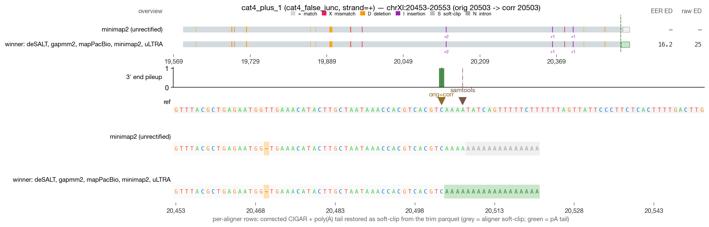
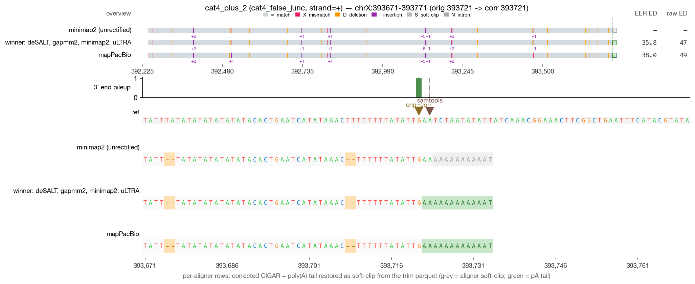

# RECTIFY DRS validation — cat4_false_junc (4 reads)

_Generated 2026-05-19 09:44 · 4 reads across 1 category_

> **Leftmost-possible-CPA principle** — in mature mRNA, the boundary between genomic A's and post-transcriptionally added poly(A) is irrecoverably lost. RECTIFY's walkback anchors at the first non-stop read=ref agreement walking inward from the alignment 3′ edge. When NET-seq is available, `rectify correct --netseq-dir` pins the corrected 3′ within that ambiguity window.

## Jump to read

- **cat4_false_junc** — [cat4_minus_1](#cat4_minus_1) · [cat4_minus_2](#cat4_minus_2) · [cat4_plus_1](#cat4_plus_1) · [cat4_plus_2](#cat4_plus_2)

---

## cat4_minus_1  — cat4_false_junc

| field | value |
| --- | --- |
| read_id | `b956f764-64a9-4875-8363-1f6f89225cf9` |
| category | cat4_false_junc |
| strand | - |
| aligner shown | minimap2 |
| chrom | chrI |
| locus shown | chrI:128067-128167 |
| alignment span | [128117, 129063) |
| 5′ position | 129062 |
| original 3′ | 128117 |
| corrected 3′ | 128117 |
| shift (corr − orig) | 0 bp (zero-shift) |
| correction_applied | `none` |

**What RECTIFY did for this read**

*Zero-shift correction.* The terminal alignment position was already at the leftmost-possible-CPA; the listed module(s) verified this but did not move the 3' end.

- No correction modules fired — the read's terminal alignment was already at a clean read=ref non-A match.

**What to verify visually**

> False junction filter: aligner introduces a spurious N-op (false intron) near the 3' end. Walkback should ignore the false junction and land at the leftmost-possible-CPA in the terminal exon.

_Reviewer notes:_ [ ] OK   [ ] flag — note here

---

## cat4_minus_2  — cat4_false_junc

| field | value |
| --- | --- |
| read_id | `a9706bbe-b2b1-485f-ad7c-bec458c3f448` |
| category | cat4_false_junc |
| strand | - |
| aligner shown | minimap2 |
| chrom | chrIX |
| locus shown | chrIX:76201-76301 |
| alignment span | [76251, 77313) |
| 5′ position | 77312 |
| original 3′ | 76251 |
| corrected 3′ | 76251 |
| shift (corr − orig) | 0 bp (zero-shift) |
| correction_applied | `none` |

**What RECTIFY did for this read**

*Zero-shift correction.* The terminal alignment position was already at the leftmost-possible-CPA; the listed module(s) verified this but did not move the 3' end.

- No correction modules fired — the read's terminal alignment was already at a clean read=ref non-A match.

**What to verify visually**

> False junction filter: aligner introduces a spurious N-op (false intron) near the 3' end. Walkback should ignore the false junction and land at the leftmost-possible-CPA in the terminal exon.

_Reviewer notes:_ [ ] OK   [ ] flag — note here

---

## cat4_plus_1  — cat4_false_junc

| field | value |
| --- | --- |
| read_id | `22e25c29-ed88-42f3-8bc8-4d0b8d3b3697` |
| category | cat4_false_junc |
| strand | + |
| aligner shown | minimap2 |
| chrom | chrXI |
| locus shown | chrXI:20453-20553 |
| alignment span | [19589, 20504) |
| 5′ position | 19589 |
| original 3′ | 20503 |
| corrected 3′ | 20503 |
| shift (corr − orig) | 0 bp (zero-shift) |
| correction_applied | `none` |

**What RECTIFY did for this read**

*Zero-shift correction.* The terminal alignment position was already at the leftmost-possible-CPA; the listed module(s) verified this but did not move the 3' end.

- No correction modules fired — the read's terminal alignment was already at a clean read=ref non-A match.

**What to verify visually**

> False junction filter: aligner introduces a spurious N-op (false intron) near the 3' end. Walkback should ignore the false junction and land at the leftmost-possible-CPA in the terminal exon.

_Reviewer notes:_ [ ] OK   [ ] flag — note here

---

## cat4_plus_2  — cat4_false_junc

| field | value |
| --- | --- |
| read_id | `09b04cdd-4573-40cf-95fb-6110595cfc89` |
| category | cat4_false_junc |
| strand | + |
| aligner shown | minimap2 |
| chrom | chrX |
| locus shown | chrX:393671-393771 |
| alignment span | [392246, 393722) |
| 5′ position | 392246 |
| original 3′ | 393721 |
| corrected 3′ | 393721 |
| shift (corr − orig) | 0 bp (zero-shift) |
| correction_applied | `none` |

**What RECTIFY did for this read**

*Zero-shift correction.* The terminal alignment position was already at the leftmost-possible-CPA; the listed module(s) verified this but did not move the 3' end.

- No correction modules fired — the read's terminal alignment was already at a clean read=ref non-A match.

**What to verify visually**

> False junction filter: aligner introduces a spurious N-op (false intron) near the 3' end. Walkback should ignore the false junction and land at the leftmost-possible-CPA in the terminal exon.

_Reviewer notes:_ [ ] OK   [ ] flag — note here
