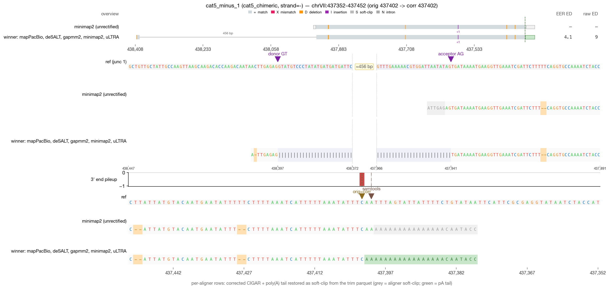
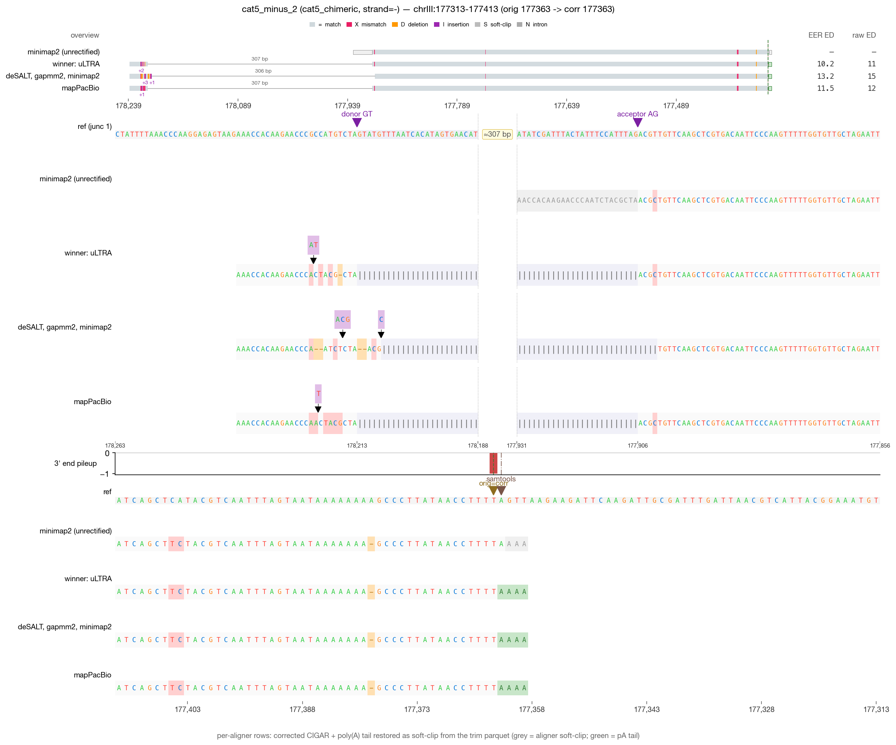
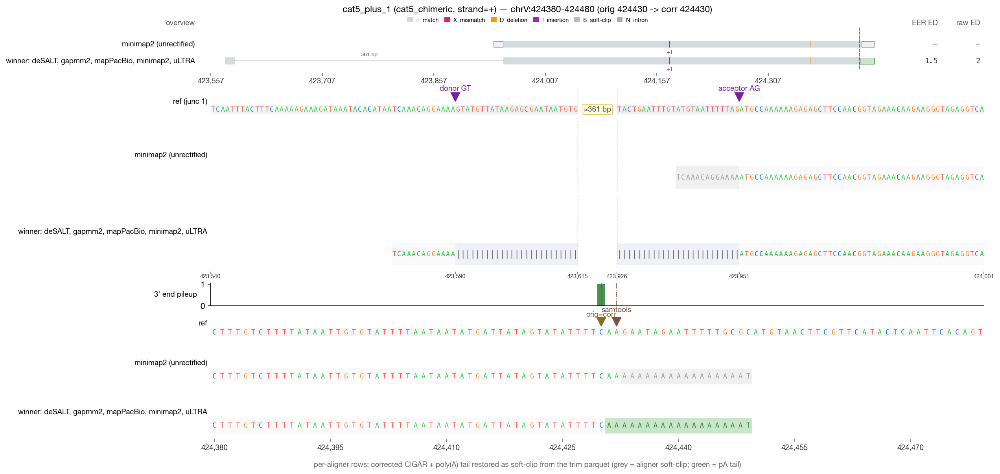
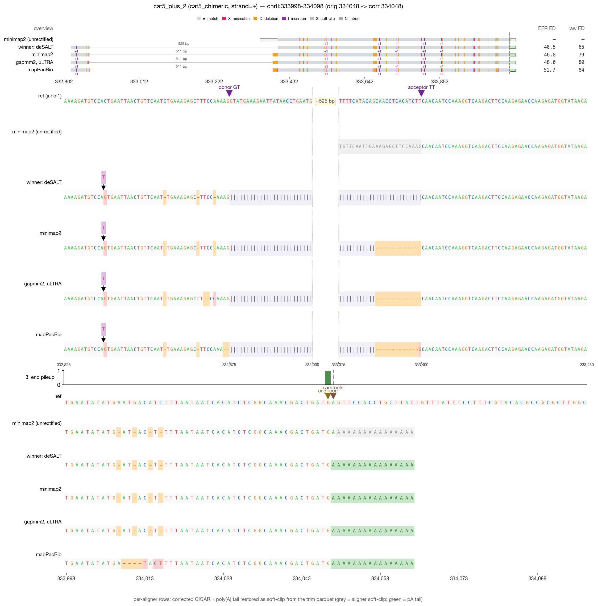

# RECTIFY DRS validation — cat5_chimeric (4 reads)

_Generated 2026-05-19 09:44 · 4 reads across 1 category_

> **Leftmost-possible-CPA principle** — in mature mRNA, the boundary between genomic A's and post-transcriptionally added poly(A) is irrecoverably lost. RECTIFY's walkback anchors at the first non-stop read=ref agreement walking inward from the alignment 3′ edge. When NET-seq is available, `rectify correct --netseq-dir` pins the corrected 3′ within that ambiguity window.

## Jump to read

- **cat5_chimeric** — [cat5_minus_1](#cat5_minus_1) · [cat5_minus_2](#cat5_minus_2) · [cat5_plus_1](#cat5_plus_1) · [cat5_plus_2](#cat5_plus_2)

---

## cat5_minus_1  — cat5_chimeric

| field | value |
| --- | --- |
| read_id | `8f86cb34-2495-4809-9a77-77afbd6c0941` |
| category | cat5_chimeric |
| strand | - |
| aligner shown | minimap2 |
| chrom | chrVII |
| locus shown | chrVII:437352-437452 |
| alignment span | [437402, 437947) |
| 5′ position | 438397 |
| original 3′ | 437402 |
| corrected 3′ | 437402 |
| shift (corr − orig) | 0 bp (zero-shift) |
| correction_applied | `five_prime_rescued` |

**What RECTIFY did for this read**

*Zero-shift correction.* The terminal alignment position was already at the leftmost-possible-CPA; the listed module(s) verified this but did not move the 3' end.

- **5' junction rescue** fired — a leading soft-clip in the mapped track was extended through an annotated splice junction into the upstream exon.

**What to verify visually**

> Chimeric consensus: different aligners disagree on the junction set; consensus stitches the best segments. Look for SA-tagged segments in the mapped track and a clean stitched read in the corrected track.

_Reviewer notes:_ [ ] OK   [ ] flag — note here

---

## cat5_minus_2  — cat5_chimeric

| field | value |
| --- | --- |
| read_id | `02165816-b2c1-4e4b-b344-031ee790f9a6` |
| category | cat5_chimeric |
| strand | - |
| aligner shown | minimap2 |
| chrom | chrIII |
| locus shown | chrIII:177313-177413 |
| alignment span | [177363, 178238) |
| 5′ position | 178237 |
| original 3′ | 177363 |
| corrected 3′ | 177363 |
| shift (corr − orig) | 0 bp (zero-shift) |
| correction_applied | `none` |

**What RECTIFY did for this read**

*Zero-shift correction.* The terminal alignment position was already at the leftmost-possible-CPA; the listed module(s) verified this but did not move the 3' end.

- No correction modules fired — the read's terminal alignment was already at a clean read=ref non-A match.

**What to verify visually**

> Chimeric consensus: different aligners disagree on the junction set; consensus stitches the best segments. Look for SA-tagged segments in the mapped track and a clean stitched read in the corrected track.

_Reviewer notes:_ [ ] OK   [ ] flag — note here

---

## cat5_plus_1  — cat5_chimeric

| field | value |
| --- | --- |
| read_id | `040195ff-7202-4211-81ed-2dd2c9ed06e7` |
| category | cat5_chimeric |
| strand | + |
| aligner shown | minimap2 |
| chrom | chrV |
| locus shown | chrV:424380-424480 |
| alignment span | [423951, 424431) |
| 5′ position | 423589 |
| original 3′ | 424430 |
| corrected 3′ | 424430 |
| shift (corr − orig) | 0 bp (zero-shift) |
| correction_applied | `five_prime_rescued` |

**What RECTIFY did for this read**

*Zero-shift correction.* The terminal alignment position was already at the leftmost-possible-CPA; the listed module(s) verified this but did not move the 3' end.

- **5' junction rescue** fired — a leading soft-clip in the mapped track was extended through an annotated splice junction into the upstream exon.

**What to verify visually**

> Chimeric consensus: different aligners disagree on the junction set; consensus stitches the best segments. Look for SA-tagged segments in the mapped track and a clean stitched read in the corrected track.

_Reviewer notes:_ [ ] OK   [ ] flag — note here

---

## cat5_plus_2  — cat5_chimeric

| field | value |
| --- | --- |
| read_id | `4d1e5c19-6332-442c-a162-0d11e5995370` |
| category | cat5_chimeric |
| strand | + |
| aligner shown | minimap2 |
| chrom | chrII |
| locus shown | chrII:333998-334098 |
| alignment span | [333400, 334049) |
| 5′ position | 332874 |
| original 3′ | 334048 |
| corrected 3′ | 334048 |
| shift (corr − orig) | 0 bp (zero-shift) |
| correction_applied | `five_prime_rescued` |

**What RECTIFY did for this read**

*Zero-shift correction.* The terminal alignment position was already at the leftmost-possible-CPA; the listed module(s) verified this but did not move the 3' end.

- **5' junction rescue** fired — a leading soft-clip in the mapped track was extended through an annotated splice junction into the upstream exon.

**What to verify visually**

> Chimeric consensus: different aligners disagree on the junction set; consensus stitches the best segments. Look for SA-tagged segments in the mapped track and a clean stitched read in the corrected track.

_Reviewer notes:_ [ ] OK   [ ] flag — note here
