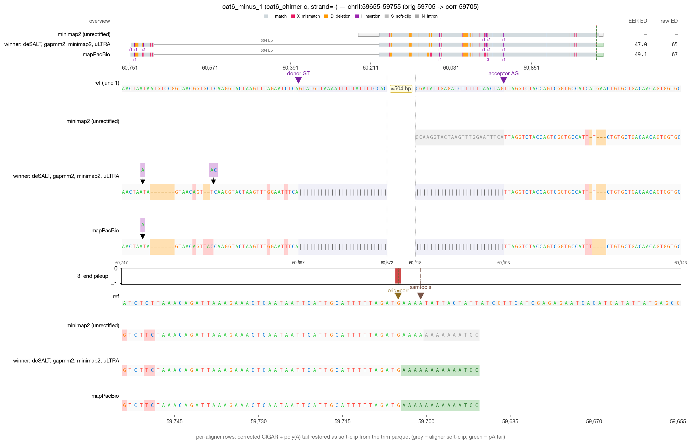
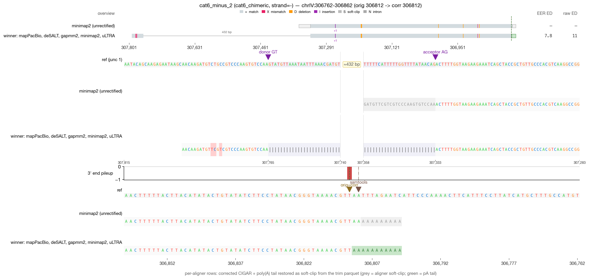
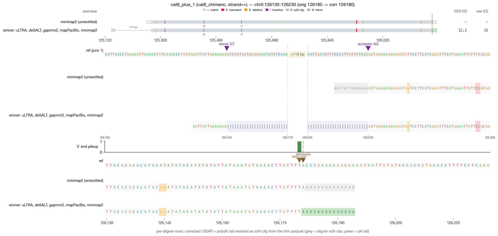
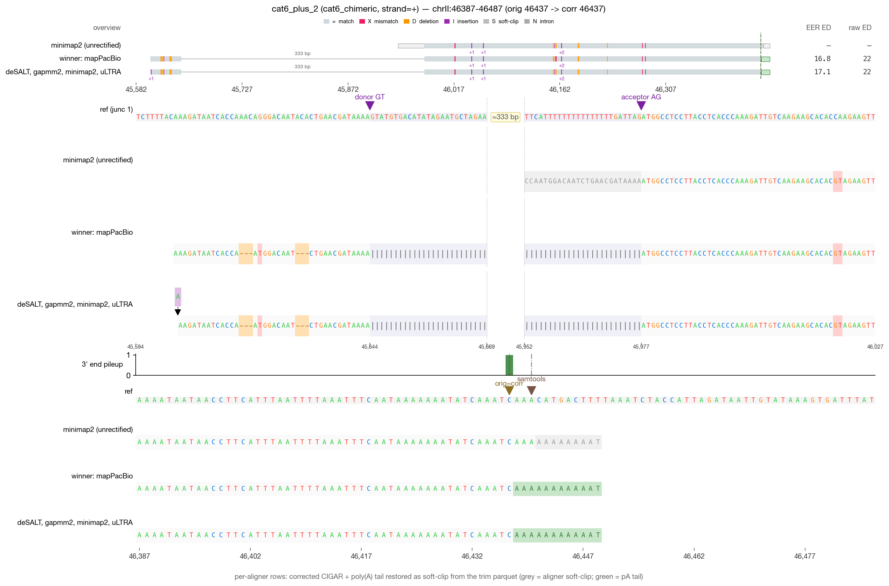

# RECTIFY DRS validation — cat6_chimeric (4 reads)

_Generated 2026-05-19 09:44 · 4 reads across 1 category_

> **Leftmost-possible-CPA principle** — in mature mRNA, the boundary between genomic A's and post-transcriptionally added poly(A) is irrecoverably lost. RECTIFY's walkback anchors at the first non-stop read=ref agreement walking inward from the alignment 3′ edge. When NET-seq is available, `rectify correct --netseq-dir` pins the corrected 3′ within that ambiguity window.

## Jump to read

- **cat6_chimeric** — [cat6_minus_1](#cat6_minus_1) · [cat6_minus_2](#cat6_minus_2) · [cat6_plus_1](#cat6_plus_1) · [cat6_plus_2](#cat6_plus_2)

---

## cat6_minus_1  — cat6_chimeric

| field | value |
| --- | --- |
| read_id | `7d5e8dc2-f72a-4c49-a057-1760984e8fc7` |
| category | cat6_chimeric |
| strand | - |
| aligner shown | mapPacBio |
| chrom | chrII |
| locus shown | chrII:59655-59755 |
| alignment span | [59705, 60193) |
| 5′ position | 60697 |
| original 3′ | 59705 |
| corrected 3′ | 59705 |
| shift (corr − orig) | 0 bp (zero-shift) |
| correction_applied | `five_prime_rescued` |

**What RECTIFY did for this read**

*Zero-shift correction.* The terminal alignment position was already at the leftmost-possible-CPA; the listed module(s) verified this but did not move the 3' end.

- **5' junction rescue** fired — a leading soft-clip in the mapped track was extended through an annotated splice junction into the upstream exon.

**What to verify visually**

> Simple chimeric: shorter chimeric structure, usually one stitch. Same logic as Cat5 but simpler topology.

_Reviewer notes:_ [ ] OK   [ ] flag — note here

---

## cat6_minus_2  — cat6_chimeric

| field | value |
| --- | --- |
| read_id | `322d880c-c14f-4e0e-b7ae-c79c0fc432f3` |
| category | cat6_chimeric |
| strand | - |
| aligner shown | mapPacBio |
| chrom | chrIV |
| locus shown | chrIV:306762-306862 |
| alignment span | [306812, 307795) |
| 5′ position | 307794 |
| original 3′ | 306812 |
| corrected 3′ | 306812 |
| shift (corr − orig) | 0 bp (zero-shift) |
| correction_applied | `none` |

**What RECTIFY did for this read**

*Zero-shift correction.* The terminal alignment position was already at the leftmost-possible-CPA; the listed module(s) verified this but did not move the 3' end.

- No correction modules fired — the read's terminal alignment was already at a clean read=ref non-A match.

**What to verify visually**

> Simple chimeric: shorter chimeric structure, usually one stitch. Same logic as Cat5 but simpler topology.

_Reviewer notes:_ [ ] OK   [ ] flag — note here

---

## cat6_plus_1  — cat6_chimeric

| field | value |
| --- | --- |
| read_id | `875a773c-e73c-40d4-8393-bb5980ffc449` |
| category | cat6_chimeric |
| strand | + |
| aligner shown | mapPacBio |
| chrom | chrII |
| locus shown | chrII:126130-126230 |
| alignment span | [125258, 126181) |
| 5′ position | 125153 |
| original 3′ | 126180 |
| corrected 3′ | 126180 |
| shift (corr − orig) | 0 bp (zero-shift) |
| correction_applied | `five_prime_rescued` |

**What RECTIFY did for this read**

*Zero-shift correction.* The terminal alignment position was already at the leftmost-possible-CPA; the listed module(s) verified this but did not move the 3' end.

- **5' junction rescue** fired — a leading soft-clip in the mapped track was extended through an annotated splice junction into the upstream exon.

**What to verify visually**

> Simple chimeric: shorter chimeric structure, usually one stitch. Same logic as Cat5 but simpler topology.

_Reviewer notes:_ [ ] OK   [ ] flag — note here

---

## cat6_plus_2  — cat6_chimeric

| field | value |
| --- | --- |
| read_id | `f8050895-938f-4998-afd5-504468ad3968` |
| category | cat6_chimeric |
| strand | + |
| aligner shown | mapPacBio |
| chrom | chrII |
| locus shown | chrII:46387-46487 |
| alignment span | [45602, 46438) |
| 5′ position | 45602 |
| original 3′ | 46437 |
| corrected 3′ | 46437 |
| shift (corr − orig) | 0 bp (zero-shift) |
| correction_applied | `none` |

**What RECTIFY did for this read**

*Zero-shift correction.* The terminal alignment position was already at the leftmost-possible-CPA; the listed module(s) verified this but did not move the 3' end.

- No correction modules fired — the read's terminal alignment was already at a clean read=ref non-A match.

**What to verify visually**

> Simple chimeric: shorter chimeric structure, usually one stitch. Same logic as Cat5 but simpler topology.

_Reviewer notes:_ [ ] OK   [ ] flag — note here
