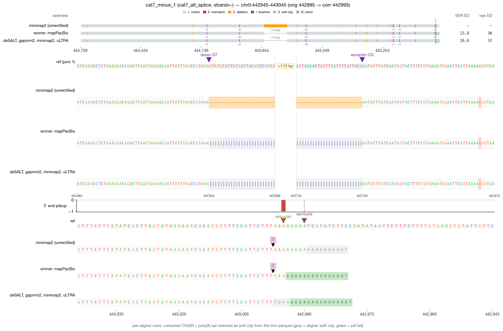
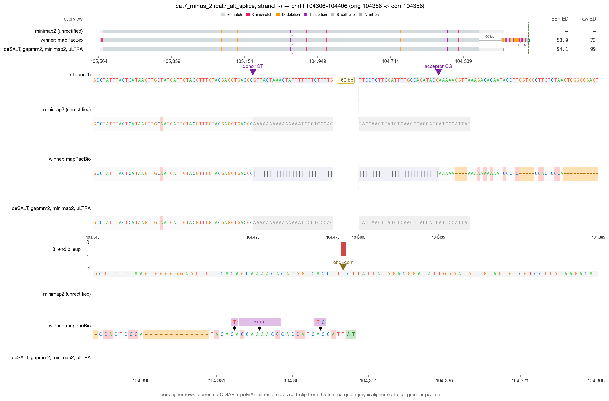
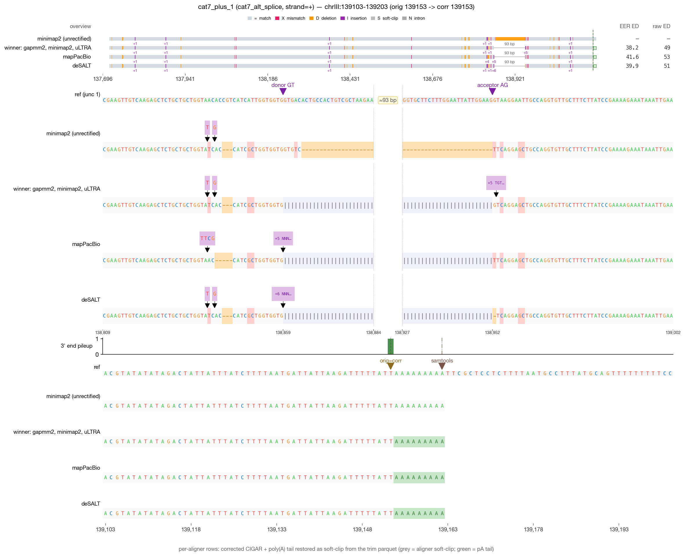
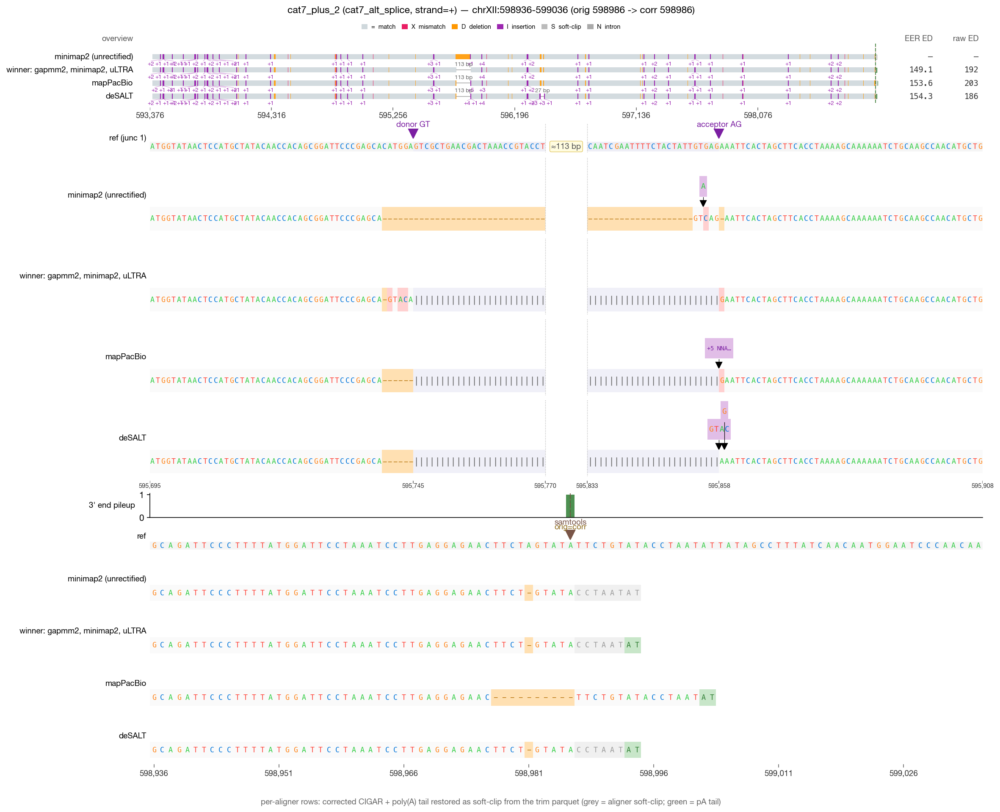

# RECTIFY DRS validation — cat7_alt_splice (4 reads)

_Generated 2026-05-19 09:44 · 4 reads across 1 category_

> **Leftmost-possible-CPA principle** — in mature mRNA, the boundary between genomic A's and post-transcriptionally added poly(A) is irrecoverably lost. RECTIFY's walkback anchors at the first non-stop read=ref agreement walking inward from the alignment 3′ edge. When NET-seq is available, `rectify correct --netseq-dir` pins the corrected 3′ within that ambiguity window.

## Jump to read

- **cat7_alt_splice** — [cat7_minus_1](#cat7_minus_1) · [cat7_minus_2](#cat7_minus_2) · [cat7_plus_1](#cat7_plus_1) · [cat7_plus_2](#cat7_plus_2)

---

## cat7_minus_1  — cat7_alt_splice

| field | value |
| --- | --- |
| read_id | `c79f1fb9-4e28-4186-bd62-955e9c5e4376` |
| category | cat7_alt_splice |
| strand | - |
| aligner shown | mapPacBio |
| chrom | chrII |
| locus shown | chrII:442945-443045 |
| alignment span | [442995, 444727) |
| 5′ position | 444726 |
| original 3′ | 442995 |
| corrected 3′ | 442995 |
| shift (corr − orig) | 0 bp (zero-shift) |
| correction_applied | `indel_correction` |

**What RECTIFY did for this read**

*Zero-shift correction.* The terminal alignment position was already at the leftmost-possible-CPA; the listed module(s) verified this but did not move the 3' end.

- **Module 2C (indel correction)** fired — the aligner had introduced indels in the terminal alignment over the poly-A region; the walkback recognized the homopolymer context and resolved the read=ref anchor.

**What to verify visually**

> Alternative splice: junction boundaries that are off by 1–5 bp from the canonical annotated site. Junction refinement (Module 2H) should adjust to the annotated GT-AG.

_Reviewer notes:_ [ ] OK   [ ] flag — note here

---

## cat7_minus_2  — cat7_alt_splice

| field | value |
| --- | --- |
| read_id | `72557a9a-4446-4e1e-826d-3351dbbc62b4` |
| category | cat7_alt_splice |
| strand | - |
| aligner shown | mapPacBio |
| chrom | chrIII |
| locus shown | chrIII:104306-104406 |
| alignment span | [104356, 105561) |
| 5′ position | 105560 |
| original 3′ | 104356 |
| corrected 3′ | 104356 |
| shift (corr − orig) | 0 bp (zero-shift) |
| correction_applied | `indel_correction` |

**What RECTIFY did for this read**

*Zero-shift correction.* The terminal alignment position was already at the leftmost-possible-CPA; the listed module(s) verified this but did not move the 3' end.

- **Module 2C (indel correction)** fired — the aligner had introduced indels in the terminal alignment over the poly-A region; the walkback recognized the homopolymer context and resolved the read=ref anchor.

**What to verify visually**

> Alternative splice: junction boundaries that are off by 1–5 bp from the canonical annotated site. Junction refinement (Module 2H) should adjust to the annotated GT-AG.

_Reviewer notes:_ [ ] OK   [ ] flag — note here

---

## cat7_plus_1  — cat7_alt_splice

| field | value |
| --- | --- |
| read_id | `4e43165e-e344-4e31-af28-85917c3f4dd7` |
| category | cat7_alt_splice |
| strand | + |
| aligner shown | mapPacBio |
| chrom | chrIII |
| locus shown | chrIII:139103-139203 |
| alignment span | [137716, 139154) |
| 5′ position | 137716 |
| original 3′ | 139153 |
| corrected 3′ | 139153 |
| shift (corr − orig) | 0 bp (zero-shift) |
| correction_applied | `none` |

**What RECTIFY did for this read**

*Zero-shift correction.* The terminal alignment position was already at the leftmost-possible-CPA; the listed module(s) verified this but did not move the 3' end.

- No correction modules fired — the read's terminal alignment was already at a clean read=ref non-A match.

**What to verify visually**

> Alternative splice: junction boundaries that are off by 1–5 bp from the canonical annotated site. Junction refinement (Module 2H) should adjust to the annotated GT-AG.

_Reviewer notes:_ [ ] OK   [ ] flag — note here

---

## cat7_plus_2  — cat7_alt_splice

| field | value |
| --- | --- |
| read_id | `0f021462-4c1f-46ce-bf40-84f78f7717a8` |
| category | cat7_alt_splice |
| strand | + |
| aligner shown | mapPacBio |
| chrom | chrXII |
| locus shown | chrXII:598936-599036 |
| alignment span | [593396, 598987) |
| 5′ position | 593396 |
| original 3′ | 598986 |
| corrected 3′ | 598986 |
| shift (corr − orig) | 0 bp (zero-shift) |
| correction_applied | `atract_ambiguity` |

**What RECTIFY did for this read**

*Zero-shift correction.* The terminal alignment position was already at the leftmost-possible-CPA; the listed module(s) verified this but did not move the 3' end.

- **A-tract ambiguity window detected** — the genome at the 3' end contains a poly-A homopolymer; the walkback's leftmost-possible-CPA principle applies.

**What to verify visually**

> Alternative splice: junction boundaries that are off by 1–5 bp from the canonical annotated site. Junction refinement (Module 2H) should adjust to the annotated GT-AG.

_Reviewer notes:_ [ ] OK   [ ] flag — note here
