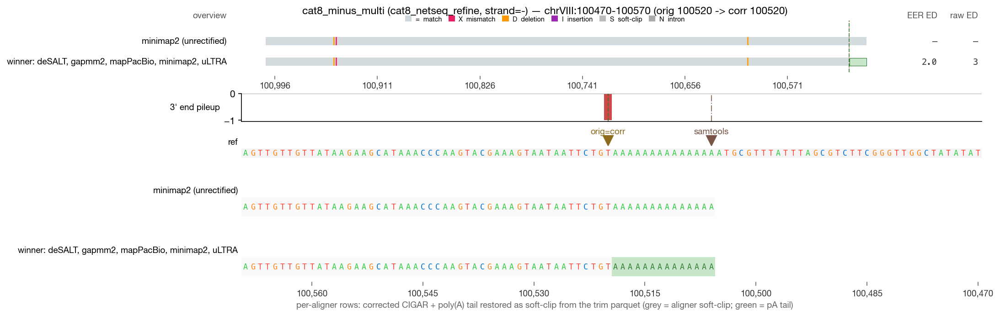
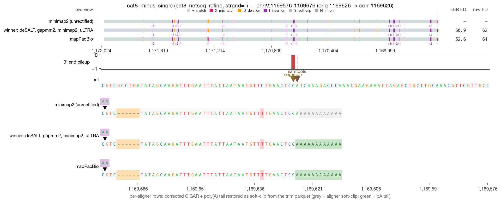
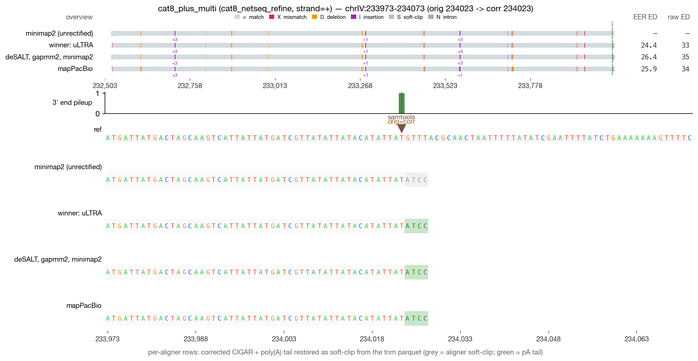
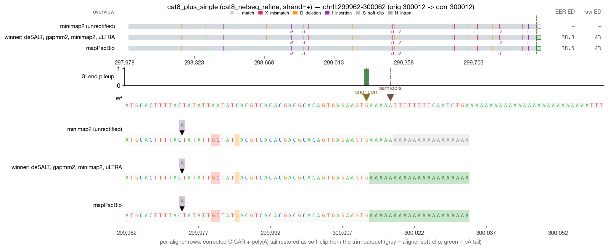

# RECTIFY DRS validation — cat8_netseq_refine (4 reads)

_Generated 2026-05-19 09:44 · 4 reads across 1 category_

> **Leftmost-possible-CPA principle** — in mature mRNA, the boundary between genomic A's and post-transcriptionally added poly(A) is irrecoverably lost. RECTIFY's walkback anchors at the first non-stop read=ref agreement walking inward from the alignment 3′ edge. When NET-seq is available, `rectify correct --netseq-dir` pins the corrected 3′ within that ambiguity window.

## Jump to read

- **cat8_netseq_refine** — [cat8_minus_multi](#cat8_minus_multi) · [cat8_minus_single](#cat8_minus_single) · [cat8_plus_multi](#cat8_plus_multi) · [cat8_plus_single](#cat8_plus_single)

---

## cat8_minus_multi  — cat8_netseq_refine

| field | value |
| --- | --- |
| read_id | `0b6b91ea-83fe-4c54-8d00-f96406d1ddf4` |
| category | cat8_netseq_refine |
| strand | - |
| aligner shown | minimap2 |
| chrom | chrVIII |
| locus shown | chrVIII:100470-100570 |
| alignment span | [100520, 101004) |
| 5′ position | 101003 |
| original 3′ | 100520 |
| corrected 3′ | 100520 |
| shift (corr − orig) | 0 bp (zero-shift) |
| correction_applied | `none` |

**What RECTIFY did for this read**

*Zero-shift correction.* The terminal alignment position was already at the leftmost-possible-CPA; the listed module(s) verified this but did not move the 3' end.

- No correction modules fired — the read's terminal alignment was already at a clean read=ref non-A match.

**What to verify visually**

> NET-seq refinement: walkback alone can't resolve the CPA inside a long A-tract; NET-seq deconvolution narrows it to a specific position. The corrected position should be inside the ambiguity_min..ambiguity_max window.

_Reviewer notes:_ [ ] OK   [ ] flag — note here

---

## cat8_minus_single  — cat8_netseq_refine

| field | value |
| --- | --- |
| read_id | `0d9b33c7-2ac5-4c54-9aa1-b0f6e8a4b7a7` |
| category | cat8_netseq_refine |
| strand | - |
| aligner shown | minimap2 |
| chrom | chrIV |
| locus shown | chrIV:1169576-1169676 |
| alignment span | [1169626, 1172007) |
| 5′ position | 1172006 |
| original 3′ | 1169626 |
| corrected 3′ | 1169626 |
| shift (corr − orig) | 0 bp (zero-shift) |
| correction_applied | `none` |

**What RECTIFY did for this read**

*Zero-shift correction.* The terminal alignment position was already at the leftmost-possible-CPA; the listed module(s) verified this but did not move the 3' end.

- No correction modules fired — the read's terminal alignment was already at a clean read=ref non-A match.

**What to verify visually**

> NET-seq refinement: walkback alone can't resolve the CPA inside a long A-tract; NET-seq deconvolution narrows it to a specific position. The corrected position should be inside the ambiguity_min..ambiguity_max window.

_Reviewer notes:_ [ ] OK   [ ] flag — note here

---

## cat8_plus_multi  — cat8_netseq_refine

| field | value |
| --- | --- |
| read_id | `0e41776e-8785-4121-9d84-817961d9265a` |
| category | cat8_netseq_refine |
| strand | + |
| aligner shown | minimap2 |
| chrom | chrIV |
| locus shown | chrIV:233973-234073 |
| alignment span | [232523, 234024) |
| 5′ position | 232523 |
| original 3′ | 234023 |
| corrected 3′ | 234023 |
| shift (corr − orig) | 0 bp (zero-shift) |
| correction_applied | `none` |

**What RECTIFY did for this read**

*Zero-shift correction.* The terminal alignment position was already at the leftmost-possible-CPA; the listed module(s) verified this but did not move the 3' end.

- No correction modules fired — the read's terminal alignment was already at a clean read=ref non-A match.

**What to verify visually**

> NET-seq refinement: walkback alone can't resolve the CPA inside a long A-tract; NET-seq deconvolution narrows it to a specific position. The corrected position should be inside the ambiguity_min..ambiguity_max window.

_Reviewer notes:_ [ ] OK   [ ] flag — note here

---

## cat8_plus_single  — cat8_netseq_refine

| field | value |
| --- | --- |
| read_id | `a0f7d856-5187-4988-8f5b-c962e9cdaa50` |
| category | cat8_netseq_refine |
| strand | + |
| aligner shown | minimap2 |
| chrom | chrII |
| locus shown | chrII:299962-300062 |
| alignment span | [297998, 300013) |
| 5′ position | 297998 |
| original 3′ | 300012 |
| corrected 3′ | 300012 |
| shift (corr − orig) | 0 bp (zero-shift) |
| correction_applied | `none` |

**What RECTIFY did for this read**

*Zero-shift correction.* The terminal alignment position was already at the leftmost-possible-CPA; the listed module(s) verified this but did not move the 3' end.

- No correction modules fired — the read's terminal alignment was already at a clean read=ref non-A match.

**What to verify visually**

> NET-seq refinement: walkback alone can't resolve the CPA inside a long A-tract; NET-seq deconvolution narrows it to a specific position. The corrected position should be inside the ambiguity_min..ambiguity_max window.

_Reviewer notes:_ [ ] OK   [ ] flag — note here
