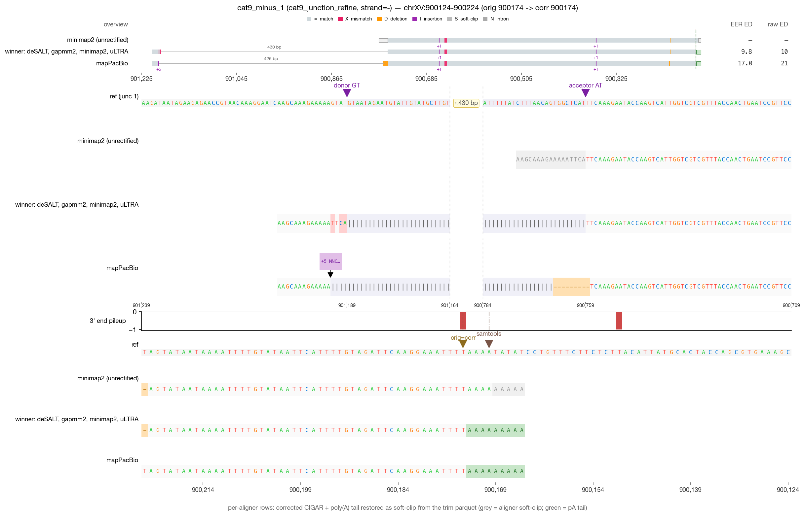
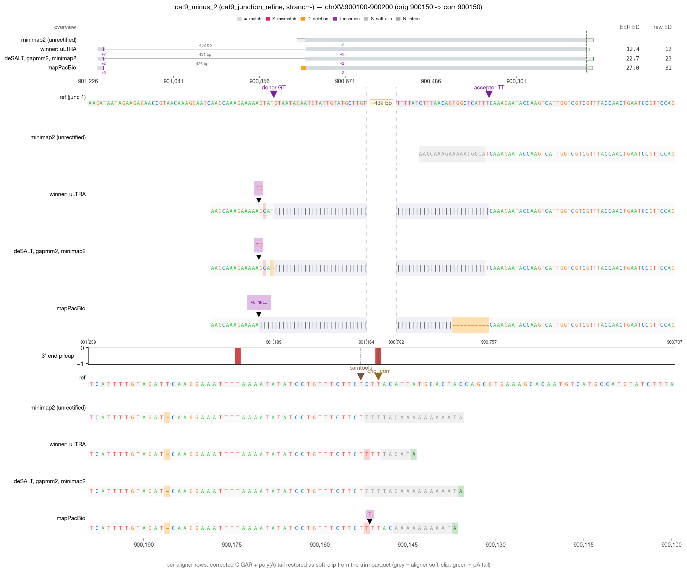
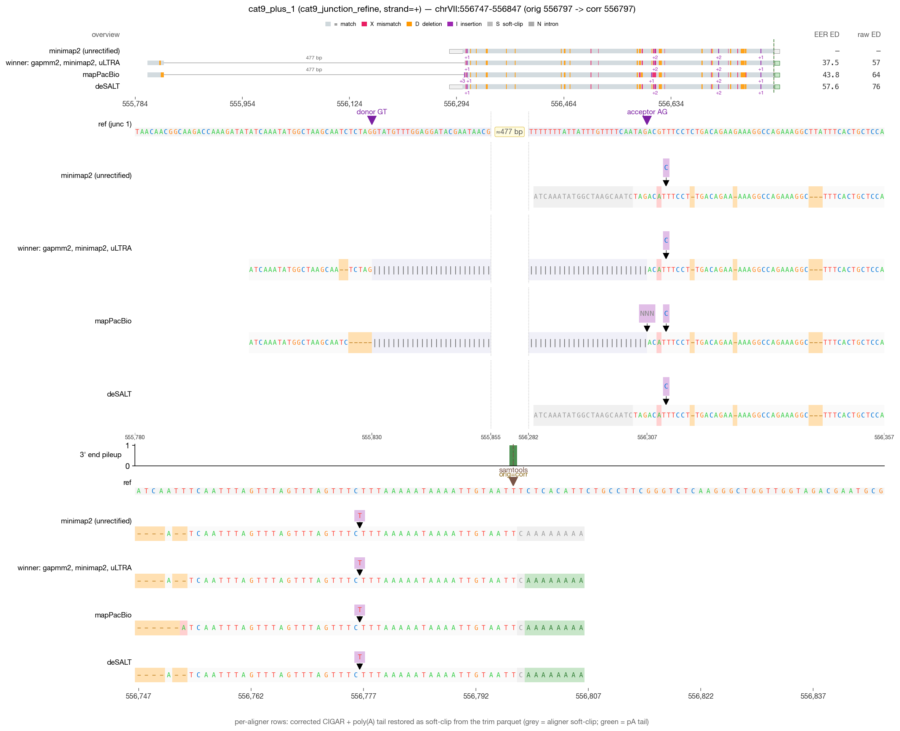
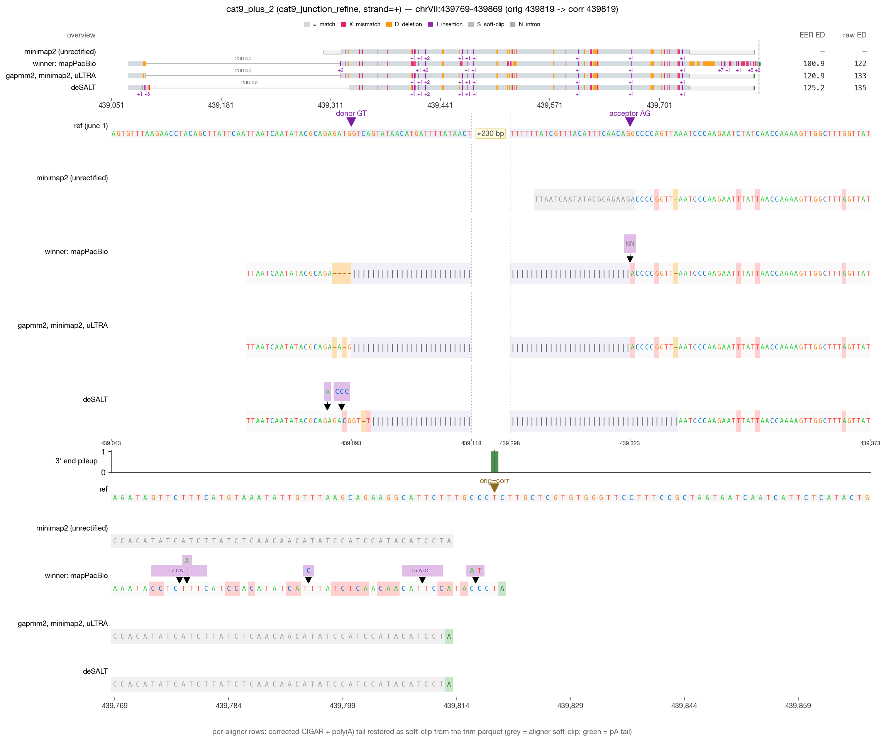

# RECTIFY DRS validation — cat9_junction_refine (4 reads)

_Generated 2026-05-19 09:44 · 4 reads across 1 category_

> **Leftmost-possible-CPA principle** — in mature mRNA, the boundary between genomic A's and post-transcriptionally added poly(A) is irrecoverably lost. RECTIFY's walkback anchors at the first non-stop read=ref agreement walking inward from the alignment 3′ edge. When NET-seq is available, `rectify correct --netseq-dir` pins the corrected 3′ within that ambiguity window.

## Jump to read

- **cat9_junction_refine** — [cat9_minus_1](#cat9_minus_1) · [cat9_minus_2](#cat9_minus_2) · [cat9_plus_1](#cat9_plus_1) · [cat9_plus_2](#cat9_plus_2)

---

## cat9_minus_1  — cat9_junction_refine

| field | value |
| --- | --- |
| read_id | `0b3b593b-d3c0-4b24-8244-50ebdecb5bbb` |
| category | cat9_junction_refine |
| strand | - |
| aligner shown | mapPacBio |
| chrom | chrXV |
| locus shown | chrXV:900124-900224 |
| alignment span | [900174, 900759) |
| 5′ position | 901189 |
| original 3′ | 900174 |
| corrected 3′ | 900174 |
| shift (corr − orig) | 0 bp (zero-shift) |
| correction_applied | `five_prime_rescued` |

**What RECTIFY did for this read**

*Zero-shift correction.* The terminal alignment position was already at the leftmost-possible-CPA; the listed module(s) verified this but did not move the 3' end.

- **5' junction rescue** fired — a leading soft-clip in the mapped track was extended through an annotated splice junction into the upstream exon.

**What to verify visually**

> Module 2H junction refinement: aligner's N-op boundaries off by 1–5 bp from annotated splice site. After refinement, the corrected N-op should match an annotated junction exactly.

_Reviewer notes:_ [ ] OK   [ ] flag — note here

---

## cat9_minus_2  — cat9_junction_refine

| field | value |
| --- | --- |
| read_id | `d3357db5-67ba-4f7f-9f81-d0e452e92df5` |
| category | cat9_junction_refine |
| strand | - |
| aligner shown | mapPacBio |
| chrom | chrXV |
| locus shown | chrXV:900100-900200 |
| alignment span | [900150, 900767) |
| 5′ position | 901189 |
| original 3′ | 900150 |
| corrected 3′ | 900150 |
| shift (corr − orig) | 0 bp (zero-shift) |
| correction_applied | `five_prime_rescued` |

**What RECTIFY did for this read**

*Zero-shift correction.* The terminal alignment position was already at the leftmost-possible-CPA; the listed module(s) verified this but did not move the 3' end.

- **5' junction rescue** fired — a leading soft-clip in the mapped track was extended through an annotated splice junction into the upstream exon.

**What to verify visually**

> Module 2H junction refinement: aligner's N-op boundaries off by 1–5 bp from annotated splice site. After refinement, the corrected N-op should match an annotated junction exactly.

_Reviewer notes:_ [ ] OK   [ ] flag — note here

---

## cat9_plus_1  — cat9_junction_refine

| field | value |
| --- | --- |
| read_id | `00a1c9b3-2939-4d6a-96b9-212837adebdd` |
| category | cat9_junction_refine |
| strand | + |
| aligner shown | mapPacBio |
| chrom | chrVII |
| locus shown | chrVII:556747-556847 |
| alignment span | [555804, 556798) |
| 5′ position | 555804 |
| original 3′ | 556797 |
| corrected 3′ | 556797 |
| shift (corr − orig) | 0 bp (zero-shift) |
| correction_applied | `none` |

**What RECTIFY did for this read**

*Zero-shift correction.* The terminal alignment position was already at the leftmost-possible-CPA; the listed module(s) verified this but did not move the 3' end.

- No correction modules fired — the read's terminal alignment was already at a clean read=ref non-A match.

**What to verify visually**

> Module 2H junction refinement: aligner's N-op boundaries off by 1–5 bp from annotated splice site. After refinement, the corrected N-op should match an annotated junction exactly.

_Reviewer notes:_ [ ] OK   [ ] flag — note here

---

## cat9_plus_2  — cat9_junction_refine

| field | value |
| --- | --- |
| read_id | `00a1e01e-2cc9-4188-8531-98366c2890ba` |
| category | cat9_junction_refine |
| strand | + |
| aligner shown | mapPacBio |
| chrom | chrVII |
| locus shown | chrVII:439769-439869 |
| alignment span | [439071, 439820) |
| 5′ position | 439092 |
| original 3′ | 439819 |
| corrected 3′ | 439819 |
| shift (corr − orig) | 0 bp (zero-shift) |
| correction_applied | `indel_correction,five_prime_rescued` |

**What RECTIFY did for this read**

*Zero-shift correction.* The terminal alignment position was already at the leftmost-possible-CPA; the listed module(s) verified this but did not move the 3' end.

- **Module 2C (indel correction)** fired — the aligner had introduced indels in the terminal alignment over the poly-A region; the walkback recognized the homopolymer context and resolved the read=ref anchor.

- **5' junction rescue** fired — a leading soft-clip in the mapped track was extended through an annotated splice junction into the upstream exon.

**What to verify visually**

> Module 2H junction refinement: aligner's N-op boundaries off by 1–5 bp from annotated splice site. After refinement, the corrected N-op should match an annotated junction exactly.

_Reviewer notes:_ [ ] OK   [ ] flag — note here
