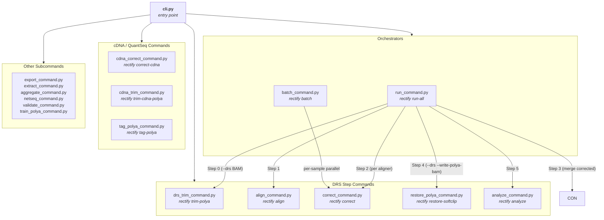
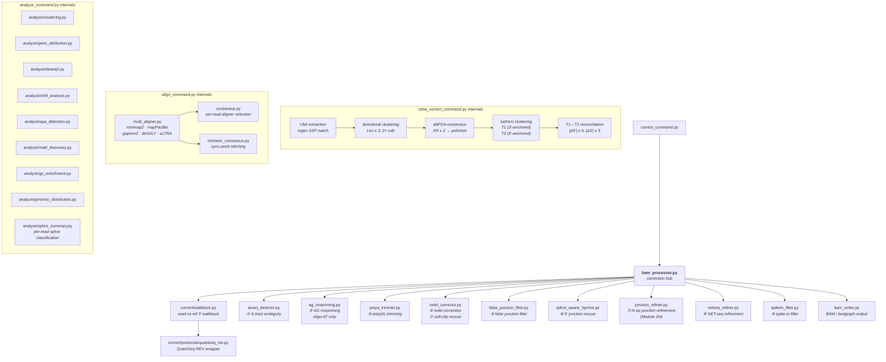

# RECTIFY Architecture

## What is this document?

This is a narrative architecture guide for developers, collaborators, and
automated agents. It covers the pipeline design, module responsibilities,
and data flow at a level deeper than the README but focused on the "why" —
not a function-by-function reference.

For auto-generated API reference (every public function, parameter, and
return type), see the ReadTheDocs site built from docstrings:
[rectify-rna.readthedocs.io](https://rectify-rna.readthedocs.io).
RTD answers *what does this function do?* — this document answers
*how do the modules fit together?*

---

## Pipeline overview

RECTIFY corrects systematic errors in poly(A)-tailed RNA-seq data and then
performs differential 3' end usage analysis across conditions. The pipeline
supports three protocol tracks that share a common correction core but differ
in pre-processing, alignment strategy, and post-correction analysis:

| Track | Input | Pre-processing | Alignment | 3' end | 5' end |
|---|---|---|---|---|---|
| **DRS** (Direct RNA-seq) | Dorado BAM (pt:i: tags) | poly(A)+adapter pre-trim → FASTQ | minimap2 + mapPacBio + gapmm2 | read-vs-ref walkback | splice-aware rescue |
| **ONT cDNA** (PCB114.24) | pre-aligned BAM | UMI extraction → directional clustering → abPOA consensus → pre-trim → per-cluster FASTQ → multi-aligner re-alignment | minimap2 + mapPacBio + gapmm2 | post-align walkback in `cdna-analyze` | T1 (5' UMI-anchored) / T2 (3' pA-anchored) isoform clustering in `cdna-analyze` |
| **QuantSeq REV** | pre-aligned BAM | (external alignment) | BWA-MEM (+ BBMap target) | read-vs-ref walkback (inverted: 3'=left) | N/A (3'-biased protocol) |

**Shared modules** (all tracks): read-vs-reference walkback (`core/correct/walkback.py`),
per-read splice classification (`core/analyze/splice_summary.py`), CPA clustering,
gene attribution, DESeq2, GO enrichment, motif discovery, genomic distribution.

**Track-specific modules**: DRS poly(A) pre-trim (`drs_trim_command.py`), cDNA UMI
consensus (`cdna_correct_command.py`), QuantSeq protocol wrapper
(`core/correct/protocols/quantseq_rev.py`).

### DRS pipeline (Steps 0–5)

```
Dorado-aligned BAM (with pt:i: tags)
    │
    ▼
[Step 0: DRS Poly(A) Pre-Trim]     rectify trim-polya
    │   Scans each read in RNA 5'→3' orientation:
    │     Pass 0: strip adapter stub via regex T[CT]{0,10}$ at 3' end
    │     Pass 1: scan pure-A tail upstream (default: strict mode, 0% error rate)
    │     Pass 2: iterative peel for stubs with A-basecalling errors at boundary
    │   Reads with polya_len=0 are passed through unchanged (not in metadata).
    │   Metadata columns: read_id, strand, polya_len, adapter_seq,
    │     adapter_pass (0/1/2), pt_tag, trimmed_3prime_seq, seq lengths
    ▼
    <sample>.bam  (unaligned, RNA-oriented, poly(A)+adapter removed)
    <sample>_polya_trim_metadata.parquet
    │
    │  samtools fastq → <sample>_trimmed.fastq.gz
    │
    ▼
[Step 1: Alignment]        multi-aligner rectification pipeline
    │                      Tier 1 (default): minimap2 + mapPacBio + gapmm2
    │                      Tier 2 (opt-in):  + deSALT, + uLTRA
    │
    │  Phase 1: mapPacBio alone (all threads)
    │  Phase 2: minimap2 + gapmm2 in parallel
    │
    │  Per aligner BAM → extract AlignmentInfo:
    │    • effective 5' clip  (MD-free, genome-only)
    │    • 5' clip rescue     (single-pass, scoring only — no position change)
    │    • A-tract 3' depth   (genome-only estimate)
    │    • 3' terminal errors (non-poly-A clip)
    │    • junction-proximity errors
    │
    │  Composite score → select best aligner per read
    │  Tiebreakers: canonical GT-AG → annotated →
    │               majority 3' vote → wider span
    ▼
    <sample>.<aligner>.bam  (one per aligner, name-sorted)
    │
    ▼
[Step 2: Correction per aligner]   rectify correct × N aligners
    │   Run the full correction pipeline independently on EACH per-aligner BAM.
    │   Corrections are computed on a per-aligner basis so that the consensus step
    │   can select winners using post-correction features (five_prime_rescued,
    │   confidence, 3' agreement) — which are normalized across aligners —
    │   rather than raw alignment scores (MAPQ, AS, soft-clip length), which
    │   are not cross-comparable because aligners differ fundamentally in how
    │   they represent soft-clips, mismatches, and junction boundaries.
    │                      ① A-tract ambiguity detection (universal)
    │                      ② AG mispriming screen (oligo-dT only)
    │                      ③ Poly(A) tail trimming (if sequenced)
    │                      ④ Indel artifact correction
    │                      ⑤ False junction filtering (poly(A)-artifact N-ops)
    │                      ⑥ 5' soft-clip junction rescue
    │                      ⑦ N-op junction refinement (Module 2H)
    │                      ⑧ NET-seq refinement (optional, resolves ambiguous windows)
    │                      ⑨ Spike-in read filtering
    ▼
    per_aligner_corrected/{aligner}/corrected_3ends.tsv   (one per aligner)
    per_aligner_corrected/{aligner}/corrected.bam         (one per aligner, opt-in)
    │
    ▼
[Step 3: Consensus]        select best corrected output per read    corrected_consensus.py
    │   For each read, selects the winning aligner from the per-aligner corrected TSVs.
    │   Selection criteria (in priority order):
    │     1. five_prime_rescued   — prefer aligner where Cat3 rescue fired (1 > 0)
    │     2. confidence           — prefer 'high' > 'medium' > 'low'
    │     3. corrected_3prime agreement — prefer position agreed on by most aligners
    │     4. alignment span       — prefer wider alignment
    │     5. n_junctions          — prefer more junctions (more completely spliced)
    │   Winner's corrected row is kept; winning aligner name written to XA tag.
    ▼
    corrected_3ends.tsv           merged per-read corrected positions (winning aligner only)
                                  columns include: chrom, strand, original_3prime,
                                  corrected_3prime, five_prime_position, polya_length,
                                  junctions_str, n_junctions, confidence, winning_aligner, …
    corrected_3ends_index.bed.gz  position-count summary: one row per unique
                                  (chrom, corrected_3prime, strand) with read count.
                                  ~300× smaller than the per-read TSV; used by
                                  manifest-mode analysis to skip re-reading every read.
    corrected.bam                 consensus BAM: winning aligner's corrected read per read_id
    <sample>.stats.tsv            per-sample QC report
    │
    ▼
[Step 4 (DRS only, opt-in): Restore poly(A) tail]    rectify restore-softclip  [--write-polya-bam]
    │   For each read, look up the winning aligner's RAW (pre-correction) BAM record
    │   and the parquet trim metadata (Step 0) for that read_id.
    │   Re-attach the original Dorado-called poly(A)+adapter sequence as a 3' soft clip:
    │     + strand: append trimmed_3prime_seq to right of query; extend trailing S op
    │     − strand: prepend RC(trimmed_3prime_seq) to left of query; extend leading S op
    │   The result shows the full read exactly as Dorado sequenced it, enabling
    │   direct IGV comparison against corrected.bam to validate what Rectify changed.
    │   Off by default — use --write-polya-bam for QC/validation only.
    ▼
    corrected_polya.bam  — winning aligner's raw read + poly(A) tail restored from parquet
                           compare against corrected.bam to see exactly what Rectify changed
    │
    ▼
[Step 5: Analysis]         multi-sample downstream analysis
    │                      ① CPA site clustering
    │                      ② Gene attribution (which gene owns each cluster?)
    │                      ③ DESeq2 differential usage (multi-sample only):
    │                           — cluster level: per-CPA-site read counts
    │                           — gene level: summed CPA counts across all clusters
    │                           each produces deseq2_{clusters,genes}_{condition}.tsv
    │                      ④ 3' UTR shift analysis: gene-level weighted-mean CPA
    │                           position shift in bp between conditions — detects
    │                           global 3' UTR lengthening/shortening per gene
    │                      ⑤ APA isoform detection: read-level grouping by
    │                           (gene, junction signature, 3' cluster) to identify
    │                           distinct isoforms and proximal:distal usage ratios
    │                      ⑥ De novo motif discovery: STREME/MEME on sequences
    │                           around DESeq2-enriched (padj<0.05, log2FC>1) and
    │                           -depleted (log2FC<-1) CPA clusters — identifies
    │                           differential poly(A) signal or downstream elements
    │                      ⑦ GO enrichment: Fisher's exact test on genes with
    │                           significantly increased or decreased CPA cluster
    │                           usage (padj<0.05, |log2FC|>1 at gene level)
    │                      ⑧ Genomic region distribution (three analyses):
    │                           — 3' end distribution: classify corrected 3' end
    │                             positions by feature (3'UTR > snoRNA > CUT >
    │                             SUT/XUT > 5'UTR/CDS > antisense > intergenic)
    │                           — 5' end distribution: classify corrected 5' end
    │                             positions by the same feature hierarchy
    │                           — Transcript body distribution: classify each read
    │                             by the biotype of the feature its full alignment
    │                             span (alignment_start → alignment_end) overlaps most
    ▼
    cpa_clusters.tsv
    deseq2_genes_{condition}.tsv
    deseq2_clusters_{condition}.tsv
    shift_analysis_{condition}.tsv
    go_enrichment_{up,down}_{condition}.tsv
    plots/
```

Steps 0–5 cover the full DRS pipeline. Steps 0–5 can be run end-to-end
via `rectify run-all`. For DRS data, Step 0 (`trim-polya`) should be run
first on the Dorado-aligned BAM, then Step 4 (`restore-softclip`) applied
after correction to re-attach the trimmed poly(A) to the softclip BAM. Each
step can also be invoked independently through its own subcommand.

### ONT cDNA pipeline (PCB114.24)

```
Pre-aligned BAM (minimap2)
    │
    ▼
[Stage 1: UMI Consensus]     rectify correct-cdna
    │
    │  Read architecture (5'→3' basecall orientation):
    │    SSP_FWD + (TT-VVVV)×4 + TTT UMI (27 nt) + GGG TSO bridge + cDNA body + poly(A) + adapter
    │
    │  ① UMI extraction: regex-match SSP → extract 27-nt UMI → XU:Z tag
    │  ② Directional clustering: Levenshtein ≤ 3 + 2× count rule
    │     Groups reads by (3'-anchor, UMI similarity) into consensus families
    │  ③ Per-cluster consensus: families with XC ≥ 2 reads → abPOA polished sequence
    │     Singletons (XC = 1) → pass through original sequence
    │  ④ Pre-trim: strip SSP/UMI/GGG at 5' and poly-A at 3' so the downstream
    │     aligner receives clean mRNA body. q_trim_5 → XQ tag, q_trim_3 → XK tag.
    │
    ▼
    stage1_consensus.fastq.gz   (one record per UMI cluster)
    TAB-separated FASTQ comment tags (propagate via `minimap2 -y`):
      XU  canonical UMI            XO  orient (fwd/rev)         XC  cluster size
      XR  input read IDs           XM  consensus method         XF  full-length tier
      XA  pre-align poly-A length  XT  read type (1/2)          XY  read subtype
      XQ  5' pre-trim bases        XK  3' pre-trim bases        XB  strand split n_top/n_bot
    │
    ▼
[Stage 2: Multi-aligner Re-alignment]    rectify align
    │   minimap2 (+ mapPacBio + gapmm2 default panel) → chimeric consensus
    │   `minimap2 -y` propagates FASTQ comment tags to the BAM aux fields.
    │
    ▼
    <prefix>.rectified.bam   (one BAM record per UMI cluster, tags intact)
    │
    ▼
[Stage 3: Isoform Clustering + T1↔T2 Pairing]   rectify cdna-analyze
    │   Operates on post-align coordinates. Per BAM record:
    │     ① Walkback (XA: corrected poly-A tail length on post-align CIGAR)
    │     ② Walk-forward TSS (post-align pos5_corrected)
    │     ③ Gene assignment (XG) + sense/antisense (XS)
    │     ④ Isoform clustering — Type-1 uses 5'+3' position; Type-2 uses 3' only
    │     ⑤ Type-1 ↔ Type-2 reconciliation (same orient + |Δ5'|≤5 + |Δ3'|≤5)
    │
    ▼
    Outputs: clusters.tsv · isoforms.tsv · t1t2_pairs.tsv · consensus_tagged.bam
    Tags added by cdna-analyze: XG (gene) · XS (sense/antisense) · XI (isoform_id) · XL (T1↔T2 partner cid)
```

The cDNA pipeline diverges from DRS at the input: it takes a pre-aligned BAM
(no poly(A) pre-trim or multi-aligner step on raw reads) and performs UMI-based
consensus *before* re-alignment. The multi-aligner step (`rectify align`) runs
on per-cluster consensus FASTQs rather than raw reads. Gene assignment, isoform
clustering, and same-molecule strand pairing all run downstream in
`rectify cdna-analyze` on the post-align CIGAR — pre-align positions were too
coarse for tol-5 = 5 / tol-3 = 5 grouping decisions.

### QuantSeq 3' REV pipeline

```
Pre-aligned BAM (BWA-MEM or user-supplied)
    │
    ▼
[Poly(A) Pre-Trim]           rectify trim-cdna-polya
    │   QuantSeq REV captures the 3' end via oligo-dT priming.
    │   BAM strand is OPPOSITE to gene strand (reverse-complement library).
    │   3' end of the transcript = LEFT side of the BAM alignment.
    ▼
[Correction]                  rectify correct  (with --quantseq-rev flag)
    │   Uses walkback_quantseq_rev() protocol wrapper:
    │     three_prime_side = "left" (not "right" as in DRS)
    │     stop_base = "A" (scan through A-tract from left)
    │   Strand handling: BAM strand = opposite of gene strand
    ▼
    corrected_3ends.tsv → standard analysis pipeline
```

---

## CLI subcommand dispatch

Entry point: `rectify.cli:main` → `create_parser()` → per-subcommand
`create_*_parser()` → dispatches to the corresponding `*_command.py`.

| Subcommand | Module | Purpose |
|---|---|---|
| `trim-polya` | `core/commands/drs_trim_command.py` | **Step 0 (DRS only)** — trim poly(A) tail + adapter from Dorado-aligned BAM; writes unaligned BAM + metadata parquet |
| `align` | `core/commands/align_command.py` | **Step 1** — multi-aligner alignment from FASTQ |
| `correct` | `core/commands/correct_command.py` | **Step 2** — 3' end correction per aligner; writes cp:i: tag on every output read |
| `consensus` | `core/commands/consensus_command.py` | **Step 3** — select the best alignment per read across per-aligner BAMs (long-read trio or short-read pair). Operates on either raw BAMs or already-corrected BAMs; the corrected-BAM path emits a final consensus via `core/consensus/corrected_consensus.py`. |
| `restore-softclip` | `core/commands/restore_polya_command.py` | **Step 4 (DRS only, opt-in)** — reconstruct full Dorado read by pulling winning aligner's raw BAM record and restoring poly(A) from parquet as soft clip; for IGV validation only |
| `run-all` | `core/commands/run_command.py` (+ `core/commands/run/`) | Full end-to-end pipeline (Steps 0–5) |
| `analyze` | `core/commands/analyze_command.py` | **Step 5** — downstream analysis (clustering, DESeq2, GO enrichment, motifs) |
| `batch` | `core/commands/batch_command.py` | Parallel correction across samples; interactive mode auto-sizes to available CPUs, HPC mode generates array job scripts for SLURM, PBS/Torque, or UGE/SGE via a portable scheduler abstraction |
| `train-polya` | `core/commands/train_polya_command.py` | Train a poly(A) tail model from calibration data (see below) |
| `validate` | `core/commands/validate_command.py` | Post-correction quality check against NET-seq or known CPA sites (see below) |
| `export` | `core/commands/export_command.py` | Export corrected 3' ends to bedGraph/bigWig |
| `extract` | `core/commands/extract_command.py` | Extract per-read info from BAM to TSV |
| `correct-cdna` | `core/commands/cdna_correct_command.py` | **ONT cDNA Stage 1** — UMI extraction, directional clustering, abPOA consensus, pre-trim → per-cluster FASTQ for `rectify align` |
| `cdna-analyze` | `core/commands/cdna_analyze_command.py` | **ONT cDNA Stage 3** — walkback + walk-forward + gene/isoform/T1↔T2 on post-align coordinates from `rectify align` |
| `trim-cdna-polya` | `core/commands/cdna_trim_command.py` | Trim poly(A) from cDNA reads (QuantSeq REV or ONT cDNA pre-processing) |
| `tag-polya` | `core/commands/tag_polya_command.py` | Tag poly(A) tail lengths on reads (BAM tag annotation) |
| `netseq` | `core/commands/netseq_command.py` | Process NET-seq BAM files with deconvolution |
| `aggregate` | `core/commands/aggregate_command.py` | Aggregate reads into CPA / TSS / junction datasets |
| `prescan` | `core/commands/prescan_command.py` | Pre-compute variant scan and junction pool from a merged BAM; emits `rescue_scan.pkl` and `junction_pool.pkl` consumed by chunked correction runs |
| `split` | `core/commands/split_command.py` | Split a FASTQ into chunks and generate SLURM/PBS/UGE array-job scripts for parallel alignment |
| `install-aligners` | `core/commands/install_aligners_command.py` | Download or compile optional aligner binaries (minimap2, mapPacBio, gapmm2, deSALT, uLTRA) into `~/.rectify/bin/` |
| `test` | `core/commands/test_command.py` | Installation smoke check: runs `correct` on bundled validation reads and asserts expected corrected 3' ends |

> **Note on `train-polya`:** Run once per sequencing technology/chemistry to
> fit A-richness thresholds. Operates on reads mapping to control sites that
> have zero downstream genomic A's — any A-rich soft-clipped sequence at such
> sites must be a genuine poly(A) tail, not a genomic artifact. Outputs a JSON
> model loaded by `rectify correct --polya-model`. Bundled models for common
> platforms are included; re-run only when adapting to a new chemistry.

> **Note on `validate`:** Optional post-correction QC. Compares corrected 3'
> end positions against NET-seq bigWig files or a known-CPA-positions TSV and
> reports accuracy improvement over raw positions. Used during development and
> benchmarking; not needed for routine production runs.

---

## Module call graph

The diagrams below show which modules are orchestrators (call others) and which are
leaf implementations. Rendered natively on GitHub; paste into
[mermaid.live](https://mermaid.live) to preview locally.

### CLI dispatch and pipeline orchestration



### Correction engine and analysis internals



---

## Directory structure

```
rectify/                              ← git repo root
├── rectify/                          ← importable Python package
│   │
│   ├── __init__.py                   version string, public API re-exports
│   ├── __main__.py                   allows `python -m rectify`
│   ├── cli.py                        argparse entry point; dispatches subcommands;
│   │                                   global --Scer/--organism hook in main()
│   ├── config.py                     all constants (chroms, thresholds, shifts)
│   ├── slurm.py                      HPC utilities: thread limits, scratch staging
│   ├── slurm_profiles/               YAML configs for HPC partitions
│   │   ├── hpc_cpu.yaml              CPU partition (streaming + scratch on by default)
│   │   └── hpc_gpu.yaml              GPU partition
│   │
│   ├── core/                         pipeline step implementations
│   │   │
│   │   ├── unified_record.py         unified read record dataclass
│   │   ├── position_index.py         per-position read-count index (corrected_3ends_index.bed.gz)
│   │   ├── exclusion_regions.py      blacklist regions (repetitive elements, etc.)
│   │   ├── spikein_filter.py         spike-in construct detection and filtering
│   │   │
│   │   ├── commands/                 CLI command wrappers (one per `rectify <subcmd>`)
│   │   │   ├── run_command.py        Steps 0–5 orchestrator (the "run-all" dispatcher)
│   │   │   ├── run/                  run-all sub-orchestrators (split from run_command):
│   │   │   │   ├── helpers.py        reference-path resolution, per-aligner BAM lookup,
│   │   │   │   │                       BAM-integrity / MD-tag checks
│   │   │   │   ├── stages.py         per-stage runners (align, correct, per-aligner correct,
│   │   │   │   │                       merge, analyze, aggregate)
│   │   │   │   ├── single_sample.py  single-sample pipeline + per-sample worker
│   │   │   │   ├── multi_sample.py   manifest-driven multi-sample pipeline
│   │   │   │   └── chunked_batch.py  scheduler-array shell-script generator (--chunked-alignment)
│   │   │   ├── align_command.py      Step 1 CLI wrapper
│   │   │   ├── correct_command.py    Step 2 CLI wrapper (DRS / generic)
│   │   │   ├── consensus_command.py  per-aligner BAM aligner-selection (`rectify consensus`)
│   │   │   ├── analyze_command.py    Step 5 CLI wrapper + GFF/GTF parsing
│   │   │   ├── batch_command.py      parallel/SLURM batch correction
│   │   │   ├── cdna_correct_command.py   ONT cDNA pipeline Stage 1 (UMI → consensus FASTQ)
│   │   │   ├── cdna_analyze_command.py   ONT cDNA pipeline Stage 3 (post-align analysis)
│   │   │   ├── cdna_trim_command.py      cDNA poly(A) trimming (`rectify trim-cdna-polya`)
│   │   │   ├── drs_trim_command.py       DRS poly(A)+adapter pre-trim (`rectify trim-polya`)
│   │   │   ├── restore_polya_command.py  Step 4 softclip restore (`rectify restore-softclip`)
│   │   │   ├── tag_polya_command.py      poly(A) tail length tagging (`rectify tag-polya`)
│   │   │   ├── train_polya_command.py    poly(A) model training
│   │   │   ├── validate_command.py       correction validation vs NET-seq / known sites
│   │   │   ├── export_command.py         bedGraph/bigWig export
│   │   │   ├── extract_command.py        per-read BAM → TSV extraction
│   │   │   ├── aggregate_command.py      3'/5'/junction aggregation dispatcher
│   │   │   ├── netseq_command.py         `rectify netseq` CLI
│   │   │   ├── prescan_command.py        pre-compute variant scan + junction pool for chunked correction
│   │   │   ├── split_command.py          FASTQ chunker for parallel array alignment
│   │   │   ├── install_aligners_command.py   download/compile external aligners
│   │   │   └── test_command.py           installation smoke-test
│   │   │
│   │   ├── align/                    alignment-layer modules
│   │   │   ├── multi_aligner.py      Tier 1: minimap2+mapPacBio+gapmm2; Tier 2: +deSALT+uLTRA
│   │   │   ├── mpb_split_reads.py    mapPacBio long-read splitting and stitching
│   │   │   ├── local_aligner.py      Semi-global NW (Gotoh affine gap) for Cat3 exon CIGAR
│   │   │   └── preprocess.py         input detection (FASTQ vs BAM), bundled genome prep
│   │   │
│   │   ├── consensus/                aligner-consensus selection
│   │   │   ├── consensus.py          per-read optimal aligner selection (non-chimeric fallback)
│   │   │   ├── chimeric_consensus.py chimeric alignment stitching from sync-points
│   │   │   ├── corrected_consensus.py    select winner from per-aligner CORRECTED TSVs (Step 3)
│   │   │   ├── extract.py            extract per-aligner alignment info for scoring
│   │   │   ├── scoring.py            composite alignment scoring helpers
│   │   │   └── select.py             tie-breakers and selection logic
│   │   │
│   │   ├── bam/                      BAM I/O + per-read correction core
│   │   │   ├── bam_processor.py      `correct_read_3prime`: per-read correction (Step 2①–⑨)
│   │   │   ├── parallel.py           region-parallel + streaming wrappers
│   │   │   │                           (process_bam_file_parallel, process_bam_streaming,
│   │   │   │                            process_bam_streaming_parallel)
│   │   │   ├── bam_writer.py         CIGAR surgery; corrected/soft-clipped/trimmed BAM emission
│   │   │   ├── bedgraph_writers.py   bedGraph emitter (paired with bam writers)
│   │   │   ├── netseq_bam_processor.py   NET-seq BAM → 3' end TSV
│   │   │   ├── output.py             output-record serialization helpers
│   │   │   ├── processing_stats.py   per-sample QC stat accumulation and reporting
│   │   │   ├── read_edits.py         per-read edit-record dataclasses
│   │   │   ├── regions.py            chromosome-region partitioning
│   │   │   └── variant_scan.py       prescan-mode variant snapshot for correction
│   │   │
│   │   ├── correct/                  3' end correction modules
│   │   │   ├── walkback.py           read-vs-ref 3' walkback core + DRS wrapper (walkback_drs)
│   │   │   ├── indel_corrector.py    indel artifact correction; variant-aware rescue
│   │   │   └── protocols/
│   │   │       └── quantseq_rev.py   QuantSeq REV wrapper (3'=left, BAM strand=opposite)
│   │   │
│   │   ├── polya/                    poly(A) detection / mispriming
│   │   │   ├── atract_detector.py    A-tract boundary detection + ambiguity window
│   │   │   ├── ag_mispriming.py      AG-richness mispriming screen (Roy & Chanfreau 2019)
│   │   │   ├── polya_trimmer.py      poly(A) tail detection and trimming
│   │   │   └── polya_model.py        JSON poly(A) model (A-richness thresholds)
│   │   │
│   │   ├── splice/                   splice-junction handling
│   │   │   ├── splice_aware_5prime.py    5' soft-clip junction rescue (Module 2F)
│   │   │   ├── junction_refiner.py       post-consensus N-op refinement (Module 2H)
│   │   │   ├── junction_scoring.py       HP-aware split-alignment scoring
│   │   │   ├── junction_validator.py     cross-sample COMPASS-style junction validation
│   │   │   ├── false_junction_filter.py  poly(A)-artifact N-op (splice junction) removal
│   │   │   ├── hp_penalty.py             homopolymer-aware indel penalties
│   │   │   ├── terminal_exon_refiner.py  terminal exon boundary refinement
│   │   │   └── calibrate_junction_overhang.py    overhang calibration helper
│   │   │
│   │   ├── netseq/                   NET-seq deconvolution
│   │   │   ├── netseq_refiner.py     NET-seq NNLS deconvolution for CPA localization
│   │   │   ├── netseq_deconvolution.py   low-level NNLS / PSF math
│   │   │   └── netseq_output.py      NET-seq output formatting
│   │   │
│   │   ├── cdna/                     ONT cDNA pipeline internals (called by cdna_correct_command)
│   │   │   ├── umi.py                UMI regex extraction (SSP + TT-VVVV pattern)
│   │   │   ├── cluster.py            directional clustering (Lev ≤ 3, 2× rule)
│   │   │   ├── consensus.py          abPOA per-cluster consensus
│   │   │   ├── walkback.py           cDNA-specific post-align walkback
│   │   │   ├── isoforms.py           T1/T2 isoform clustering + reconciliation
│   │   │   ├── read_info.py          per-cluster XG/XS/XI/XL/XU/XC tag schema
│   │   │   ├── gff.py                GFF parsing for gene assignment
│   │   │   ├── io.py                 BAM/FASTQ I/O helpers
│   │   │   └── _constants.py         shared constants (tag names, SSP sequences)
│   │   │
│   │   ├── analyze/                  downstream statistical analysis modules
│   │   │   ├── clustering.py         CPA site clustering (fixed-distance + adaptive)
│   │   │   ├── gene_attribution.py   read-body attribution of 3' clusters to genes
│   │   │   ├── deseq2.py             DESeq2 differential cluster + gene usage
│   │   │   ├── shift_analysis.py     3' UTR shift scoring and visualization
│   │   │   ├── apa_detection.py      APA isoform quantification (Isosceles-style)
│   │   │   ├── motif_discovery.py    de novo motif discovery via STREME/MEME
│   │   │   ├── go_enrichment.py      GO enrichment via Fisher's exact test
│   │   │   ├── genomic_distribution.py   read classification by genomic feature
│   │   │   ├── junction_analysis.py  splice junction statistics
│   │   │   ├── junction_validation.py    annotation-based junction validation
│   │   │   ├── deconvolution.py      generalized deconvolution utilities
│   │   │   ├── pan_mutant_refiner.py pan-mutant NET-seq CPA refinement
│   │   │   ├── atract_refiner.py     A-tract-aware CPA position refinement
│   │   │   ├── heatmap.py            heatmap visualization of cluster usage
│   │   │   ├── splice_summary.py     per-read splice classification (annotated/alternative/novel/unspliced)
│   │   │   ├── bedgraph.py           analyze-stage bedgraph emitters
│   │   │   ├── exclusions.py         exclusion-region masking at analyze stage
│   │   │   ├── loaders.py            corrected-TSV / index loaders
│   │   │   ├── manifest.py           multi-sample manifest parsing
│   │   │   ├── pca.py                PCA of per-sample cluster counts
│   │   │   └── summary.py            per-run summary statistics
│   │   │
│   │   ├── aggregate/                per-end aggregation (output of `rectify aggregate`)
│   │   │   ├── three_prime.py        cluster by 3' CPA end; attribute to gene via read body
│   │   │   ├── five_prime.py         cluster by 5' TSS end; Bambu-style full-length filter
│   │   │   └── junctions.py          aggregate splice junctions with partial evidence
│   │   │
│   │   └── classify/
│   │       └── full_length_classifier.py   Bambu-style full-length vs truncated classifier
│   │
│   ├── utils/                        shared low-level utilities
│   │   ├── genome.py                 load_genome(), fetch_genomic_sequence(), A-tract utils
│   │   ├── alignment.py              CIGAR parsing, soft-clip extraction, coordinate ops
│   │   ├── chromosome.py             chromosome name normalization helpers
│   │   ├── stats.py                  confidence scoring, QC metrics
│   │   ├── junction_bed.py           minimap2 junction BED generation from annotation
│   │   ├── splice_motif.py           GT-AG and other splice site motif scoring
│   │   └── provenance.py             SHA-256 provenance tracking; skip-if-unchanged logic
│   │
│   ├── visualize/                    plotting layer
│   │   ├── config.py                 plot-wide style constants (colors, fonts, DPI)
│   │   ├── figure_utils.py           shared figure helpers (axes, colorbars, layout)
│   │   ├── gene_track.py             gene structure panel (box-arrow CDS glyphs)
│   │   ├── coverage.py               BAM coverage extraction and filled-area plots
│   │   ├── metagene.py               metagene signal aggregation (PositionIndex)
│   │   ├── metagene_loaders.py       convenience loaders for metagene workflows
│   │   ├── multi_track.py            multi-panel genome browser layout
│   │   ├── read_browser.py           stacked read browser (LineCollection-based)
│   │   ├── ridge.py                  ridge/joy-division plots of CPA distributions
│   │   └── vep_panels.py             variant effect prediction visualization panels
│   │
│   ├── data/                         bundled reference data + organism dispatch
│   │   ├── __init__.py               data-loading API + add_organism_args / resolve_reference_paths
│   │   ├── genomes/saccharomyces_cerevisiae/
│   │   │   ├── S288C_reference_sequence_R64-5-1_20240529.fsa.gz   genome FASTA (bgzipped)
│   │   │   ├── *.fai, *.gzi, *.pkl                                 index and pickle cache
│   │   │   ├── saccharomyces_cerevisiae_R64-5-1_20240529.gff.gz   gene annotation (GFF3)
│   │   │   ├── go_annotations.tsv.gz                               SGD GO term assignments
│   │   │   ├── bbmap_index/                                        mapPacBio index
│   │   │   └── desalt_index/                                       deSALT index
│   │   ├── motif_databases/                                        MEME-format motif databases
│   │   ├── bin/linux_x86_64/                                       bundled aligner binaries
│   │   └── validation/                                              bundled validation reads + TSVs
│   │       ├── generate_igv_html.py                                  IGV-bundle generator
│   │       ├── aligners/                                            per-aligner test BAMs
│   │       └── rectified/                                           rectified output BAMs
│   │
│   ├── calibration/
│   │   └── calibrate_shift_corrections.py   derive A-count→shift table from NET-seq data
│   │
│   └── scripts/                      one-off database construction scripts
│       ├── build_pan_mutant_netseq_database.py   build pan-mutant NET-seq TSV
│       └── create_atract_netseq_reference.py     build A-tract NET-seq TSV
│
├── tests/                            pytest suite (46 test files; 934 passing + 28 skipped + 4 deselected, ≈1 min)
├── docs/                             MkDocs source for RTD
│   └── ARCHITECTURE.md               this file
├── conda-recipe/                     conda-forge recipe (meta.yaml)
├── examples/                         usage notebooks and scripts
├── scripts/                          helper shell/Python scripts (not part of package)
├── pyproject.toml                    pip packaging metadata + dependency list
├── mkdocs.yml                        ReadTheDocs / MkDocs configuration
├── CLAUDE.md                         AI agent / developer context
└── README.md                         user-facing overview
```

---

## Layer-by-layer module descriptions

### Layer 1: Entry point

**`cli.py`** — Builds the top-level `argparse` parser and 22 subparsers.
Each subparser delegates to a `create_*_parser()` function in the
corresponding `core/commands/*_command.py`. A global `--Scer` / `--organism`
hook in `main()` calls `rectify.data.resolve_reference_paths(args)` after
parsing for all subcommands except the three that perform their own bespoke
reference resolution (`correct`, `run-all`, `batch`); the matching arg helper
`rectify.data.add_organism_args` is wired into the parser for every
reference-aware subcommand (align, analyze, aggregate, extract, validate,
netseq, consensus, train-polya, prescan, split, export, correct, run-all,
batch, …). No business logic lives in `cli.py`.

**`config.py`** — Single source of truth for all numeric constants:
chromosome name maps (chrI ↔ NCBI), A-count→expected-shift calibration
table, poly(A) detection thresholds, NET-seq signal thresholds, indel
detection windows. Import from here; never hard-code thresholds elsewhere.

**`slurm.py`** — SLURM-aware utilities called at process startup (before
numpy is imported): `set_thread_limits()` sets `OMP_NUM_THREADS`,
`OPENBLAS_NUM_THREADS`, `MKL_NUM_THREADS`, and `LOKY_MAX_CPU_COUNT` to
prevent thread oversubscription. Also provides `make_job_scratch_dir()` and
`sync_to_oak()` for scratch-staging patterns.

**`provenance.py`** — Lightweight Snakemake-style provenance: SHA-256
hashes input/output files and writes sidecar `.provenance.json`. The
`step_needed()` method enables skip-if-unchanged logic without Snakemake.

---

### Layer 2: Pipeline orchestration

**`core/commands/run_command.py`** (with helpers in `core/commands/run/`) — The full end-to-end orchestrator. Handles
single-sample (FASTQ or BAM input) and multi-sample (manifest TSV) modes.
In multi-sample mode, correction runs per-sample in parallel, then analysis
runs once across all corrected outputs. DESeq2, GO enrichment, and motif
discovery only fire in multi-sample mode (need multiple conditions for
statistics). Also resolves bundled genome/annotation paths transparently.

When `--drs` is passed with a BAM input, `_run_single_sample()` automatically
inserts Step 0 (`trim_drs_bam_polya` → `samtools fastq -T pt`) before alignment
and Step 4 (`restore_polya_softclips`) after correction. The poly(A) trim
metadata parquet is written to the Oak output directory so it survives
`$SCRATCH` purge; the trimmed FASTQ is written to `$SCRATCH/drs_trim/` for
alignment I/O.

**`core/commands/batch_command.py`** — Parallel batch correction across samples.
In interactive mode, auto-sizes a `ThreadPoolExecutor` to available CPUs
and runs `rectify correct` per sample in parallel. In HPC mode, reads a
profile YAML and generates array job scripts. Generated scripts include a
portable scheduler abstraction block that normalises CPU count, job ID, and
task ID from SLURM (`$SLURM_CPUS_PER_TASK`), PBS/Torque (`$PBS_NUM_PPN`),
and UGE/SGE (`$NSLOTS`) environment variables, so the same script body
works on all three schedulers without modification.

**`core/commands/align_command.py`** — Thin CLI wrapper around `core/align/multi_aligner.py`.

**`core/commands/correct_command.py`** — Step 2 orchestrator (DRS / generic): validates
inputs, sets thread limits, calls `core/bam/parallel.process_bam_file_parallel()`
or `core/bam/parallel.process_bam_streaming()`, writes `corrected_3ends.tsv` and stats report.

**`core/commands/cdna_correct_command.py`** — ONT cDNA pipeline Stage 1
(`rectify correct-cdna`). Implements the upstream half of the PCB114.24
workflow; downstream isoform analysis lives in `cdna_analyze_command.py`.
1. **UMI extraction** — regex-matches SSP_FWD in soft-clip, extracts the
   27-nt UMI (pattern `(TT-VVVV)×4 + TTT`), writes `XU:Z` tag.
2. **Directional clustering** — groups reads by (3'-anchor, UMI similarity)
   using Levenshtein distance ≤ 3 with the 2× count rule (a UMI with count N
   can only absorb UMIs with count ≤ N/2). Replaces the earlier
   connected-components approach which over-merged distant UMIs.
3. **abPOA consensus** — families with ≥ 2 reads are polished via abPOA
   partial order alignment. Singletons pass through with original sequence.
4. **Pre-trim** — strip SSP/UMI/GGG at 5' and poly-A at 3' so the downstream
   aligner (`rectify align`) receives clean mRNA body. The trim lengths
   ride along as `XQ:i` (5') and `XK:i` (3') so a soft-clip can be
   reconstructed downstream if needed.
5. **FASTQ output** — one record per UMI cluster, written to
   `stage1_consensus.fastq.gz`. TAB-separated SAM-format tags in the FASTQ
   comment are propagated to the aligned BAM via `minimap2 -y`.

Per-cluster tags written to the FASTQ comment (alignment-independent):
`XU` (canonical UMI), `XO` (orient), `XC` (cluster size), `XR` (input read IDs),
`XM` (consensus method), `XF` (full-length tier), `XA` (pre-align poly-A length),
`XT` (read type 1/2), `XY` (read subtype), `XQ` (5' pre-trim length),
`XK` (3' pre-trim length), `XB` (strand split n_top/n_bot).

**`core/commands/cdna_analyze_command.py`** — ONT cDNA pipeline Stage 3
(`rectify cdna-analyze`). Operates on the multi-aligner-rectified BAM
produced by `rectify align` on the Stage-1 FASTQ. Per record:
1. **Walkback** — recompute corrected poly-A tail length on post-align CIGAR
   (`XA:i`).
2. **Walk-forward TSS** — recompute the 5' TSS correction position.
3. **Gene assignment** — `classify_sense_antisense()` against the GFF gene
   tree; writes `XG:Z` (primary gene) and `XS:Z` (sense/antisense).
4. **Isoform clustering** — Type-1 reads use 5'+3' positions, Type-2 use
   3' only. Writes `XI:Z` (isoform_id) per cluster.
5. **Type-1 ↔ Type-2 same-orient pairing** — links T1/T2 clusters at the
   same gene+orient with `|Δ5'|≤5 ∧ |Δ3'|≤5`. Writes `XL:i` (partner cid)
   on both records.

Outputs: `clusters.tsv`, `isoforms.tsv`, `t1t2_pairs.tsv`, and a tagged
`consensus_tagged.bam` (input BAM rewritten with the new XA/XG/XS/XI/XL
tags added).

**`core/commands/analyze_command.py`** — Step 5 orchestrator: parses GFF/GTF,
calls analysis modules in sequence, writes all output TSVs and plots.
Handles both single-sample (no DESeq2) and manifest mode (full analysis).

---

### Layer 3: Alignment (Step 1)

**`core/align/multi_aligner.py`** — Runs all enabled aligners in parallel
subprocesses. Tier 1 (default): minimap2, mapPacBio, gapmm2. Tier 2
(opt-in via `--aligners`): deSALT (high-sensitivity splice aligner) and
uLTRA (annotation-guided graph aligner, requires GTF). Each aligner
produces a sorted, indexed BAM. Junction annotations from GFF are passed
to minimap2 via `--junc-bed` to improve splice site accuracy while keeping
scoring annotation-blind (novel junctions are still discoverable). Returns
per-aligner BAM paths.

**`core/consensus/chimeric_consensus.py`** — Chimeric rectification: finds "sync
points" where two or more aligners agree on query→reference mapping, then
scores segments between sync points independently. The best segment from
each aligner can be combined into one chimeric alignment. This is the key
innovation that handles DRS reads where no single aligner wins everywhere:
one may handle the 5' splice-through better, another the 3' poly(A)
boundary.

**`core/consensus/consensus.py`** — Simpler per-read optimal selection (non-chimeric):
scores each aligner's full alignment and picks the best one. Used as
fallback when chimeric stitching is disabled or sync points are not found.

**`core/align/mpb_split_reads.py`** — mapPacBio can fail on reads >100 kb.
Splits long reads, aligns each chunk, then stitches the resulting BAMs
back together with corrected CIGAR strings.

#### Pre-consensus scoring: what happens to each read before selection

The key insight driving the design is: **it is cheaper to select the right
alignment before correction than to correct a bad alignment after the fact**.
`extract_alignment_info()` in `consensus.py` is called for every read from
every aligner's BAM. It computes five signals from the raw alignment using
genome sequence alone (no MD tags required at this stage):

**Signal 1 — Effective 5' clip (`_get_effective_5prime_clip`):**
Scans up to 20 bp from the 5' end for terminal imperfections.
- **Explicit soft-clip** (minimap2, gapmm2): the `S` op length in the CIGAR.
- **mapPacBio forced-mismatch region**: mapPacBio deliberately forces
  mismatches rather than soft-clipping at splice junction boundaries.
  `_get_effective_5prime_clip` extends the effective clip length to include
  any contiguous terminal mismatch/indel region. Both representations are
  treated identically in scoring — this levels the playing field between
  aligners that soft-clip and those that force mismatches.

**Signal 2 — 5' soft-clip rescue (`_rescue_5prime_softclip`):**
For each read with a non-zero effective 5' clip, a lightweight rescue is attempted:
1. Collect all candidate junctions (annotated + all aligners' observed junctions).
2. For each candidate within `junction_proximity_bp` of the alignment's 5' end:
   compute edit distance against the upstream exon-1 sequence window.
3. If `edit_distance / clip_length ≤ max_edit_frac` (default 20%): rescue fires —
   the 5' clip penalty is waived for this aligner.

This is a simplified, single-pass version of the full rescue in
`splice_aware_5prime.py`. Its sole purpose is to avoid penalising aligners
that correctly identified an intron but could not align the upstream exon
fragment. **It does not change positions or CIGARs** — it only affects
the alignment's score for the purposes of aligner selection.

**Signal 3 — A-tract 3' depth (`calculate_atract_ambiguity`):**
Using genome sequence, estimates how far the aligner's 3' end is from the
true CPA site in A-tract regions. `downstream_a_count` (A's downstream of
the raw 3' end within 10 bp) quantifies how deep into the A-tract the aligner
landed. Penalty: −1 per downstream A, capped at 10. The full MD-tag-dependent
walk-back correction runs later in `rectify correct` (Module 2C/2E).

**Signal 4 — 3' non-poly(A) terminal errors (`_get_effective_3prime_clip`):**
Scans the 3' terminal region for non-A/T errors — mismatches or indels that
are NOT part of a poly(A) tail. Penalty: −2 per base, capped at 10.

**Signal 5 — Junction-proximity errors (`_count_junction_proximity_errors`):**
For each N-op, counts mismatches and indels within 5 bp of each junction
boundary. Penalty: −1 per error, capped at 10. This favours aligners that
produce clean junction handling (mapPacBio is typically best here).

**Composite score:**
```
score = − 2 × effective_5prime_clip     (0 if rescued)
        − 1 × atract_depth              (capped at 10)
        − 2 × effective_3prime_clip     (capped at 10)
        − 1 × junction_proximity_errors (capped at 10)
```

**Tiebreakers** (in order when scores are equal):
1. Most canonical GT-AG junctions
2. Most annotated junction matches
3. Majority vote on `corrected_3prime` (genome-only estimate)
4. Wider reference span (more of the transcript covered)

The winning aligner's raw BAM record is written to `consensus.bam`. MD tags
are added via `samtools calmd` to enable the MD-dependent modules in
`rectify correct`.

---

### Layer 4: Correction (Step 3)

**`core/bam/bam_processor.py`** (per-read core) **+ `core/bam/parallel.py`** (workers)
— The correction pipeline hub. `bam_processor.py` owns the per-read workhorse
`correct_read_3prime()`; `parallel.py` wraps it in the two execution modes and
also contains the chunked/streaming variants:
- `parallel.process_bam_file_parallel()`: per-chromosome parallelism, accumulates
  all results in memory before writing (use for small genomes or low RAM).
- `parallel.process_bam_streaming()`: 10,000-read chunks, writes incrementally.
  Peak RAM ~4–5 GB regardless of BAM size. **Use this for SLURM jobs.**
- `parallel.process_bam_streaming_parallel()`: streaming output combined with
  multi-worker region-parallel execution.

#### Read-vs-reference walkback (`core/correct/walkback.py`)

The protocol-agnostic 3' end correction engine. `walkback_3prime(read,
chrom_seq, three_prime_side, stop_base="A")` returns `(original_3prime,
corrected_3prime, applied)`. The algorithm uses a 3-case terminal gate:

1. **Terminal base is non-stop-base AND matches genome** → anchored. The read's
   3' end is already at an unambiguous non-A position; no walkback needed.
2. **Terminal base is stop-base** → proceed to walk-back scan.
3. **Terminal base is non-stop-base BUT mismatches genome** → proceed to scan
   (the mismatch could be a sequencing error in an A-tract).

The walk-back scan iterates through aligned pairs from the 3' end, walking
through `read_base == stop_base` positions and mismatches, stopping when
`read_base == ref_base and read_base != stop_base` — that's the true CPA anchor.

Protocol wrappers customize the directionality:
- **`walkback_drs()`** (in `walkback.py` itself): `three_prime_side="right"`,
  BAM strand equals gene strand. Also provides `is_minus_strand_dRNA()`.
- **`protocols/quantseq_rev.py`** — `walkback_quantseq_rev()`:
  `three_prime_side="left"` (3' end of transcript is at the left side of the
  BAM alignment because QuantSeq REV is a reverse-complement library).

The walkback replaces the earlier reference-only A-tract detection approach.
See "Why read-vs-reference walkback?" in the design decisions section below.

#### Correction modules (called in order by bam_processor)

**① `core/polya/atract_detector.py`** — Counts A's (or T's for minus strand) in the
downstream genomic window, looks up expected alignment shift from the
calibration table in `config.py`, and computes an `ambiguity_min`/
`ambiguity_max` window. This correction is UNIVERSAL — it applies to
all poly(A)-tailed RNA-seq, not just direct RNA.

**② `core/polya/ag_mispriming.py`** — For oligo-dT libraries: screens downstream
sequence for AG-richness. High AG-richness flags a read as likely
internally primed (misprimed on a genomic A/G run). The original
RECTIFY algorithm from Roy & Chanfreau 2019.

**③ `core/polya/polya_trimmer.py`** — For reads that directly sequence the poly(A)
tail: detects A-rich soft-clipped sequence, calculates `polya_length`,
and back-calculates the pre-tail cleavage position. Uses a trained
model (JSON) for A-richness thresholds.

**④ `core/correct/indel_corrector.py` (Module 2C)** — Detects deletion/insertion artifacts
that arise when aligners force-align poly(A) tails to genomic A-tracts.
The `find_polya_boundary` walk-back algorithm scans backward from the
soft-clip boundary, skipping A's, deletions, T sequencing errors, and N-ops,
until the first unambiguous non-A/T genome–read agreement. Key guards:
- **Large-deletion pre-scan:** detects over-calling artifacts where a large
  deletion (≥5 bp within 50 bp of 3' end) bridges a poly-A over-extension
  back to the exon body, when the alignment starts in a poly-T/poly-A context.
- **N-op boundary guard (minus strand):** stops the forward scan at the first
  N-op boundary, preventing the scan from crossing into an earlier exon.
- **Trailing-base false-stop guard:** if the last base of a poly-A tail
  coincidentally matches a genomic base (e.g. terminal T=T), and the
  K=4 positions before it are all poly-A context, the scan continues rather
  than stopping prematurely.
The `VariantAwareHomopolymerRescue` class also handles cases where a SNP in
an A-tract could be misinterpreted as an artifact.

**⑤ `core/splice/false_junction_filter.py`** — Removes spurious N operations (introns)
in CIGAR strings near the 3' end that arise from poly(A) tail misalignment
to distant A-tracts. A junction is flagged if it is within a configurable
window of the 3' end AND the downstream region is highly A-rich.

**⑥ `core/splice/splice_aware_5prime.py` (Module 2F)** — Full Cat3 / Cat4 5' junction
rescue. When the first exon is short, aligners may place the read's 5' end
within an annotated intron rather than at the true TSS. Four cases handled
in priority order:

| Case | Trigger | Action |
|------|---------|--------|
| **1** | 5' soft-clip whose bases match upstream exon within `max_edit_frac` | Snap 5' end to intron boundary; emit M/I/D exon CIGAR via local NW aligner |
| **2** | mapPacBio forced-mismatch terminal region matching upstream exon | Same as Case 1 |
| **3** | 5' end within `junction_proximity_bp + five_clip` of a known 3'SS but no sequence evidence | Record junction hit; do not move 5' end |
| **4** | 5' end strictly inside an annotated intron, no existing N-op covers it | Snap to exon-1-side boundary (intronic snap) — only when exon sequence is a strictly better match than intron sequence (guards against misclassifying unspliced pre-mRNA reads) |

The proximity threshold for Cases 1/2/3 is extended by the soft-clip length
(`dist > junction_proximity_bp + five_clip`), so reads whose soft-clipped
bases reach across the junction boundary are not filtered by the distance check.

**⑦ `core/splice/junction_refiner.py` (Module 2H)** — Post-consensus N-op junction
refinement. For every N-op in every read, collects all candidate junctions
within `search_radius` (default 5000 bp) and scores each using HP-aware
split-alignment. The rescue sequence (bases downstream of the N-op split
point in transcript orientation) is split at every candidate `k ∈ [0, L)`:

```
t1(k) = hp_score(rescue[k:],       genome[intron_end  : intron_end + buf])
t2(k) = hp_score(rescue[:k][::-1], genome[intron_end - buf : intron_end][::-1])
score(k) = t1(k) + t2(k)        # minimise over k
```

HP-aware linear costs: del=0.5 within a homopolymer run ≥4 bp (reflecting
Nanopore HP dropout), del=1.0 otherwise, ins=1.25, sub=1.0. When the current
N-op is non-canonical (tier ≥ 4), canonical-tier alternatives receive a 0.5
discount (`_CANONICAL_HP_PRIOR`) equal to the expected noise floor for one
Nanopore HP deletion.

Tiebreaker priority: sequence score → current-junction stability (equal-scoring
candidates never displace an already-correct junction) → canonical GT-AG →
annotated → smallest boundary shift. **Annotation never overrides a
better-scoring junction.**

Fast path: reads already at an annotated canonical-tier-0 junction skip
scoring entirely (255× speedup). Requires `--aligner-bams` for novel
junction discovery.

**⑧ `core/netseq/netseq_refiner.py`** — For reads whose corrected position falls in an
ambiguous window: queries NET-seq signal, deconvolves the PSF spread caused
by short poly(A) tails in NET-seq, and re-assigns reads proportionally to
deconvolved peak intensities. Converts positional uncertainty into a
probabilistic split across the most likely true CPA sites. Requires
NET-seq bigWig or TSV data.

**⑨ `core/spikein_filter.py`** — Detects and removes reads from synthetic
spike-in constructs by comparing 3' UTR sequence to the genomic
reference; spike-ins have a synthetic 3' UTR not present in the genome.

Support modules called by `bam_processor`:
- **`core/polya/polya_model.py`** — Loads/saves the JSON poly(A) model.
- **`core/splice/terminal_exon_refiner.py`** — Refines terminal exon boundaries.
- **`core/splice/junction_validator.py`** — Cross-sample COMPASS-style junction
  validation: aggregates junctions across samples, applies minimum-support
  and splice-motif filters, then downgrades low-confidence junctions.
- **`core/exclusion_regions.py`** — Reads a BED blacklist and marks reads
  overlapping excluded regions.

#### Implementation file reference

| File | Responsibility |
|------|---------------|
| `core/consensus/consensus.py` | `extract_alignment_info`, `score_alignment`, `select_best_alignment`, `_rescue_5prime_softclip`, `_get_effective_5prime_clip`, `_get_effective_3prime_clip`, `_count_junction_proximity_errors` |
| `core/align/multi_aligner.py` | Per-aligner subprocess management, two-phase scheduling |
| `core/bam/bam_processor.py` | Per-read correction core: `correct_read_3prime` calls all modules in order |
| `core/bam/parallel.py` | Region-parallel / streaming wrappers around `correct_read_3prime` |
| `core/splice/splice_aware_5prime.py` | Module 2F: full Cat3/Cat4 5' junction rescue |
| `core/splice/junction_refiner.py` | Module 2H: N-op refinement, HP-aware scoring |
| `core/correct/indel_corrector.py` | Module 2C/2E: walk-back, A-tract, poly(A) boundary |
| `core/splice/false_junction_filter.py` | Module FJF: poly(A) artifact junction detection |
| `core/bam/bam_writer.py` | CIGAR surgery for Cat3 extension, intronic tail clipping, 3' soft-clip rescue |
| `core/align/local_aligner.py` | Semi-global NW (Gotoh affine gap) for Cat3 exon CIGAR |
| `core/polya/atract_detector.py` | A-tract ambiguity calculation (genome-only, used pre-consensus) |
| `core/correct/walkback.py` | Read-vs-reference 3' walkback core + DRS wrapper (`walkback_drs`) |
| `core/correct/protocols/quantseq_rev.py` | QuantSeq REV walkback wrapper (3'=left, inverted strand) |
| `core/commands/cdna_correct_command.py` | ONT cDNA pipeline: UMI → clustering → consensus → isoform typing |

---

### Layer 5: Analysis (Step 5)

**`core/analyze/clustering.py`** — Groups corrected 3' positions into CPA
site clusters. Two algorithms:
- Fixed-distance (default, `--cluster-distance 25`): reads within 25 bp
  on the same strand are merged. O(n log n).
- Adaptive valley-based (`--adaptive-clustering`): finds valleys in the
  read-depth histogram to split clusters at natural breakpoints.
After clustering, `annotate_clusters_with_genes()` uses an IntervalTree to
attribute each cluster to the gene whose 3' region it falls in.

**`core/analyze/gene_attribution.py`** — Attributes 3' end clusters to
genes based on read bodies (not just proximity). For each cluster, tallies
what fraction of reads whose 3' end falls in the cluster also have their
read body overlapping a given CDS/ncRNA feature. This handles the common
case of two adjacent genes where the read bodies disambiguate which gene
the 3' end belongs to.

**`core/analyze/deseq2.py`** — Wraps pyDESeq2 for differential CPA usage.
Runs two independent analyses per condition pair:
- **Cluster level**: per-CPA-site read counts across samples → identifies
  which individual CPA sites are gained or lost between conditions.
  Output: `deseq2_clusters_{condition}.tsv`
- **Gene level**: CPA counts summed across all clusters within each gene →
  identifies genes whose overall 3' end usage changes.
  Output: `deseq2_genes_{condition}.tsv`
Both analyses output padj, log2FoldChange, and baseMean columns. Results
from the cluster-level analysis feed motif discovery; gene-level results
feed GO enrichment.

**`core/analyze/shift_analysis.py`** — Gene-level 3' UTR shift scoring.
For each gene, computes the weighted mean CPA position (weights = read
counts per cluster) in condition A and condition B, and reports the
difference in bp. A positive shift means the 3' ends moved downstream
(3' UTR lengthening); negative means upstream (3' UTR shortening). This
is a single scalar per gene — it summarizes the overall directionality of
CPA redistribution without specifying which isoforms are responsible.

**`core/analyze/apa_detection.py`** — Read-level APA isoform detection
(Isosceles-style). Where shift analysis gives one number per gene, APA
detection identifies *which isoforms* drive the change. Groups reads by
the triplet `(gene, junction_signature, 3' cluster)` — reads with the
same gene body splicing pattern and the same CPA cluster are counted as
one isoform. Computes proximal:distal CPA usage ratio and flags genes
where this ratio changes between conditions.

**`core/analyze/motif_discovery.py`** — De novo motif discovery via STREME
or MEME. Operates on DESeq2 cluster-level results: extracts sequences from
±100/50 bp windows around enriched CPA clusters (padj<0.05, log2FC>1) and
depleted clusters (log2FC<−1), then runs motif discovery on each set. This
identifies poly(A) signals, downstream elements, or other sequence features
that distinguish gained from lost CPA sites. Writes MEME-format output and
a summary TSV per condition.

**`core/analyze/go_enrichment.py`** — GO term enrichment via Fisher's exact
test. Operates on DESeq2 gene-level results: collects genes with
significantly increased CPA usage (padj<0.05, log2FC>1) and genes with
significantly decreased usage (log2FC<−1) separately, then tests for GO
term over-representation in each set.

**`core/analyze/genomic_distribution.py`** — Three complementary distribution
analyses, each producing a horizontal bar chart across conditions:
- **3' end distribution**: classifies each corrected 3' end *position* by
  the genomic feature it falls in. Priority order: 3'UTR > snoRNA±300bp >
  CUTs > SUTs/XUTs > 5'UTR/CDS > antisense CDS > intergenic.
- **5' end distribution**: classifies each corrected 5' end *position*
  (`five_prime_position`) by the same genomic feature hierarchy.
- **Transcript body distribution**: classifies each *read* by the RNA
  biotype of the feature whose bp overlap its full alignment span is greatest.

**`core/analyze/splice_summary.py`** — Per-read splice classification. For
each aligned read, classifies its splicing status against the gene annotation.
The `GeneIntronSet` dataclass holds `donors` and `acceptors` as frozensets
for O(1) lookup. `classify_read(read, gene, snap_tolerance, span_margin)`
applies a strict 0-bp matching criterion (with optional boundary snapping)
through a sequential decision tree:

| Class | Criterion |
|---|---|
| `no_intron_span` | Read does not span any annotated intron (±`span_margin` bp) |
| `unspliced` | Read spans annotated intron(s) but has no N-cigar ops in gene region (intron retention) |
| `annotated` | All N-ops match annotated introns (both donor and acceptor) |
| `alternative` | At least one N-op shares a donor OR acceptor with an annotated intron (alt-5'SS, alt-3'SS, exon skipping) |
| `novel` | At least one N-op has neither end matching any annotated splice site |

Other analysis modules: `junction_analysis.py` (splice stats),
`junction_validation.py` (annotation-based validation), `heatmap.py`
(cluster usage heatmaps), `pca.py` (PCA of count matrix), `summary.py`
(run-level summary statistics), `pan_mutant_refiner.py` (pan-mutant
NET-seq CPA refinement), `atract_refiner.py` (A-tract-aware refinement),
`deconvolution.py` (generalized NNLS math).

---

### Layer 6: Utilities

**`utils/genome.py`** — `load_genome()`: reads a FASTA (gzipped or plain),
normalizes all chromosome names to chrI/chrII/… format at load time using
`standardize_chrom_name()` (which maps NCBI `ref|NC_001133|` → `chrI`), and
caches as a pickle for fast subsequent loads. All downstream code receives a
`{chrI: sequence, ...}` dict and never needs NCBI-format lookups.
Also provides `fetch_genomic_sequence()`, `reverse_complement()`,
`get_downstream_sequence()`, and A-tract detection helpers.

**`utils/alignment.py`** — CIGAR operation parsing: `extract_junctions_simple()`
(splice-aware N-op extraction), `extract_soft_clips()`, `get_cigar_stats()`,
`format_junctions_string()`. All use 0-based coordinates consistent with pysam.

**`utils/chromosome.py`** — `standardize_chrom_name()` and friends; called
by `load_genome()` at load time so translation is a one-time cost.

**`utils/stats.py`** — `calculate_confidence()` assigns high/medium/low
confidence labels based on the number of corrections applied, degree of
ambiguity, and NET-seq agreement.

**`utils/junction_bed.py`** — Generates the junction BED file from GFF
annotation for `minimap2 --junc-bed`. Cached per sample.

**`utils/splice_motif.py`** — GT-AG, AT-AC, and other splice site motif
classification. Used as a tiebreaker in consensus scoring (deliberately
excluded from primary score to avoid penalizing novel junctions).

---

### Layer 7: Visualization

All plots use matplotlib. Visualization modules are stateless — callers
pass DataFrames and axes, modules draw and return.

**`visualize/metagene.py`** — `PositionIndex`: O(1) read-depth lookups
using a `{chrom: {strand: {position: count}}}` dict. Supports per-locus
normalization, percentile capping, and trimmed-mean aggregation across
loci. `MetagenePipeline` provides a one-call interface for the full
metagene workflow including strand verification.

**`visualize/gene_track.py`** — Draws gene structure panels with pentagon/
arrow CDS glyphs indicating strand. Handles overlapping genes via vertical
staggering. Supports both common names and systematic names.

**`visualize/coverage.py`** — Extracts coverage from BAM files and draws
strand-specific filled-area plots.

**`visualize/read_browser.py`** — Stacked read browser using
`LineCollection` for batch rendering (~6 draw calls for 400 reads vs
2000 `Line2D` objects). Supports junction-spanning reads (exon blocks
connected by thin intron lines).

**`visualize/ridge.py`** — Ridge/joy-division plots of CPA position
distributions per gene or cluster, useful for showing condition-specific
shifts in 3' end usage.

**`visualize/multi_track.py`** — Multi-panel genome browser layout
combining coverage, gene track, and read browser panels with shared
x-axis.

**`visualize/metagene_loaders.py`** — Convenience loaders that build a
`PositionIndex` from corrected TSV files.

**`visualize/figure_utils.py`** — Shared helpers: axis formatting,
colorbar placement, figure sizing, color palette definitions.

**`visualize/vep_panels.py`** — Variant effect prediction visualization:
per-variant effect score panels aligned to genomic tracks.

---

## Bundled data

The package ships with reference data for *Saccharomyces cerevisiae* (S288C
R64-5-1). Other organisms require user-supplied files.

| File | Purpose |
|---|---|
| `genomes/saccharomyces_cerevisiae/*.fsa.gz` | Genome FASTA (bgzipped, indexed) |
| `genomes/saccharomyces_cerevisiae/*.pkl` | Pickle cache for fast genome loading |
| `genomes/saccharomyces_cerevisiae/*.gff.gz` | GFF3 gene annotation |
| `genomes/saccharomyces_cerevisiae/go_annotations.tsv.gz` | SGD GO term assignments |
| `genomes/saccharomyces_cerevisiae/bbmap_index/` | mapPacBio alignment index |
| `netseq_wt.tsv.gz` | Wild-type NET-seq 3' end reference (for refinement) |
| `netseq_pan.tsv.gz` | Pan-mutant NET-seq reference (broader coverage) |
| `atract_netseq.tsv.gz` | A-tract-focused NET-seq reference (highest resolution at A-tracts) |
| `motif_databases/` | MEME-format poly(A) signal motif databases |
| `models/` | Trained poly(A) tail JSON models |
| `validation/validation_reads.bam` | 36 test reads for CI/regression testing |
| `validation/corrected_3ends.tsv` | Expected correction output for CI comparison |
| `validation/aligners/*.bam` | Per-aligner test BAMs (minimap2, mapPacBio, gapmm2, deSALT, uLTRA) |
| `validation/rectified/*.bam` | Rectified output BAMs (corrected, trimmed, soft-clipped) |

---

## Coordinate conventions

All coordinates are **0-based, half-open** (pysam / BED convention).

| Strand | 5' end (TSS) | 3' end (CPA) |
|---|---|---|
| `+` | `read.reference_start` | `read.reference_end - 1` |
| `-` | `read.reference_end - 1` | `read.reference_start` |

GFF/GTF files are 1-based inclusive. When loading:
```python
start = int(fields[3]) - 1   # GFF 1-based → 0-based
end   = int(fields[4])        # 1-based inclusive → 0-based exclusive (half-open)
```

Chromosome names are normalized to `chrI`, `chrII`, … at genome load time
in `load_genome()`. NCBI-format names (`ref|NC_001133|`) in FASTA headers
are converted transparently; all downstream code uses the canonical format.

---

## Key design decisions

**Why correct before consensus?**
Raw alignment scores (MAPQ, AS tag, soft-clip length, junction-proximity
errors) are not cross-comparable across aligners. Aligners differ
fundamentally in how they represent ambiguous regions: some soft-clip at
junction boundaries, others force mismatches, others extend globally into
poly(A) tracts. An aligner that soft-clips aggressively will always appear
to have fewer terminal errors than one that aligns to the same position using
mismatches — even if their underlying 3' end calls are identical.

Running `rectify correct` independently on each aligner's BAM first produces
post-correction features (`five_prime_rescued`, `confidence`, corrected 3'
position agreement) that are produced by the same correction pipeline
regardless of input aligner. These features are directly comparable across
aligners and reliably identify which aligner produced the best starting
point for each individual read. The consensus step then selects winners
using these normalized signals rather than raw alignment scores.

The lightweight pre-correction scoring signals in `consensus.py`
(`_get_effective_5prime_clip`, `_rescue_5prime_softclip`, etc.) are retained
as the scoring mechanism used by the standalone `rectify consensus` subcommand,
which operates on raw alignment BAMs without per-aligner correction.
They are NOT used in the `run-all` pipeline, which uses the correct-first approach.

**Why does Module 2H (junction refinement) run after Module 2F?**
Module 2F (5' junction rescue) runs before Module 2H (N-op refinement).
2F resolves Cat3/Cat4 5' end truncations by snapping soft-clipped or
misplaced 5' ends to the correct exon-1 boundary; this can shift N-op
positions as CIGAR surgery adjusts the read's leading edge. Module 2H
then operates on the post-2F N-op coordinates, refining all remaining
junction boundaries using HP-aware split-alignment. Running 2H after
2F ensures N-op boundaries already corrected by 2F are not moved again
by junction refinement scoring.

**Why does the rescue in consensus scoring not change positions?**
`_rescue_5prime_softclip` in `score_alignment` is a scoring heuristic only
— it waives the clip penalty for aligners that found a correct junction
but could not fully align the upstream exon end. Position changes are deferred
to `rectify correct` (Module 2F), which runs the full shift-aware, HP-weighted
rescue with proper CIGAR surgery.

**Unspliced pre-mRNA guard (Module 2F Case 4):**
Case 4 (intronic snap) fires when a read's 5' end is inside an annotated
intron. Without a guard, this would incorrectly snap the 5' end of unspliced
pre-mRNA reads to the exon-1 boundary. The guard compares the intronic query
bases against both the intron reference and the exon-1 reference using HP-aware
edit distance: snap only fires when the exon-1 match is strictly better (ties
favour the unspliced interpretation, keeping the read in the intron).

**No candidate guards in Module 2H (permanent policy):**
All junctions in the candidate pool are scored; non-canonical, non-annotated
(novel) alternatives are never filtered before scoring. The previous guard
(`if is_alt==1 and tier>=4 and is_novel==1: continue`) silently discarded reads
that genuinely belong at non-canonical junctions (e.g. when many reads from the
same splice isoform all score perfectly at a novel non-canonical site). Annotation
and canonical tier remain as TIE-BREAKERS only, never as gates. **This policy is
permanent and must not be re-introduced.**

**Why read-vs-reference walkback replaced reference-only A-tract detection?**
The original 3' end correction (`atract_detector.py`) looked only at the reference
genome: count A's downstream of the alignment end, look up expected shift from a
calibration table. This worked for the common case (aligner lands in a genomic
A-tract) but failed in three scenarios: (1) sequencing errors in the poly(A) tail
that create non-A bases matching the genome, causing premature stop; (2) reads
where the poly(A) tail was pre-trimmed (DRS Step 0) so no tail is present in the
alignment; (3) reads aligned to A-poor regions where the reference-only heuristic
has nothing to correct but the actual 3' end is wrong due to indel artifacts.

The read-vs-reference walkback (`correct/walkback.py`) solves all three by
examining the actual aligned pairs: it walks backward from the 3' end through
positions where `read_base == stop_base` (A for plus strand, T for minus),
and stops at the first position where `read_base == ref_base and read_base !=
stop_base`. This uses the read's own sequence as evidence rather than relying
on a genome-only heuristic.

The protocol wrapper pattern (`walkback_drs()` in walkback.py, `protocols/quantseq_rev.py`)
makes the walkback agnostic to library orientation: DRS has 3' on the right side
of the alignment with BAM strand matching gene strand; QuantSeq REV has 3' on
the left side with BAM strand opposite to gene strand. The core algorithm is
identical — only `three_prime_side` and strand interpretation differ.

**Why Type-1 (5' UMI-anchored) vs Type-2 (3' pA-tail-anchored) in cDNA?**
ONT PCB114.24 cDNA libraries produce two populations of reads. Type-1 reads
have the SSP+UMI at their 5' end, indicating they were captured from the cap
through to the CPA site (full-length or near-full-length). The UMI is the
molecule identity: reads sharing a UMI are the same molecule regardless of
3' truncation status, so 3'-truncated reads are absorbed into the cluster.
Isoform assignment uses both 5' (real TSS) and 3' positions.

Type-2 reads lack the SSP, indicating they are either XRN1 5'→3' decay
intermediates (biologically meaningful — the 5' end marks the decay front) or
technical truncations. The key limitation: with no UMI, no deduplication is
possible. Independent molecules commonly share the same 3' CPA site, so
position alone cannot distinguish molecules. (This is grounded in the
observation that most Type-1 UMIs are singletons, confirming low PCR
duplication — each Type-2 read is therefore an independent molecule.)
Isoform assignment uses only 3' position (5' grouping is skipped).

This asymmetry — UMI absorbs 3' truncation but nothing absorbs 5' truncation —
is the fundamental reason the two populations must be handled separately.
The T1↔T2 reconciliation step then links clusters from both populations that
agree at both 5' and 3' termini (|Δ| ≤ 5 bp each), cross-validating the
isoform catalog.

---

## Key design principles

**1. Universal A-tract correction, technology-specific stack.**
The A-tract ambiguity correction in `atract_detector.py` applies to every
poly(A)-tailed technology. Technology-specific corrections (AG mispriming
for oligo-dT, poly(A) trimming for direct RNA) stack on top and are
enabled/disabled by flags.

**2. Annotation-aware but annotation-blind scoring.**
Junction BED files are passed to aligners to improve splice site detection,
but the primary alignment scoring does not reward canonical GT-AG motifs.
GT-AG scoring is used only as a tiebreaker between otherwise-equal alignments.
This ensures novel splice sites are not penalized.

**3. Memory-efficient streaming for large datasets.**
`--streaming` mode processes reads in 10,000-read chunks with O(1) peak RAM
relative to BAM size. The `corrected_3ends_index.bed.gz` position count file
(~300× smaller than per-read TSV) further accelerates multi-sample analysis
by making Pass 1 and Pass 2 near-instant.

**4. HPC-aware from the start.**
Thread limits are set before numpy is imported. Scratch staging is built
into `run_command.py`. SLURM profile YAMLs live inside the package.
All SLURM scripts generated by `batch_command.py` include explicit conda
Python paths (no `conda activate`).

**5. Provenance tracking without Snakemake.**
Every output file gets a sidecar `.provenance.json` with SHA-256 hashes
of its inputs. `step_needed()` enables skip-if-unchanged re-runs without
requiring a workflow manager.

**6. Single genome normalization point.**
All FASTA chromosome name translation happens in `load_genome()` and never
again inside the pipeline. Any `CHROM_TO_GENOME` / `GENOME_TO_CHROM` lookup
outside of `load_genome()` is dead code (legacy from an earlier internal version).
