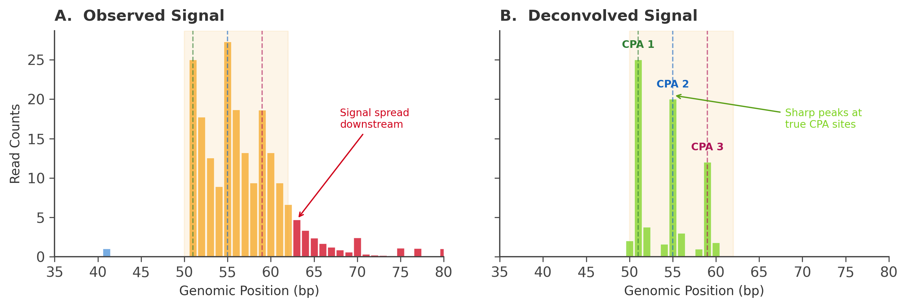

# NET-seq Refinement

NET-seq refinement is an **optional** post-correction step that snaps 3' ends to NET-seq signal peaks within the read's ambiguity window. It is only active when `--netseq-dir` is provided to `rectify correct`; without it the step is skipped entirely.

NET-seq runs as the final refinement step, after all main 3' end correction modules (2E pre → 2F → 2A → 2B → 2C → 2D → 2G → 2E main → 2H) have completed. For reads in A-tract regions where the walk-back algorithm cannot uniquely resolve the true CPA position, NET-seq signal is used to guide the final position assignment.

**Implementation:** `rectify/core/netseq/netseq_refiner.py` (`NetseqLoader`,
`refine_with_netseq`), `rectify/core/analyze/deconvolution.py`
(`DEFAULT_PSF`, `load_psf`, `build_convolution_matrix`, `deconvolve_signal`).

---

## Why NET-seq?

NET-seq captures nascent RNA 3' ends with single-nucleotide resolution. Because the reads come from actively transcribing polymerases (not polyadenylated mRNAs), they are not subject to the A-tract ambiguity that plagues poly(A)-enriched libraries.

However, NET-seq has its own artifact: **oligo(A)-spreading**. Nuclear RNA undergoes oligoadenylation (addition of short A tails), which creates downstream signal spreading around CPA sites.

<figure markdown>
  { width="500" }
  <figcaption>NET-seq signal at a CPA is not a single sharp peak — oligoadenylation of nascent RNA produces a downstream "spread" of secondary peaks at +1, +2, +3 nt offsets that must be deconvolved before the signal can be used as ground truth.</figcaption>
</figure>

<figure markdown>
  { width="680" }
  <figcaption>RECTIFY's NNLS deconvolution decomposes the spread NET-seq signal into a sum of point-spread-function-convolved peaks, recovering sharp single-nucleotide CPA positions. These deconvolved peaks then guide walk-back tie-breaking within A-tract regions.</figcaption>
</figure>

---

## Oligo(A) spreading artifact

Raw NET-seq signal around a CPA site looks like:

```
True CPA
    ↓
────|────────────────────────────────────────── Genome
    ↑↑↑↑↑↑↑↑↑↑
NET-seq signal spreading into A-tract
(each A is a possible oligo-A extension endpoint)
```

The spreading width depends on the downstream A-tract length. The point-spread function (PSF) describes this spreading distribution.

---

## NNLS deconvolution

The point-spread function is an **empirical 0A-site PSF**: it is the observed
offset distribution `P(observed_position = j | true_CPA = i)` measured at
**zero-A control sites** — positions where the genome immediately downstream
has no A's, so all NET-seq signal must originate from the true CPA (no spreading
possible). RECTIFY ships a `DEFAULT_PSF` derived from WT NET-seq (GSE25107 +
GSE159603), peaking at ~54% on the true position; `load_psf()` can load a
sample- or organism-specific PSF table instead.

The observed NET-seq signal `y` is modeled as:

```
y = A · x + ε
```

where:
- `y` = observed signal vector (counts at each genomic position)
- `A` = convolution matrix built from the PSF (`build_convolution_matrix`)
- `x` = true CPA signal (what we want to recover)
- `ε` = noise

RECTIFY solves for `x` using **Non-negative Least Squares (NNLS)** with L2
regularization, which enforces `x ≥ 0` (counts can't be negative):

```python
def deconvolve_signal(observed, convolution_matrix=None, tract_length=None,
                      psf=None, regularization=None):
    """
    NNLS deconvolution of NET-seq signal (L2-regularized).

    Returns the deconvolved signal array (recovered per-position peak
    intensities). Implemented in rectify/core/analyze/deconvolution.py.
    """
```

---

## Refinement workflow

For reads whose corrected 3' end carries a non-zero A-tract `ambiguity_range`
(i.e. it sits inside a genomic A/T-tract), `refine_with_netseq()` operates over
the `[ambiguity_min, ambiguity_max]` window:

1. Extract the NET-seq signal across the ambiguity window
2. Optionally deconvolve it with NNLS to remove the oligo(A)-spreading artifact
3. Find peaks in the (deconvolved) signal
4. Return either a winner-take-all position or a proportional split of the read
   across the most likely true CPA sites (`proportional_split=True`)
5. The resulting `netseq_confidence` can downgrade the read's `confidence`
   (e.g. to `low`) when no clear peak is found

```python
def refine_with_netseq(netseq_loader, chrom, ambiguity_min, ambiguity_max,
                       strand, original_position, use_deconvolution=True,
                       psf=None, proportional_split=True):
    """
    Refine a CPA position using NET-seq signal across the ambiguity window.
    Returns a single assignment dict, or a list of proportional assignments.
    """
```

Signal access goes through `NetseqLoader`, initialized once with NET-seq signal
(BigWig files via `load_bigwig`/`load_directory`, or the bundled per-organism TSV
arrays via `load_bundled`) and reused per read; it keeps a thread-safe LRU cache
(`MAX_CACHE_SIZE = 10000`) to avoid redundant signal lookups.

---

## Bundled data (yeast)

For *S. cerevisiae*, RECTIFY bundles pre-processed NET-seq 3'-end references as
gzipped TSVs (auto-detected when `--Scer` is set):

- `saccharomyces_cerevisiae_netseq_wt.tsv.gz` — wild-type NET-seq 3' ends
- `saccharomyces_cerevisiae_netseq_pan.tsv.gz` — pan-mutant reference (broader coverage)
- `saccharomyces_cerevisiae_atract_netseq.tsv.gz` — A-tract-focused reference

To process custom NET-seq data (other organisms or mutant conditions), run
`rectify netseq` on the NET-seq BAM(s) — it extracts 3' ends, applies NNLS
deconvolution, and writes per-read parquet plus RPM-normalized bedgraphs:

```bash
rectify netseq my_netseq.bam \
    --genome genome.fa.gz \
    --gff genes.gff.gz \
    -o netseq_processed/

# Then point correction at the processed NET-seq directory:
rectify correct reads.bam \
    --genome genome.fa.gz \
    --netseq-dir netseq_processed/ \
    -o corrected_reads.tsv
```

---

## PSF representation

The PSF is **not** a parametric Gaussian — it is an empirical offset
distribution indexed by `offset = observed − true` and normalized to sum to 1.
The bundled `DEFAULT_PSF` (in `rectify/core/analyze/deconvolution.py`) places
the majority of mass at offset 0 with a downstream tail reflecting
oligo(A)-spreading. `load_psf(filepath)` reads an alternative PSF table (the 0A
slice, `acount == 0`) when adapting to a new chemistry or organism, and
`deconvolve_signal(..., regularization=...)` controls the L2 strength applied
during NNLS.

---

## Donor-side junction rescue (`rectify netseq`)

Everything above is the *consumer* side — NET-seq signal used as a prior for long-read 3'-end
correction. This section is the *producer* side: two corrections `rectify netseq` applies while
extracting 3' ends from a NET-seq BAM.

**Implementation:** `rectify/core/netseq/netseq_rescue.py`
(`JunctionPool`, `rescue_read`, `call_tail`), wired through
`rectify/core/bam/netseq_bam_processor.py`.

### The problem

Under Churchman geometry the RNA 3' end is the read's **5' terminus** and the gene strand is the
inverse of the BAM strand. A nascent RNA whose 3' end sits only 1–10 nt into exon 2 therefore has
an exon-2 overhang too short to anchor a spliced alignment, so a short-read aligner either
soft-clips it (STAR `--alignEndsType Local`, bbmap) or mis-extends the alignment a few nt into the
intron. Either way the read is reported at the **5' splice site** — manufacturing a false splicing
intermediate at exactly the coordinate where the real splicing-intermediate signal lives.

Nothing in `rectify correct` re-places that clip: its one junction-aware clip re-placer
(Module 2F, `rescue_3ss_truncation`) is transcript-**5'**-only, and the three 3'-side modules
(poly-A walkback, homopolymer soft-clip rescue, over-call terminal-match rescue) all match
**contiguous** reference and take no junction pool.

### Coordinates

All gene-strand. For an intron at 0-based half-open `[intron_start, intron_end)`:

| term | `+` gene | `-` gene |
|---|---|---|
| `donor` (first intronic base) | `intron_start` | `intron_end - 1` |
| `exon1_last` | `intron_start - 1` | `intron_end` |
| `exon2_first` | `intron_end` | `intron_start - 1` |
| 5'-ward in RNA | decreasing coordinate | increasing coordinate |

The `--junction-pool` TSV uses the same convention: `donor` = **first** intronic base, `acceptor` =
**last** intronic base, both on the gene strand (so `donor > acceptor` on a `-` gene).

### The rule

For a read whose aligned RNA 3' end `p` sits between `exon1_last` and `--rescue-max-intronic` nt
past the donor:

```
S = (read bases aligned at/past the donor, gene-strand order) + (read-5' soft clip in RNA orientation)
k = length of the longest prefix of S equal to the genome from exon2_first, gene-strand-ward
r = len(S) - k                                    # the non-templated remainder
```

Rescue when `k >= --rescue-min-k` **and** `r` is an allowed remainder — `{0}` with no randomer, and
`{0, N-1, N, N+1}` with `--umi-length N`, because a randomer's terminal 1–2 nt align by chance
(measured 1 : 0.28 : 0.09 for a 6-nt randomer). The rescued 3' end is `k - 1` nt into exon 2.

Read classes, all reported in `<sample>.netseq_summary.json`:

| class | meaning |
|---|---|
| `spliced_rescued` | overhang recovered; 3' end moved into exon 2 |
| `exon1_end` | aligned end exactly at the exon-1 3' end, nothing matches exon 2 — a genuine splicing intermediate, **left where it is** |
| `ambiguous` | `k >= min_k` but the remainder is not an allowed length |
| `intronic_end` | alignment runs into the intron and nothing matches exon 2 |
| `none` | no pooled donor within reach |

### The chance-match null — read it before trusting a low `k`

Every candidate read is also matched against a **decoy acceptor** 50 nt further into exon 2, under
the identical acceptance rule. `decoy_rescued` in the summary is therefore the chance-match floor
for the rescue count itself. On a 194 k-read *S. cerevisiae* chrI+chrII slice: 504 reads reached a
pooled donor, 227 were rescued, and the decoy would have rescued **54** — all of the decoy's hits at
`k <= 4`, none at `k >= 5`. A `--rescue-min-k` of 1 is therefore noise-dominated in a randomer
library; raise it (or read `rescued_by_k_clean`, the `r == 0` channel) when single-nt calls matter.

### Non-templated tails

The same clip carries the poly(A)/oligo(A) tail, and in a randomer library it carries the randomer
**distal** to the tail — `[tail A's][randomer]` in RNA orientation. So:

1. strip the distal `--umi-length` nt (a 6-nt clip is randomer-only and contributes no tail);
2. take the A-run adjacent to the alignment;
3. add a genome-aware walkback — walk 5'-ward in RNA from `p` while the read base **and** the
   genome base are `A` — gated on the non-randomer clip region being entirely A, because a non-A
   base 3' of the A-run bounds the RNA terminus there.

This replaces the legacy "≥ 80 % A over the whole clip" test, which classifies every
randomer-bearing read as untailed.

⚠️ Step 3 is invariant 7 (a terminal read A over a genomic A is *not* skipped) and is right for a
library where every read has a tail. Nascent RNA is not that library: on the slice above, 41,711 of
42,644 walkbacks had no clip evidence at all, and at *RPL32* — whose exon 1 ends `…AAAA` — 24 of the
33 reads sitting on the exon-1 3' end were walked 4 nt off it. `--walkback-requires-clip-a` gates
the walkback on a non-templated A being present; the summary always reports `tail_clip_evidence`
against `tail_walkback_only` so the choice can be made from data.

---

## See also

- [rectify netseq command](../user_guide/commands/netseq.md) — process raw NET-seq BAMs
- [3' End Indel Correction](3prime_indel_correction.md) — the primary correction that NET-seq refines
