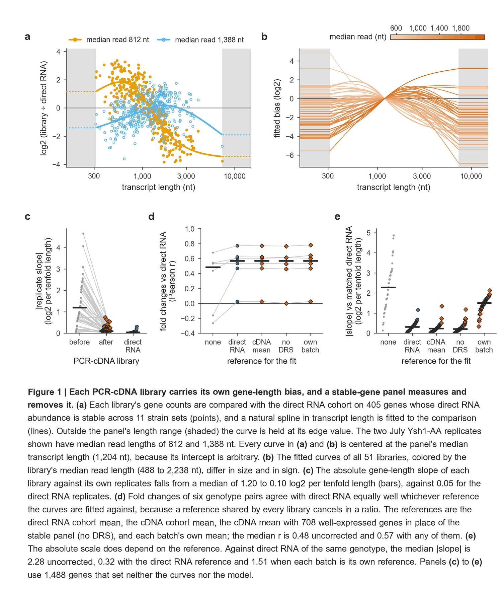

# rectify cdna-length-correct

Per-library correction of the gene-length bias in ONT PCR-cDNA gene counts, calibrated on a panel of stably
expressed genes against direct RNA.

For the pipeline that produces the molecules this command counts, see the
[ONT PCR-cDNA pipeline overview](correct_cdna_overview.md).

---

## What the bias is

Replicate ONT PCR-cDNA libraries (SQK-PCB114.24) count long genes very differently from one another. In a
calibration cohort of 51 libraries, a 3-kb gene was counted 0.16 to 12 times as often as a 0.5-kb gene relative
to the library's own replicates, while direct RNA libraries (SQK-RNA004) of the same strains stayed between 0.82
and 1.14. The bias belongs to the library preparation rather than to the RNA, the flow cell or the run. It follows
the library's read length, it can change sign between replicates, and it also moves isoform ratios within a gene.

Because the bias differs from library to library, it does not cancel in a fold change between conditions whose
libraries happen to differ in read length. A median-of-ratios size factor cannot remove it either, because it is a
function of gene length rather than a single number per library.

<p align="center">
  
</p>

## How the correction works

1. **Count** molecules per gene with one rule for every library: one UMI-deduplicated molecule per row of
   [`cdna-analyze`](cdna_analyze.md)'s `clusters.tsv`, keeping `XF >= 1` molecules of both read types. The 3' end
   is the walk-back anchor, and the gene is the one whose stop codon is the nearest upstream one on the RNA strand,
   with the 3' end at most 30 nt upstream and at most 500 nt downstream of it. Genes are defined by their CDS.
2. **Compare** each library with a reference abundance on the panel genes:
   `y = log2(CPM + 0.5) - log2(REF + 0.5)`. The reference is the cohort-mean CPM of direct RNA libraries counted
   with the same rule, and the panel is a set of genes whose direct RNA abundance is stable across the conditions
   the panel was built for.
3. **Fit** a natural cubic spline in log10 gene length to those differences, with four knots at quantiles of the
   panel's lengths. The knots are fixed at fit time, and the curve is held flat outside the panel's length range,
   so it is never extrapolated.
4. **Divide it out.** Each gene's bias factor is `B = 2^f(L)`. Corrected CPM is `CPM / B`, renormalized to one
   million. For DESeq2, the command writes `normalizationFactors` that carry `B` (see below).

The curve's intercept is arbitrary. Corrected CPM, the DESeq2 factors and any ratio of two lengths do not depend
on it.

## Quick start (S. cerevisiae)

```bash
# 1. gene counts from each library's cdna-analyze output (names come from <library>/analyze/)
rectify cdna-length-correct count --Scer lib1/analyze/clusters.tsv lib2/analyze/clusters.tsv -o counts/

# 2. fit each library's curve on the bundled panel against the bundled direct RNA reference
rectify cdna-length-correct fit --Scer --counts counts/counts.tsv --library-meta libraries.tsv -o fit/

# 3. apply the stored curves to the full-depth counts of the same libraries
rectify cdna-length-correct apply --Scer --params fit/params.tsv --counts full_depth/counts.tsv -o full_depth_fit/
```

`libraries.tsv` declares each library's `background`, `medium` and `condition` (and optionally a replicate
`group`); see [Certification](#certification).

## Modes

| Mode | Input | Output |
| --- | --- | --- |
| `genes` | a GFF3 (+ optional transcript models) | the CDS-defined gene table: stop codons, CDS and transcript lengths |
| `count` | `clusters.tsv` files, or 3'-end tables (`--input-format three-prime`, e.g. direct RNA) | `counts.tsv` (gene x library), `count_stats.tsv` |
| `panel` | cDNA counts, reference counts and each reference library's condition group | `panel.tsv`, `reference_cpm.tsv` |
| `fit` | counts, a panel and a reference | `params.tsv`, `qc.tsv`, `bias_factors.tsv.gz`, `corrected_cpm.tsv.gz`, `deseq2_normalization_factors.tsv.gz` |
| `apply` | `params.tsv` and counts of the same libraries | the same corrected tables |
| `ratio` | `params.tsv`, two lengths and `--scale` | the per-library correction of a two-class ratio |

### `fit` outputs

- **`params.tsv`**: one row per library with the model, the coefficients and knots at full precision, the clamp
  range (`len_lo_nt`, `len_hi_nt`) and a fingerprint of the gene-length definition. `apply` refuses a gene table
  whose lengths differ from that fingerprint, because a curve is a function of the lengths it was fitted in.
- **`qc.tsv`**: one row per library with the panel residual SD, the equivalent slope (log2 per tenfold length),
  a linear slope and its SE, the number of genes held at the edge factor (`n_genes_clamped`, split into below and
  above), and `certified` with its reason. With a `group` column in `--library-meta`, it also gives each
  library's gene-length slope against its own replicates before and after correction, and `replicate_eval.tsv`
  gives the replicate spread per group.
- **`fit_provenance.json`**: inputs with checksums, the counting rule, the model and the cohort-mean curve against
  the reference (see [Without direct RNA](#without-direct-rna)).

### DESeq2

`deseq2_normalization_factors.tsv.gz` follows DESeq2's `estimateNormFactors` with `normMatrix = B`. `B` is scaled
so each gene's geometric mean is 1, size factors are the median of ratios of `counts / B`, and the product is
scaled again so each gene's geometric mean is 1. Load it with raw counts:

```r
nf <- as.matrix(read.delim("fit/deseq2_normalization_factors.tsv.gz", row.names = 1))
normalizationFactors(dds) <- nf[rownames(dds), colnames(dds)]
```

Do not feed corrected CPM or corrected counts to DESeq2.

## Isoform ratios and short molecules: `ratio --scale`

Gene counts use the curve at full strength (scale `c = 1`), because it is fitted and applied between genes. A
readout that compares two molecule classes within a gene, such as an isoform ratio, is corrected by
`-c (f(L1) - f(L2))` in log2. There, the between-gene curve over-states the length effect: on one reporter's
2.6-kb and 0.44-kb isoforms the fitted `c` was about 0.5. Molecules shorter than the panel's shortest gene receive
the curve's edge value, so their correction is an extrapolation whose size depends on `c`. `c` is therefore
required:

```bash
rectify cdna-length-correct ratio --params fit/params.tsv --numerator-length 2604 --denominator-length 443 --scale 0.5
```

Every output row records the `c` used and flags a length outside the fitted range.

## Certification

A panel is valid only where its stability was measured. The bundled S. cerevisiae panel was built from direct RNA
of **W303 anchor-away strains grown in YPD and depleted with rapamycin**. A library is certified only when
`--library-meta` declares `background = W303-AA`, `medium = YPD` and `condition = rapamycin`. Every other strain
(for example BY4742), medium (for example SD), condition (for example a stress) and every undeclared library is
reported as not certified, with the reason. The correction still runs for those libraries, but it is an
extrapolation. Check the panel residual SD against the cohort's: a library whose panel genes scatter much more
than its peers' is one where the panel's stability assumption may fail.

For your own panel, declare its scope with `--panel-scope scope.json`
(`{"background": [...], "medium": [...], "condition": [...]}`).

## Without direct RNA

A reference shared by every library shifts every fitted curve by the same function of length. That function
cancels in any fold change between the libraries and in the DESeq2 factors, so **differential expression does not
depend on which reference is used**. What the reference sets is the absolute scale of the corrected values, which
matters for comparisons between genes. In the calibration cohort (held-out genes, Rrp6-AA against WT-AA, Pearson r
of the cDNA fold changes with direct RNA fold changes):

| Reference | Panel | r | Slope against genotype-matched direct RNA |
| --- | --- | --- | --- |
| none (uncorrected) | none | -0.16 | 2.28 |
| direct RNA cohort mean | stable panel (405 genes) | 0.47 | 0.32 |
| cDNA cohort mean (`--reference-self`) | stable panel | 0.47 | 0.24 |
| cDNA cohort mean | high-count genes, no stability information (708) | 0.46 | 0.21 |
| each batch's own cDNA mean | stable panel | 0.47 | 1.51 |

The absolute-scale column is specific to this cohort, whose libraries' biases span both signs and roughly cancel
in the cohort mean. A batch whose libraries share a bias keeps it (last row). `fit_provenance.json` reports the
cohort-mean curve against the reference, which is the part of every correction that the libraries share.

- **A new yeast library** needs no direct RNA of its own; its curve is fitted on the bundled panel.
- **Another organism** (for example human) needs its own panel and reference. The bundled calibration contains
  yeast genes, and every library's curve is its own. Build a panel from a direct RNA cohort of your cell type with
  `panel`, or, without direct RNA, use `--reference-self` with a panel of genes you assume stable
  (`--panel-high-count N` uses every well-expressed gene). The panel chosen without stability information absorbs
  some real length-related biology into the curve.

## Limits

- Corrected values are on the reference's scale. A length bias common to every reference library is invisible.
- Above about 4 kb, the most biased libraries over-correct, because few panel genes are that long. Genes outside
  the panel's range (314 to 7,346 nt for the bundled panel) receive the edge factor and are counted in `qc.tsv`.
- Counts and curves must share one gene table. The bundled gene table omits mitochondrial genes, the rDNA locus
  and eight genes whose loci collected reporter-plasmid transcripts in the calibration cohort (PSP2, MDJ1, ADH1,
  PDC1, URA3, CYC1, GAL1 and GAL10). To count those, build your own gene table, panel and reference.
- GC content and hydrolysis-prone dinucleotides (UpA, CpA) added almost nothing beyond length in the calibration
  cohort: they are small, constant offsets that do not track the library, and adding any of them changed
  held-out error by less than 0.5 %. `fit --covariates` accepts per-gene features for testing on other data and is off by
  default.

## Validation

On 1,488 genes that set neither the curve nor the model choice (51 PCR-cDNA libraries):

| Measure | Before | After | Direct RNA |
| --- | --- | --- | --- |
| Replicate gene-length slope, median \|slope\| (log2 per tenfold length) | 1.20 | 0.10 | 0.05 |
| Replicate SD of log2 CPM, genes > 2 kb | 0.75 | 0.26 | 0.18 |
| Slope against genotype-matched direct RNA, median \|slope\| | 2.28 | 0.32 | |
| Rrp6-AA / WT-AA fold changes against direct RNA, Pearson r | -0.16 | 0.47 | |

The model (four-knot spline in transcript length on the 405-gene panel) was chosen among 12 candidates on a
separate random half of the genes. The correction overshoots by about 7 % of the bias.
