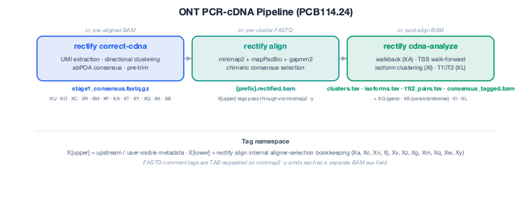
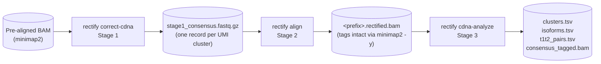

# ONT PCR-cDNA pipeline

The ONT PCR-cDNA track is a three-stage UMI-aware pipeline for Oxford
Nanopore PCR-cDNA libraries built with the SQK-PCB114.24 kit. Unlike DRS,
where each read is one molecule, PCR-cDNA produces multiple PCR copies
per starting RNA — so RECTIFY deduplicates by UMI **before** correction
and runs gene / isoform assignment **after** post-alignment.

<p align="center">
  
</p>

---

## Three stages



| Stage | Command | What it does |
|-------|---------|--------------|
| **1** | [`rectify correct-cdna`](correct_cdna.md) | UMI extraction (regex SSP match), directional clustering (Levenshtein <= 3 with 2x rule), abPOA per-cluster consensus, pre-trim of SSP / UMI / GGG + poly-A. Emits one FASTQ record per UMI cluster with per-cluster tags on a TAB-separated comment. |
| **2** | [`rectify align`](align.md) | Standard multi-aligner consensus (minimap2 + mapPacBio + gapmm2 + optional chimeric reconstruction) on the Stage 1 FASTQ. `minimap2 -y` propagates each `XX:T:value` from the FASTQ comment into its own BAM aux field. |
| **3** | [`rectify cdna-analyze`](cdna_analyze.md) | Post-align walkback + walk-forward, gene assignment (`XG`), sense / antisense classification (`XS`), Type-1 vs Type-2 isoform clustering, and same-molecule Type-1 / Type-2 pairing (`XL`). |

---

## End-to-end example

```bash
# Stage 1 — UMI extraction + per-cluster abPOA consensus
rectify correct-cdna pcb114.bam \
    --reference genome.fa \
    --gff genes.gff \
    -o out/

# Stage 2 — multi-aligner consensus on the per-cluster FASTQ
rectify align out/stage1_consensus.fastq.gz \
    --genome genome.fa \
    --prefix stage1 \
    -o out/

# Stage 3 — post-align walkback + isoform clustering + T1/T2 pairing
rectify cdna-analyze out/stage1.rectified.bam \
    --reference genome.fa \
    --gff genes.gff \
    -o out/
```

Outputs after Stage 3:

| File | Source |
|------|--------|
| `out/clusters.tsv` | Per-cluster manifest (one row per UMI cluster) |
| `out/isoforms.tsv` | Isoform-level aggregation (`tol-5` / `tol-3` grouping) |
| `out/t1t2_pairs.tsv` | Type-1 / Type-2 same-molecule pairings |
| `out/consensus_tagged.bam` | Stage 2 BAM rewritten with `XA` / `XG` / `XS` / `XI` / `XL` tags added |

---

## Tag namespace

The cDNA pipeline owns the `X[upper]` BAM-tag namespace. All `X[upper]`
tags are **persistent, user-visible metadata** — they ride through every
stage of the pipeline and are stable for downstream consumers.

| Owner | Tags |
|-------|------|
| `rectify correct-cdna` (Stage 1) | `XU`, `XO`, `XC`, `XR`, `XM`, `XF`, `XA` (pre-align), `XT`, `XY`, `XQ`, `XK`, `XB` |
| `rectify cdna-analyze` (Stage 3) | `XA` (overwritten with post-align value), `XG`, `XS`, `XI`, `XL` |

See [`rectify correct-cdna`](correct_cdna.md#per-cluster-tag-glossary) for
the full glossary.

`X[lower]` tags (`Xa`/`Xc`/`Xn`/`Xj`/`Xv`/`Xz`/`Xg`/`Xm`/`Xq`/`Xw`/`Xy`)
are reserved for `rectify align`'s internal aligner-selection bookkeeping
— debug metadata only, not stable for downstream consumers.

---

## See also

- [`rectify correct-cdna`](correct_cdna.md) — Stage 1
- [`rectify align`](align.md) — Stage 2
- [`rectify cdna-analyze`](cdna_analyze.md) — Stage 3
- [cDNA correct design spec](../../algorithms/cdna_correct.md) — full algorithmic write-up with empirical UMI validation
