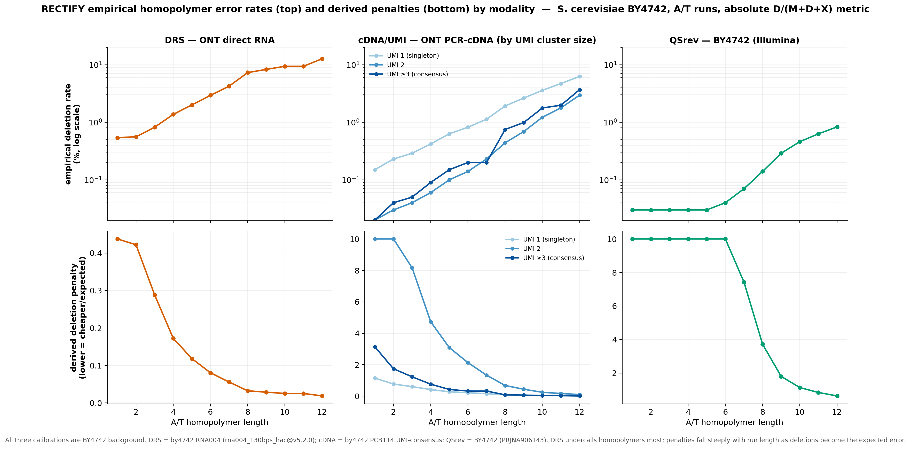

# S. cerevisiae bundled penalty tables

Empirical per-base error penalties for `rectify correct`'s junction-refinement
module (Module 2H). Resolution is **protocol-aware** via
`rectify/data/__init__.py::resolve_reference_paths()` — passing `--Scer`
together with the right combination of `--dT-primed-cDNA` / `--short-read`
picks the matching table:

| Caller flags | Resolved tables | Underlying calibration |
|---|---|---|
| `--Scer` (no protocol flags) | `*.tsv` (DRS — back-compat default) | BY4742 wild-type direct RNA-seq, RNA004 / Dorado |
| `--Scer --dT-primed-cDNA` | `*_cdna.tsv` pooled (falls back to DRS if absent) | ONT PCR-cDNA, UMI-consensus, BY4742 wt_rep2 |
| `--Scer --ONT-cDNA` | per-UMI-bin `*_cdna_umi{1,2,3plus}.tsv` + pooled fallback, routed per-read by `XC` tag | ONT PCR-cDNA, UMI-consensus, BY4742 wt_rep2 |
| `--Scer --short-read --dT-primed-cDNA` | `*_qsrev.tsv` (overhang falls back to DRS) | BY4742 QSrev WT (76 bp Illumina; PRJNA906143) |

The `--ONT-cDNA` path uses a `PenaltyTableSet` (Module 2H, built at startup)
rather than a single static table: each read's `XC:i:N` tag (UMI cluster size
written by the cDNA pipeline) selects the matching calibrated table at scoring
time.  Reads without an `XC` tag fall back to the pooled table.

The fallback to DRS for missing protocol-specific tables is intentional — it
means a partially-calibrated bundle still resolves to a working table set,
rather than crashing on `None`.

---

## Files

### DRS (default — **regenerated 2026-06-01** from by4742 RNA004, M-tracking/absolute)

| File | Purpose |
|---|---|
| `penalty_scores.tsv`         | HP-length-aware D/X/I penalties, AT vs CG split |
| `str_penalty_scores.tsv`     | Dinucleotide / trinucleotide STR slippage penalties |
| `junction_overhang_table.tsv`| Minimum overhang threshold per intron-size bin |

**Calibration sample (current):** `wt_by4742_rep{1,2,3}` (BY4742 wild-type DRS,
**SQK-RNA004**, basecall model `rna004_130bps_hac@v5.2.0`; H2 deposit
`by4742-wt-upf1D_polya_drs_2025`). 5-aligner concordance panel:
minimap2 + mapPacBio + deSALT + uLTRA + gapmm2; 21 chunks; 6.39 B HP events;
Sherlock job 27113242. **Read-coord exclusion:** none (5'=0, 3'=0).
BY4742 is S288C-isogenic → clean isolated-base (HP=1) baseline.

**Why regenerated (2026-06-01):** the prior bundled DRS table (calibrated
2026-04-22) used the **conditional** rate `D/(D+X)` because that profiler
version never accumulated M (match) events. As shown below, the
conditional-vs-absolute choice does **not** cancel across HP length, so the
old table under-weighted long-homopolymer deletions ~8–16× at HP≥8 and did
not reproduce this repo's own documented empirical penalties (0.44/0.17/0.033
at HP 1/4/8). The current table is **absolute** `D/(M+D+X)` and reproduces them
(0.438/0.173/0.032). STR table regenerated in the same pass (see STR fix below).
The "R10.4.1" chemistry label in older docs was a mislabel — DRS is RNA004.

**Cross-validation:** the lab's W303-background cpa anchor-away DRS
(`PRJNA1229592`) gives identical long-HP rates (confirming chemistry) but a
variant-inflated HP1–3 baseline vs the S288C reference (W303 SNPs, no variant
masking) — which is why the S288C-isogenic by4742 is the correct substrate.

### cDNA — calibrated 2026-05-17/18 (UMI-bin-stratified)

| File | Status | UMI cluster size | Read count | HP events |
|---|---|---|---|---|
| `penalty_scores_cdna_umi1.tsv`    | ✓ bundled (125 rows) | 1 (singleton) | 399,644 | 368 M |
| `penalty_scores_cdna_umi2.tsv`    | ✓ bundled (117 rows) | 2 (doubleton) | 58,166 | 74 M |
| `penalty_scores_cdna_umi3plus.tsv`| ✓ bundled (106 rows) | ≥3 (consensus) | 25,605 | 35 M |
| `penalty_scores_cdna.tsv`         | ✓ bundled (125 rows, pooled) | all | 483,415 | 477 M |
| `str_penalty_scores_cdna.tsv`     | not bundled — STR profiling yielded 0 events; resolver falls back to DRS |
| `junction_overhang_table_cdna.tsv`| not bundled — falls back to DRS table |

#### UMI-bin routing (Phase C)

`rectify correct --ONT-cDNA` builds a `PenaltyTableSet` at Module 2H startup
that holds all four tables. For each read, the `XC:i:N` tag (UMI cluster size,
written by `rectify consensus`) selects the matching table:

| `XC` value | Table used |
|---|---|
| 1 | `penalty_scores_cdna_umi1.tsv` — calibrated on raw-accuracy singletons |
| 2 | `penalty_scores_cdna_umi2.tsv` — calibrated on doubleton consensus |
| ≥3 | `penalty_scores_cdna_umi3plus.tsv` — calibrated on high-confidence consensus |
| absent / untagged | `penalty_scores_cdna.tsv` — pooled fallback |

Tag note: `XC:i:N` = UMI cluster size (number of reads merged). `XK:i:N` is a
different tag (3′ trim length) — do not confuse the two.

#### Why stratify by UMI cluster size?

The pooled cDNA table averages over a ~75/15/10 singleton/doubleton/triplet mix.
Singletons have raw per-base error rates ~0.2–0.5 %, while ≥3-read consensus
reads are nearly error-free (<0.05 %). A single pooled table is biased optimistic
for singletons and conservative for high-consensus reads. Stratification lets
RECTIFY apply appropriate junction-scoring confidence per read.

**Calibration sample:** `stage1_consensus.bam` from
`/u/scratch/k/kevinroy/ont_cdna_v4/wt_rep2/out/` — **UMI-consensus** ONT
PCR-cDNA reads (median ~1.9 kb). 5-aligner concordance panel:
minimap2 + mapPacBio + gapmm2 + uLTRA + deSALT (same as DRS).
**Read-coord exclusion:** (5'=50 bp, 3'=50 bp) to mask template-switch
adapter bleed at both ends.
**Compute:** Sherlock larsms partition (JID 25334819), 8 chunks, all 5 aligners.

> **Important caveat:** the per-bin tables are calibrated on UMI-consensus
> reads from a single replicate (`wt_rep2`). Running RECTIFY on raw
> (non-UMI-collapsed) PCR-cDNA will apply the `umi1` (singleton) table, which
> is calibrated on consensus-quality singletons — still more accurate than the
> pooled table for single-pass reads, but not specifically calibrated for
> fully-raw ONT cDNA. If you don't have a UMI consensus step, prefer the DRS
> table or pass `--junction-penalty-table` explicitly.

**Convergence summary (8-chunk run, median |Δ%| across consecutive chunk pairs):**

| Bin | Median \|Δ%\| | Verdict |
|---|---|---|
| umi1 | 3.12% | 8 chunks sufficient |
| umi2 | 3.03% | 8 chunks sufficient |
| umi3+ | 1.98% | 8 chunks sufficient |

### QSrev — calibrated 2026-05-17

| File | Status |
|---|---|
| `penalty_scores_qsrev.tsv`     | ✓ bundled (579 M HP events pooled across wt_R1 + wt_R2) |
| `str_penalty_scores_qsrev.tsv` | not bundled — STR profiling yielded 0 events; resolver falls back to DRS |
| `junction_overhang_table_qsrev.tsv` | not bundled — falls back to DRS table |

**Calibration sample:** BY4742 QSrev WT (`wt_R1` + `wt_R2`,
76 bp single-end Illumina). 2-aligner concordance panel: bbmap + bwa.
**Read-coord exclusion:** (5'=10 bp, 3'=16 bp) — keeps ~50 bp interior; the
handoff's original (30, 50) would have dropped every read at 76 bp.
**Compute:** H2 SGE (JID 13421248), ~50 min total wall (split + bbmap + bwa
+ profile per replicate). Bundled via `bundle_protocol_tables.py --protocol qsrev`.

**Notes:**
- Illumina-class chemistry is substitution-dominated. Empirical D and I rates
  are ~3 × 10⁻⁴ — far below sub rates — so penalty_score for D and I clamps
  at 10.0 (the cap) for most HP lengths. The table is therefore mostly
  *substitution-driven*; using it is roughly equivalent to a unit-cost-edit
  model that down-weights insertions and deletions strongly. See handoff
  §6 Q3 — Kevin chose "calibrated HP, skip overhang" precisely because the
  short-read chemistry doesn't need overhang nuance.
- STR profiling emitted 0 events because the (10, 16) read-coord exclusion
  + 5+ copy threshold left no qualifying contexts in 76 bp reads. The
  bundled DRS STR table is used as fallback — fine for QSrev since STR
  slippage is rare in Illumina reads.
- The bundled `penalty_scores_qsrev.tsv` has `ins(HP=1) = 0` for both AT and
  CG (no insertion events at HP=1 anywhere in 6.99M × 2 reads). This is
  partly real (Illumina rarely inserts) and partly a calibration artifact:
  the (10, 16) read-coord mask excises both ends of the 76 bp reads, and
  the residual ~50 bp middle has too few HP=1 contexts to sample a rare
  event. The bundled DRS HP=1 insertion rate is used implicitly via the
  `--default-ins 1.25` baseline.

**Why no QSrev overhang table:** short-read junctions are too rare in
QuantSeq REV to calibrate a meaningful intron-size-binned threshold.

---

## Observed error-rate tables (per platform) — `error_rates_<platform>.tsv`

In addition to the derived `penalty_scores_*` tables, the directory ships the **raw observed
error rates** each platform's penalties are built from, one table per platform:

| File | Platform | Source run |
|---|---|---|
| `error_rates_drs.tsv`   | DRS (ONT direct RNA, RNA004) | by4742 RNA004, v3 set1 wt_by4742 rep1-3, 5-aligner, 21 chunks, **job 27113242** (M-tracked) |
| `error_rates_cdna.tsv`  | cDNA (ONT PCR-cDNA)          | `error_profile_cdna_20260518/pooled` (mm2/mapPacBio/gapmm2 + uLTRA/deSALT; M-tracked) |
| `error_rates_qsrev.tsv` | BY4742 QSrev (Illumina)  | `error_profile_qsrev_20260517` wt_R1+wt_R2 (bbmap/bwa; M-tracked) |

**Schema:** `op_type {D,I,X}` · `base_class {AT,CG}` · `hp_length` · `count` · `total_positions` ·
`rate`. The first two lines are `#` provenance comments. **All three calibrations are BY4742
background** (DRS = by4742 RNA004; cDNA = by4742 PCB114 UMI-consensus; QSrev = BY4742,
PRJNA906143) on an **identical absolute metric** `rate = op_count / (M+D+X)` — so the tables
are mutually comparable and the cross-modality comparison isolates chemistry, not strain.



**Observed A/T homopolymer deletion rates (absolute) — headline numbers:**

| HP len | DRS del | cDNA del | QSrev del |
|---|---|---|---|
| 1  | 0.54% | 0.12% | 0.032% |
| 6  | 2.92% | 0.68% | 0.036% |
| 8  | 7.16% | 1.66% | 0.130% |
| 12 | 12.73%| 5.66% | 0.744% |

DRS deletion rate rises steeply with run length and is **3–4.5× cDNA and 17–81× QSrev**; DRS
*insertions fall* at long HP, so net length-loss `(D−I)` is overwhelmingly DRS-specific. cDNA is
intermediate (both ONT); QSrev (Illumina) is near-flat until very long runs. Deep-dive:
`handoffs/REPORT_hp_undercalling_termination_20260531.html`.

### Metric note — why DRS was regenerated (✅ RESOLVED 2026-06-01)

The bundled `penalty_scores_*` `rate_mean` column is the **absolute** rate `D/(M+D+X)` for all three
modalities — but the DRS table only became so after the 2026-06-01 regeneration. The prior DRS table
(2026-04-22) reported the **conditional** rate `D/(D+X)` (that profiler never tracked M), and this
does **change the derived penalties across HP length** (an earlier note here wrongly claimed it
cancels). The normalization `penalty = sub_rate(HP=1)/rate(op,HP)` cancels the denominator **only at
fixed HP**: `penalty_cond/penalty_abs = error_frac(HP)/error_frac(HP=1)` → 1.0 at HP=1, growing with
run length. Proven on identical pooled counts (5.2 B DRS events): D/AT penalty ratio
conditional÷absolute = **1.01 at HP=1 → 9.7× at HP=8 → 16× at HP=12**. The old conditional DRS table
therefore under-weighted long-homopolymer deletions ~8–16× at HP≥8 and missed the documented empirics
(0.44/0.17/0.033 at HP 1/4/8); the current absolute table reproduces them (0.438/0.173/0.032). This was
a **behavior-changing production fix** (long-HP deletions ~8–16× cheaper in DRS junction/3′ scoring),
applied to `penalty_scores.tsv` + `str_penalty_scores.tsv` on 2026-06-01.

**STR fix (2026-06-01):** the per-chunk `--aligner-bams` profiler route did not emit the
`str_error_counts.tsv` the bundler pools (only `str_error_rates.tsv`/`str_penalty_scores.tsv`), so STR
initially pooled to 0. Fixed by (a) `_write_str_outputs` now also writing `str_error_counts.tsv`, and
(b) `bundle_protocol_tables.py` falling back to `str_error_rates.tsv` (which carries the integer count
column) when the counts file is absent — plus the STR bundle path now writes via a temp dir so it can
no longer clobber the production unsuffixed `str_penalty_scores.tsv`. STR repooled to 120.8 M events.

### Per-platform calibration parameters (provenance at a glance)

| Property | DRS | cDNA | QSrev |
|---|---|---|---|
| `--isolation-flank` | 10 | 10 | 10 |
| read-coord exclusion (5′,3′) | (0, 0) | (50, 50) | **(10, 16)** — relaxed for 76 bp reads |
| aligner concordance panel | 5 long-read | 5 long-read | 2 short-read (bbmap/bwa) |
| M tracked (absolute rate) | penalty run: **no**; `error_rates_drs.tsv`: yes | yes | yes |

The QuantSeq read-coord exclusion is deliberately relaxed to `(10, 16)` because the original
`(30, 50)` would drop every 76 bp read — this is the "shorter reads need less flanking" caveat, and
it is the *only* intended cross-platform parameter difference. (`isolation-flank` stays 10 for all.)

---

## Regeneration

DRS — uses the legacy invocation (preserved for byte-identical reproducibility):

```bash
python scripts/calibration/empirical_cigar_error_profiler.py \
    --run-dir <DRS dev_run> \
    --reference .../S288C_reference_sequence_R64-5-1_20240529.fsa.gz \
    --output-dir ./error_profile_drs_<date> \
    --isolation-flank 10 --union --str-repeat --workers 8
# DRS defaults to --protocol drs which keeps --exclude-{5,3}prime-bp at 0.
```

cDNA / QSrev — see the SGE/SLURM submit scripts in `scripts/calibration/`:
- `run_profiler_cdna_sherlock.sh` (Sherlock, SLURM, ~1-2 h wall for 8 chunks)
- `run_profiler_cdna_h2.sh`       (H2, SGE/UGE, ~6-12 h wall)
- `run_profiler_qsrev_h2.sh`      (H2, SGE/UGE, ~1-2 h wall)

The profiler writes per-bin error count TSVs when `--umi-tag XC` and
`--umi-bins 1,2,3+` are passed (the Sherlock script already sets these).
After the per-sample profiler outputs land, bundle **each bin separately**:

```bash
# Per-bin tables (run once per bin):
for BIN in umi1 umi2 umi3plus; do
    python scripts/calibration/bundle_protocol_tables.py \
        --protocol cdna \
        --umi-bin "$BIN" \
        --inputs path/to/error_profile_cdna_*/
done

# Pooled table (all reads together):
python scripts/calibration/bundle_protocol_tables.py \
    --protocol cdna \
    --inputs path/to/error_profile_cdna_*/
```

For QSrev (no UMI binning):
```bash
python scripts/calibration/bundle_protocol_tables.py \
    --protocol qsrev \
    --inputs path/to/error_profile_qsrev_*/  \
    [--overhang path/to/junction_overhang_table.tsv]
```

Each `bundle_protocol_tables.py` invocation writes the protocol-suffixed TSV
directly into this directory. The `BUNDLED_GENOMES[...]['protocols']` map
already points at the expected filenames, so resolution starts working
immediately after the files are written.
